# Descripción de los Mockups

---

## Módulo BI — Reportes Operativos y Gerenciales

El módulo de BI transforma la actividad diaria en información estratégica para la gerencia operativa, cumpliendo con los requerimientos de la Fase 1.

---

### 1. Dashboard Principal: Corte de Operaciones Diario

Fotografía instantánea del estado de la empresa. Muestra tarjetas de KPIs (Servicios completados, Facturación, Incidentes) y un gráfico de dona con el volumen de operaciones distribuido por sede.

---

### 2. Vista Detallada: Últimos Despachos

Tabla de trazabilidad inmediata para monitorear las órdenes logísticas más recientes (ID, Cliente, Ruta y Estado), eliminando la dependencia de hojas de cálculo.

---

### 3. Medición de Cumplimiento (KPIs)

Auditoría del nivel de servicio (SLA). Compara gráficamente el **Tiempo Real** vs **Tiempo Promesa** de entrega e incluye una tabla para identificar y corregir cuellos de botella (ej. retrasos en aduanas).

---

### 4. Análisis de Rentabilidad

Soporte para decisiones financieras. Destaca el margen promedio y cruza gráficamente los ingresos frente a los gastos operativos por cliente, permitiendo identificar los contratos más rentables.

---

### 5. Alertas y Planificación Regional (Capacidad)

Vista estratégica dual: incluye un panel de alertas automáticas por desviaciones (ej. exceso de combustible) y una proyección gráfica de los camiones y pilotos extra necesarios para la expansión a El Salvador y Honduras.

---

## Módulos Operativos y Autenticación

Descripciones de las pantallas para la gestión operativa y el control de acceso del personal de LogiTrans.

---

### 1. Login (Inicio de Sesión)

Pantalla de acceso principal. Permite la autenticación segura a la plataforma para los distintos roles de la empresa (clientes, agentes, encargados de patio y gerencia) mediante credenciales de correo y contraseña.

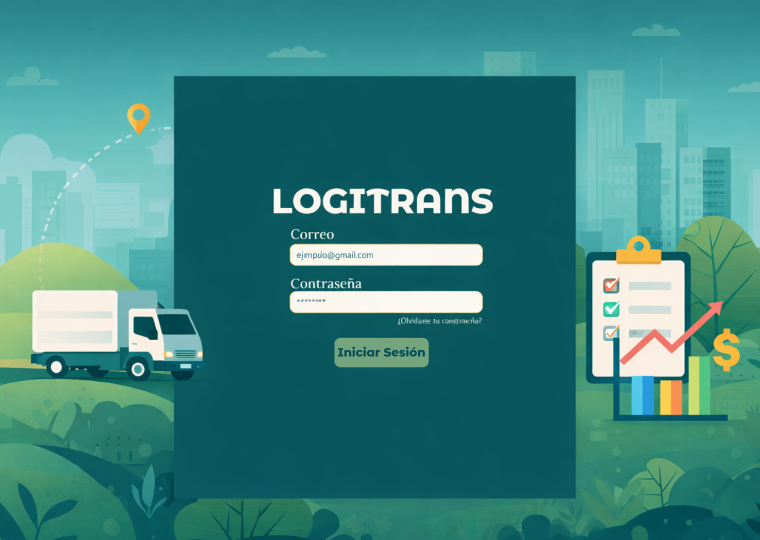

---

### 2. Panel del Agente Logístico

Centro de control para gestionar solicitudes de transporte. Cuenta con filtros avanzados (fecha, cliente, ruta, peso) y un listado claro de las órdenes activas para monitorear si están pendientes o ya han sido asignadas.

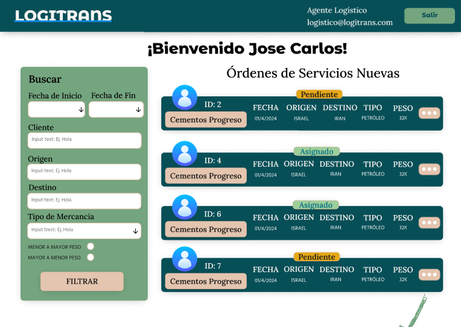

---

### 3. Detalles de la Orden (Asignación)

Vista ampliada de una solicitud de servicio. Resume la información del cliente, los detalles de la carga y permite al agente logístico seleccionar y asignar un piloto y vehículo específico para ejecutar el viaje.

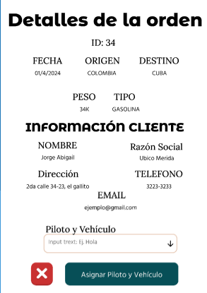

---

### 4. Panel del Encargado de Patio (Formalización)

Interfaz para la gestión física en las sedes. Permite al personal de patio validar las unidades asignadas, registrar el peso real en báscula, confirmar visualmente la estiba y marcar la unidad como **"Lista para Despacho"**.

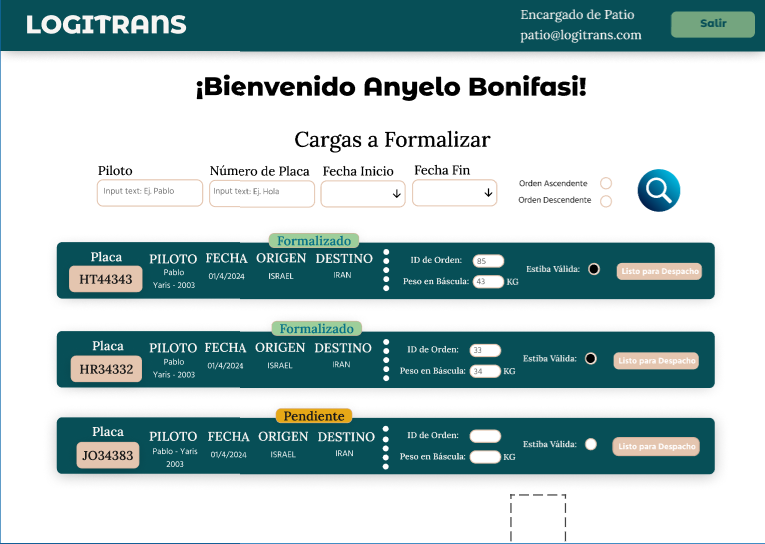

---

## Módulo de Agente Operativo — Gestión de Clientes y Contratos

Este módulo está diseñado para que el equipo operativo gestione la cartera de clientes, permitiendo el ingreso de nuevas empresas y la parametrización de sus condiciones comerciales.

---

### 1. Registrar Cliente Nuevo

Formulario estructurado para la creación de perfiles comerciales. Permite la captura de datos generales, información fiscal (NIT, Razón Social) y cuenta con una sección crítica para evaluar el **Perfil de Riesgo** (capacidad de pago, riesgo en aduanas y mercancía) antes de registrar y enviar las credenciales de acceso.

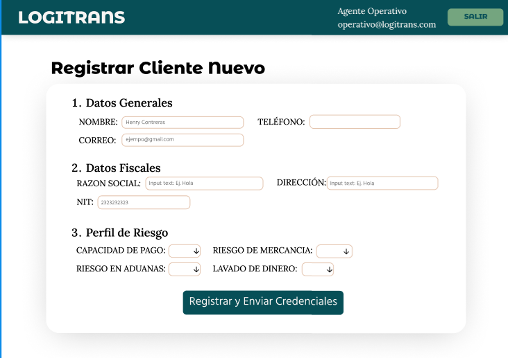

---

### 2. Formalización de Contrato

Interfaz para configurar los términos de servicio de un cliente ya registrado. Facilita la asignación de límites de crédito, plazos de pago (15, 30 o 45 días), y restricciones operativas como rutas autorizadas y tipos de carga permitidos, culminando con la generación y envío de la propuesta formal.

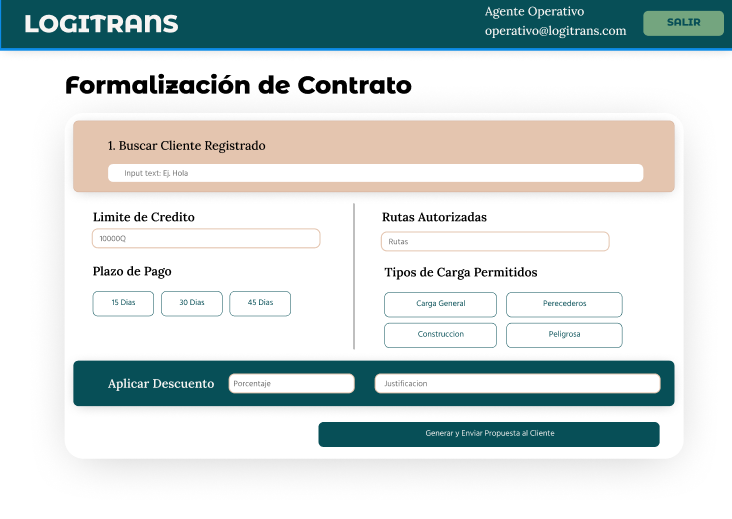

---

## Módulo de Pilotos — Gestión y Monitoreo de Viajes

Centro de operaciones para los conductores de la flota. Permite visualizar las cargas asignadas, reportar eventualidades en ruta y documentar la entrega final al cliente.

---

### 1. Dashboard del Piloto (Mis Viajes)

Pantalla de inicio para el conductor que muestra un resumen de sus asignaciones. Cuenta con un panel lateral de filtros avanzados y un listado de tarjetas de viaje que indican claramente el estado de la orden (Pendiente o En Tránsito), con botones de acción rápida para iniciar ruta o actualizar el estado.

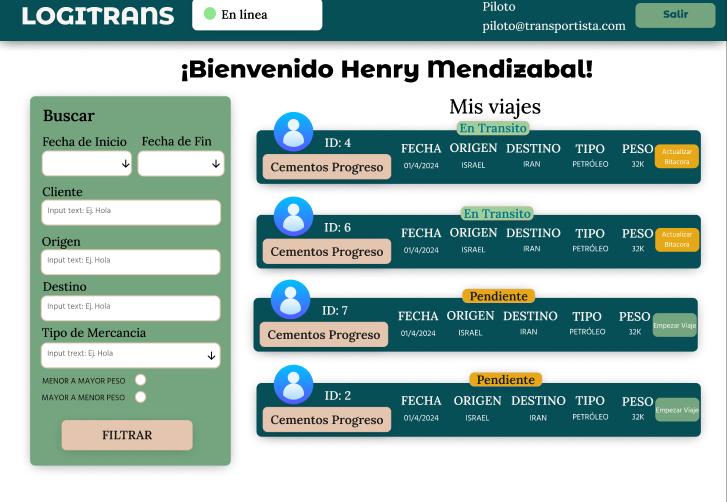

---

### 2. Monitoreo de Ruta y Bitácora de Eventos

Vista de seguimiento durante un viaje en curso. Presenta la información clave de la orden (origen, destino, tiempo estimado) y una **Bitácora de Eventos** en formato de línea de tiempo, donde el piloto documenta el progreso del trayecto hasta el momento de finalizar el viaje.

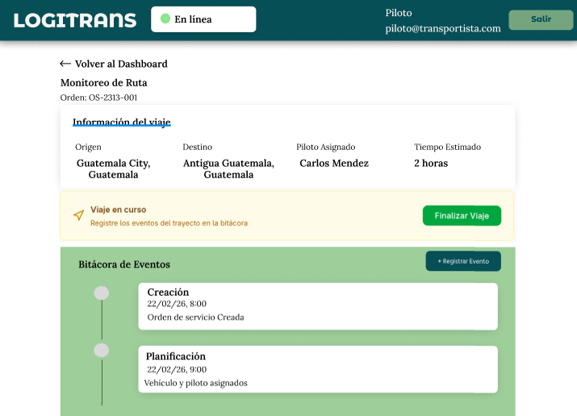

---

### 3. Confirmación de Entrega y Evidencia

Pantalla de cierre operativo que garantiza la cadena de custodia. Requiere que el piloto ingrese los datos del receptor de la carga y capture evidencia digital obligatoria, incluyendo la **Firma Digital** en pantalla y, opcionalmente, fotografías del estado de la mercancía entregada.

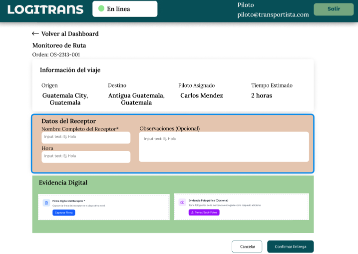

---

## Módulo de Facturación

Este módulo proporciona a los agentes financieros las herramientas necesarias para parametrizar costos, emitir documentos tributarios electrónicos (DTE) y llevar el control de los ingresos de la empresa.

---

### 1. Configuración Tarifario Base

Pantalla de parametrización financiera y operativa. Permite establecer y actualizar los costos base por kilómetro recorrido según el tipo de transporte (Unidad Ligera, Camión Pesado o Cabezal/Trailer) y su capacidad de carga máxima, sirviendo como cimiento para la cotización automática de los fletes.

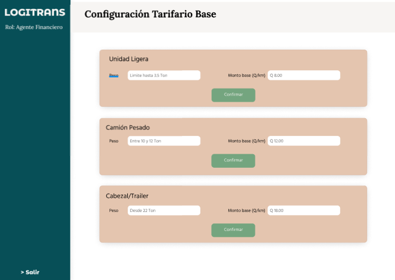

---

### 2. Panel de Facturación (Agente Financiero)

Centro de control para la gestión de cobros. Presenta un listado centralizado de los borradores de factura generados automáticamente cuando los viajes pasan a estado "Entregada", permitiendo al equipo financiero revisar el documento fiscal, ajustarlo si hace falta y remitirlo al flujo FEL.

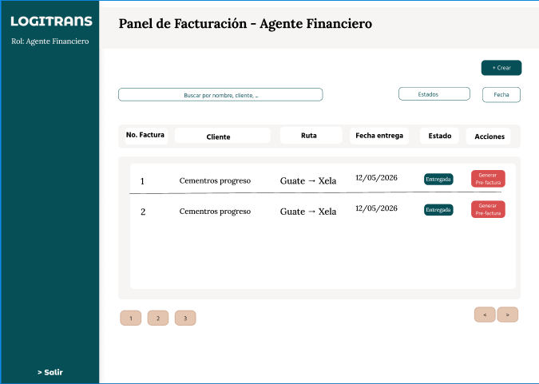

---

### 3. Revisión Pre-factura (DTE)

Vista previa y validación del borrador de cobro autogenerado. Permite al agente financiero auditar los datos fiscales del cliente, el concepto detallado del servicio logístico y el desglose de montos (Subtotal, IVA y Total a facturar) antes de enviar el documento definitivo para su certificación legal.

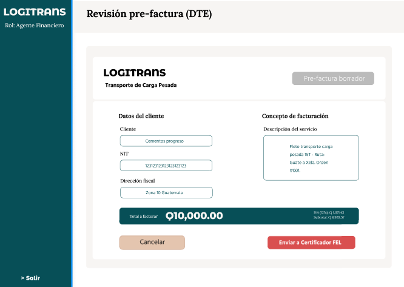

---

### 4. Portal Certificador FEL (Bandeja de Aprobación)

Simulador del entorno del certificador externo (Factura Electrónica en Línea). Funciona como una bandeja de entrada donde se reciben las pre-facturas emitidas por LogiTrans, permitiendo a la entidad tributaria autorizar ("Certificar") o rechazar los Documentos Tributarios Electrónicos (DTE).

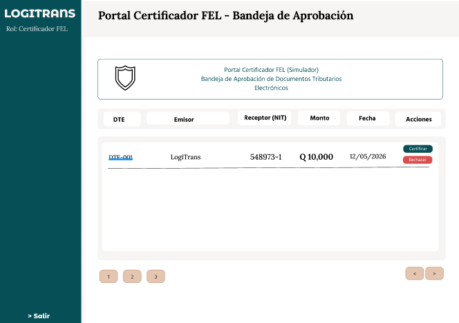

---

### 5. Conciliación de Pagos Recibidos

Interfaz diseñada para el cierre del ciclo financiero. Permite al agente cruzar y validar los abonos realizados por los clientes (identificados mediante banco y número de referencia) contra las facturas emitidas por el sistema, facilitando la acción de **"Aprobar y aplicar pago"** para mantener el saldo del cliente actualizado.

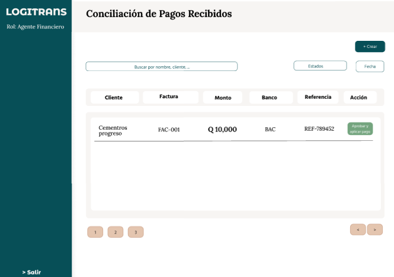

---

## Módulo de Cliente — Portal de Autogestión

Este módulo está diseñado para que los clientes de LogiTrans (como Cementos Progreso) tengan control total y visibilidad en tiempo real sobre sus operaciones logísticas, finanzas y acuerdos comerciales.

---

### 1. Dashboard Principal: Resumen Operativo

Pantalla de bienvenida que ofrece una radiografía inmediata de la cuenta. Muestra tres indicadores visuales clave: la cantidad de órdenes activas en ruta, un medidor gráfico del consumo del límite de crédito y el saldo pendiente de pago.

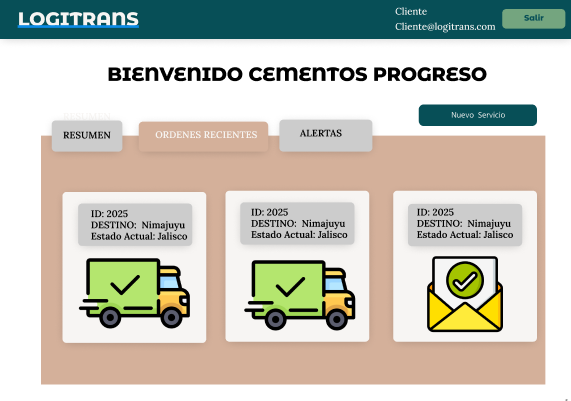

---

### 2. Panel de Alertas y Notificaciones

Centro de control de excepciones. Clasifica los eventos mediante un sistema de colores (Crítico, Medio, Información), alertando al cliente proactivamente sobre límites de crédito excedidos, facturas vencidas, problemas en ruta u órdenes recién entregadas.

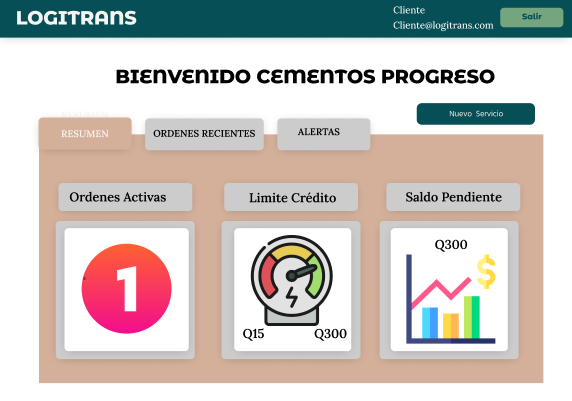

---

### 3. Estado de Cuenta Financiero

Visor del estatus crediticio. Detalla numéricamente el límite de crédito, la deuda actual y el saldo disponible. Incorpora un semáforo de "Reporte de vencimientos" (Al día, Vencido, Crítico) y un carrusel interactivo para revisar las facturas con pagos pendientes.

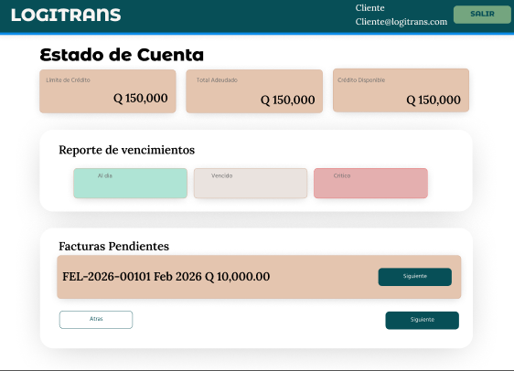

---

### 4. Historial de Facturas (DTE)

Tabla de gestión documental. Proporciona al cliente un repositorio con buscador para consultar todas sus facturas emitidas. Detalla el número de autorización fiscal, monto y estado, con acciones directas para descargar el documento en formato PDF.

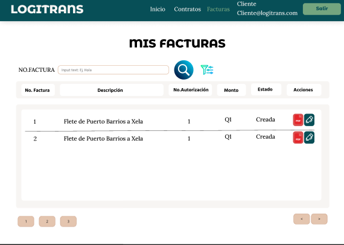

---

### 5. Visualizador Rápido de Documentos

Interfaz de confirmación o modal rápido que indica la localización exitosa de un documento financiero específico dentro del sistema para su pronta descarga o revisión.

---

### 6. Repositorio de Contratos

Panel de gestión legal. Interfaz visual que clasifica los acuerdos comerciales del cliente en dos grandes categorías: contratos **"Vigentes"** y **"Vencidos"**, facilitando la auditoría de los términos de servicio a lo largo del tiempo.

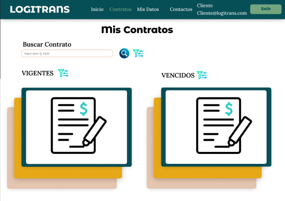

---

### 7. Búsqueda Avanzada de Contratos

Formulario de filtrado detallado. Permite al usuario localizar acuerdos específicos cruzando variables como fechas de inicio/finalización, rutas autorizadas, tipo de carga (ej. peligrosa, perecedera) y estado del documento.

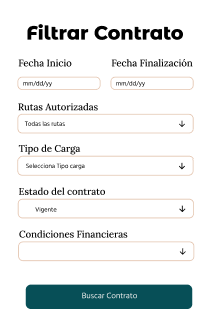

---

### 8. Detalle de Contrato (Modal)

Vista ampliada del acuerdo comercial. Resume las reglas de negocio activas para la empresa (ej. Empresa S.A), incluyendo la vigencia, las condiciones financieras (crédito y plazos de pago), las rutas autorizadas y el tarifario exacto pactado por tipo de vehículo.

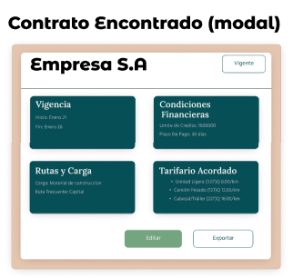

---

### 9. Mi Perfil (Datos Corporativos)

Panel de administración de la cuenta. Permite al cliente actualizar sus credenciales de acceso (Datos Generales) y mantener al día su información fiscal (Razón Social, NIT, Dirección), la cual es vital para la correcta emisión de las facturas automáticas.

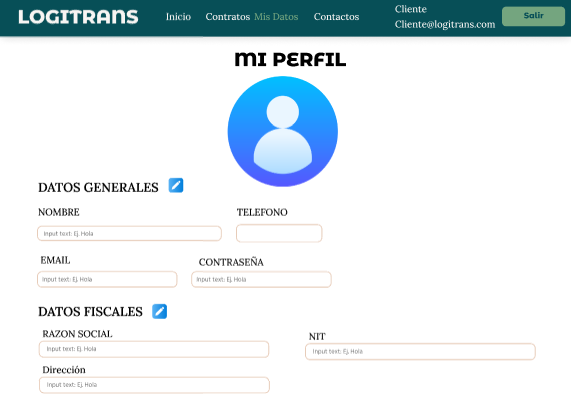

---

### 10. Gestión de Contactos Clave

Directorio corporativo del cliente. Interfaz que permite registrar, editar o eliminar a los diferentes miembros de su equipo (gerentes, encargados de bodega) que interactuarán con LogiTrans, detallando sus roles, correos y números de teléfono.

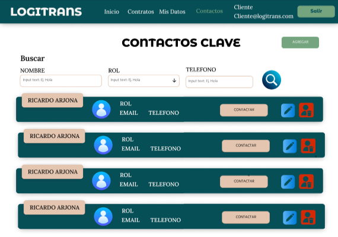

---

### 11. Órdenes Recientes (Visor Rápido)

Pestaña secundaria del Dashboard para el seguimiento operativo. Despliega un carrusel de tarjetas individuales por cada orden de transporte activa (ej. ID: 2025), mostrando de un vistazo su destino y estado geográfico actual (ej. Jalisco). Utiliza iconos ilustrativos para identificar rápidamente en qué fase se encuentra el camión.

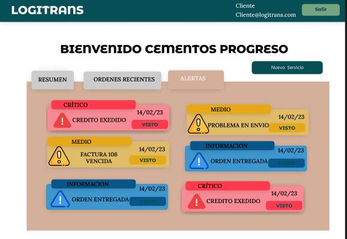

---

### 12. Creación de Nueva Solicitud (Paso 1: Datos de Carga)

Asistente guiado (stepper) para que el cliente programe un nuevo viaje. En esta primera fase de "Detalles de la Solicitud", el sistema captura la información logística básica: el contrato a utilizar, el tipo de mercancía, las ubicaciones exactas de origen/destino y el peso estimado, antes de avanzar a la asignación de recursos.

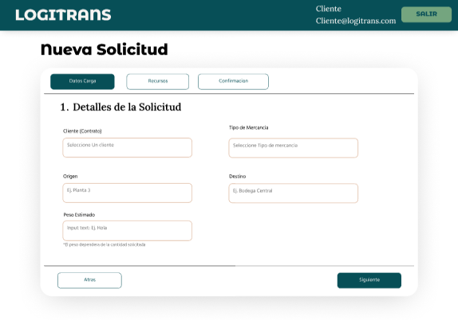

---

### 13. Búsqueda Avanzada de Facturas

Formulario complementario al historial financiero. Proporciona al cliente filtros específicos para localizar ágilmente un documento tributario dentro de un volumen grande de operaciones, permitiendo acotar la búsqueda por rangos de fecha (inicio y finalización) y por el estado actual de la factura.

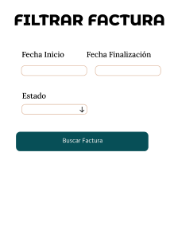

---

### 14. Trazabilidad y Detalles de la Orden (Modal)

Visor detallado del estado de un servicio. Permite al cliente auditar la "Bitácora de Viaje" en tiempo real, leyendo las actualizaciones cronológicas reportadas por el piloto y el personal de patio (ej. carga pesada, salida del predio, paso por punto de control GPS) junto con las ubicaciones exactas de origen y destino.

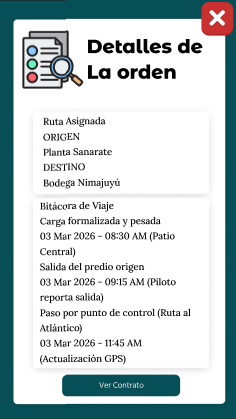