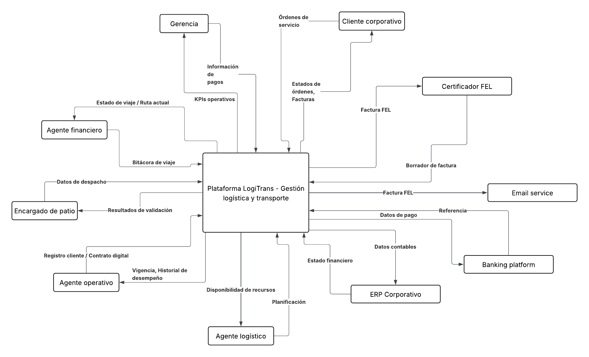
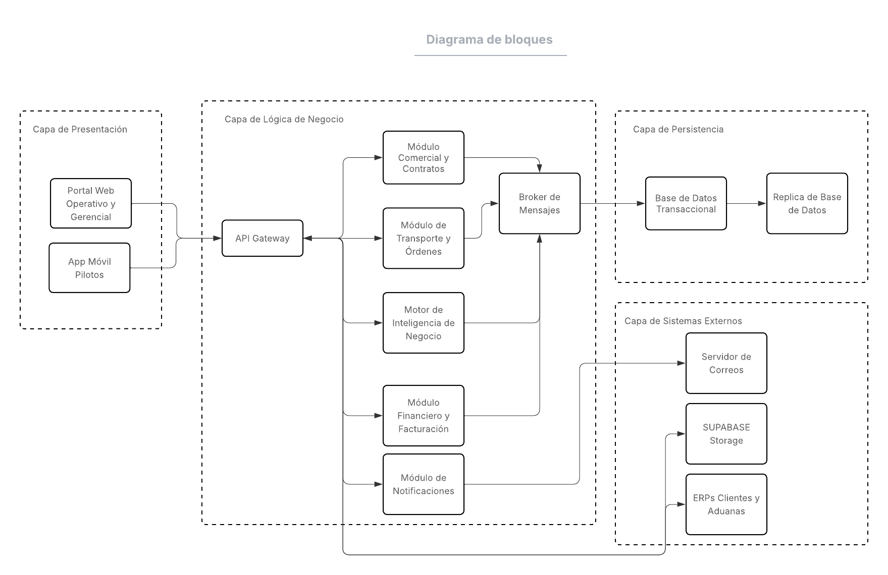
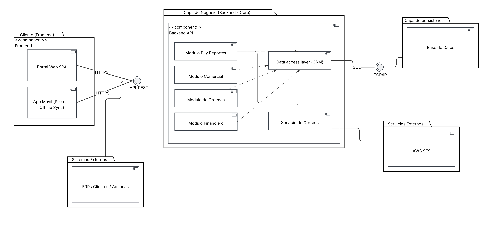
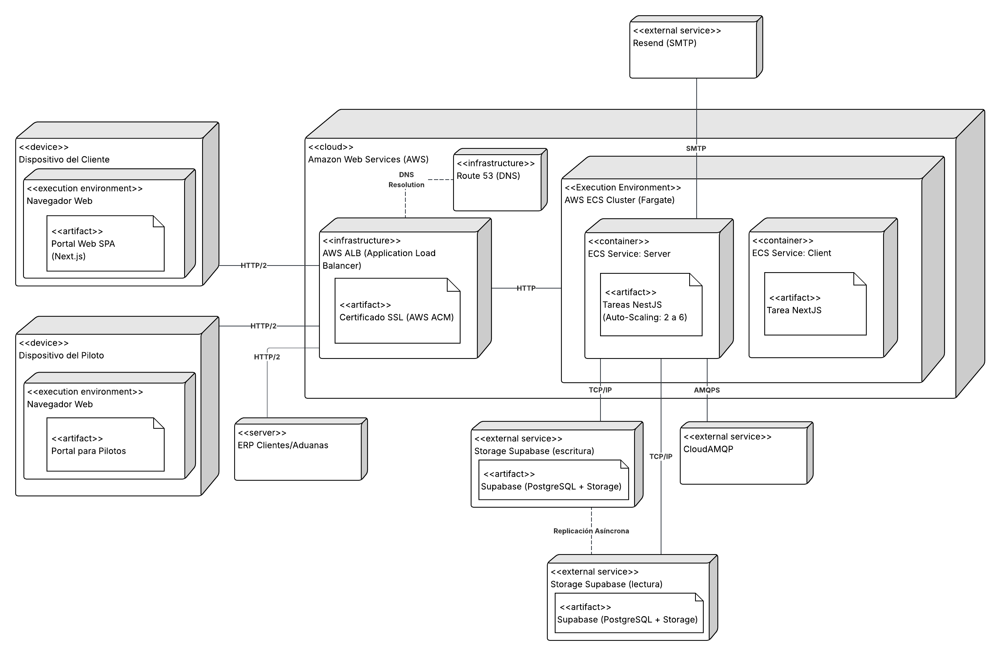

# Arquitectura del Sistema — LogiTrans

---

## Tabla de Contenidos

- [Arquitectura del Sistema — LogiTrans](#arquitectura-del-sistema--logitrans)
  - [Tabla de Contenidos](#tabla-de-contenidos)
  - [1. Resumen Arquitectónico](#1-resumen-arquitectónico)
  - [2. Estilo y Patrón Arquitectónico](#2-estilo-y-patrón-arquitectónico)
  - [3. Diagrama de Contexto](#3-diagrama-de-contexto)
    - [Actores Humanos (Usuarios del Sistema)](#actores-humanos-usuarios-del-sistema)
    - [Sistemas Externos](#sistemas-externos)
  - [4. Diagrama de Bloques](#4-diagrama-de-bloques)
    - [CDU001 — Gestión Comercial y Contratos](#cdu001--gestión-comercial-y-contratos)
    - [CDU002 — Gestión de Órdenes y Transporte](#cdu002--gestión-de-órdenes-y-transporte)
    - [CDU003 — Gestión Financiera y Facturación](#cdu003--gestión-financiera-y-facturación)
    - [CDU004 — Inteligencia de Negocio y Reportes](#cdu004--inteligencia-de-negocio-y-reportes)
  - [5. Diagrama de Componentes](#5-diagrama-de-componentes)
    - [Capa de Presentación (Frontend)](#capa-de-presentación-frontend)
    - [Capa de API Gateway](#capa-de-api-gateway)
    - [Capa de Servicios (Backend por Módulo)](#capa-de-servicios-backend-por-módulo)
    - [Capa de Integración (Adapters)](#capa-de-integración-adapters)
    - [Capa de Persistencia](#capa-de-persistencia)
  - [6. Decisiones Arquitectónicas Clave](#6-decisiones-arquitectónicas-clave)
  - [7. Infraestructura y Despliegue](#7-infraestructura-y-despliegue)

---

## 1. Resumen Arquitectónico

El sistema **LogiTrans** es una plataforma de gestión logística y transporte diseñada para operar en múltiples sedes (Ciudad de Guatemala, Xela y Puerto Barrios). Su arquitectura está orientada a soportar la operación diaria de una empresa de transporte de carga, cubriendo desde la negociación comercial y la generación de órdenes de servicio, hasta la facturación electrónica y la inteligencia de negocio gerencial.

Los principios que guían la arquitectura son:

| Principio | Descripción |
|-----------|-------------|
| **Disponibilidad** | Operación 24/7 con una meta de 99.5% de uptime y recuperación ante fallas en menos de 10 minutos. |
| **Escalabilidad** | Capacidad de absorber un crecimiento del 200% en el volumen transaccional en un horizonte de 3 años. |
| **Bajo Acoplamiento** | Módulos independientes que se comunican mediante APIs, permitiendo agregar funcionalidades regionales (ej. aduanas) sin afectar el núcleo. |
| **Cloud-Ready** | Despliegue inicial on-premise usando infraestructura existente, con un diseño contenerizado que facilita la migración a la nube en el futuro. |
| **Seguridad y Auditabilidad** | Control de acceso basado en roles (RBAC) y bitácora de auditoría inalterable para el 100% de las operaciones críticas. |

---

## 2. Estilo y Patrón Arquitectónico

La plataforma adopta una **arquitectura modular orientada a servicios** con los siguientes elementos:

- **Backend por módulos:** Cada dominio del negocio (Contratos, Órdenes, Facturación, BI) está encapsulado en un módulo de backend con responsabilidades bien delimitadas, expuesto a través de una API REST.
- **Frontend desacoplado:** Una aplicación web SPA (Single Page Application) que consume la API del backend, permitiendo que ambas capas escalen de forma independiente.
- **Contenerización (Docker):** Todos los servicios se empaquetan en contenedores para garantizar la portabilidad entre ambientes (desarrollo, staging, producción on-premise y futura nube).
- **Integración con sistemas externos:** El sistema expone y consume interfaces estándar para integrarse con el Certificador FEL (SAT) y potenciales ERPs de clientes corporativos.
- **Base de datos relacional centralizada:** Almacena la información de todos los módulos con integridad referencial, asegurando consistencia de datos entre Contratos, Órdenes, Facturación y Reportes.
- **Mensajería asíncrona (RabbitMQ):** Eventos de dominio entre módulos desacoplados mediante un message broker, garantizando que los cambios de estado no queden bloqueados por servicios externos.

---

## 3. Diagrama de Contexto



> **Descripción del diagrama:** El diagrama presenta al sistema LogiTrans como núcleo central rodeado por siete actores humanos (Cliente, Agente Operativo, Agente Logístico, Encargado de Patio, Piloto, Agente Financiero y Gerencia) y dos sistemas externos (Certificador FEL de SAT y ERPs de Clientes Corporativos). Las flechas bidireccionales representan los flujos de datos e interacciones entre cada actor y la plataforma, delimitando claramente la frontera del sistema y diferenciando los roles internos de las integraciones externas.

El diagrama de contexto sitúa al sistema LogiTrans como el núcleo central y define todos los actores externos que interactúan con él. Se identifican dos categorías de actores:

### Actores Humanos (Usuarios del Sistema)

| Actor | Interacción con el Sistema |
|-------|---------------------------|
| **Cliente** | Genera órdenes de servicio, acepta contratos digitales, consulta el estado de sus envíos y gestiona sus pagos a través del portal web. |
| **Agente Operativo** | Registra y perfilamiento de clientes, formaliza contratos digitales y aplica tarifas y descuentos. |
| **Agente Logístico** | Planifica y asigna recursos (pilotos y vehículos) a las órdenes de transporte aprobadas. |
| **Encargado de Patio** | Valida la identidad del piloto, el pesaje de la carga y las condiciones de estiba antes de autorizar el despacho físico. |
| **Piloto** | Registra la bitácora del viaje, reporta novedades y confirma la entrega con evidencia fotográfica desde un dispositivo móvil. |
| **Agente Financiero** | Configura el tarifario base, emite facturas FEL y concilia los pagos recibidos de los clientes. |
| **Gerencia** | Visualiza el dashboard gerencial con KPIs, márgenes de rentabilidad y proyecciones de capacidad operativa. |

### Sistemas Externos

| Sistema | Tipo de Integración |
|---------|---------------------|
| **Certificador FEL (SAT)** | Integración en tiempo real mediante API. Recibe los documentos tributarios electrónicos (DTE), los valida, firma digitalmente y devuelve la certificación oficial ante la SAT. |
| **ERPs de Clientes Corporativos** | Integración opcional vía API REST para consultar el estado y geolocalización de órdenes en tiempo real, sin intervención humana. |

El contexto deja en claro que el sistema **no** gestiona directamente la infraestructura de comunicación satelital ni los dispositivos GPS; esos datos son aportados por el piloto a través de la bitácora de viaje.

---

## 4. Diagrama de Bloques



> **Descripción del diagrama:** El diagrama muestra los cuatro bloques funcionales del sistema — CDU001 (Gestión Comercial y Contratos), CDU002 (Gestión de Órdenes y Transporte), CDU003 (Gestión Financiera y Facturación) y CDU004 (Inteligencia de Negocio y Reportes) — conectados secuencialmente de izquierda a derecha siguiendo el ciclo de vida de un servicio de transporte. CDU001 alimenta a CDU002, que a su vez desencadena CDU003 para el cierre financiero, mientras CDU004 consume datos transversales de todos los módulos. Todos los bloques comparten una misma base de datos relacional centralizada, garantizando la consistencia e integridad referencial.

El diagrama de bloques descompone el sistema en sus cuatro módulos funcionales principales, mostrando cómo se relacionan entre sí y con la base de datos compartida. El flujo de negocio recorre los módulos de izquierda a derecha en dirección a la facturación, siguiendo el ciclo de vida de un servicio de transporte:

```
[CDU001: Contratos] ──► [CDU002: Órdenes] ──► [CDU003: Facturación]
                                  │
                                  ▼
                         [CDU004: BI / Reportes]
```

### CDU001 — Gestión Comercial y Contratos

Módulo de entrada al sistema. Gestiona el ciclo de vida de la relación comercial:
- Registro y perfilamiento de clientes (validación de NIT ante SAT).
- Gestión de credenciales de acceso (generación y envío cifrado de credenciales).
- Configuración del tarifario base diferenciado por tipo de unidad (Ligera 3.5T / Pesada 10-12T / Cabezal 22T+).
- Formalización de contratos digitales con aceptación por ambas partes.
- Validación automática de riesgo y crédito (bloqueo ante mora o límite excedido).

**Precondición para CDU002:** Existencia de un contrato en estado "Vigente".

### CDU002 — Gestión de Órdenes y Transporte

Módulo operativo central. Gestiona el flujo completo del servicio de transporte:
- Generación de órdenes por parte del cliente (condicionada a contrato vigente y crédito disponible).
- Planificación y asignación de piloto + vehículo compatibles con los requerimientos de la carga.
- Registro del despacho en patio (validación de identidad, pesaje y estiba).
- Registro de bitácora de viaje y geolocalización por el piloto.
- Confirmación de entrega con evidencia fotográfica y firma de recepción.

**Precondición para CDU003:** Orden en estado "Entregado".

### CDU003 — Gestión Financiera y Facturación

Módulo de cierre del ciclo económico:
- Emisión automática de Facturas Electrónicas (FEL) con validación fiscal.
- Certificación del DTE ante la SAT a través del Certificador FEL externo.
- Generación de representación gráfica de la factura (PDF).
- Gestión del estado de cuenta del cliente (saldos, facturas pendientes y vencimientos).
- Registro y aplicación de pagos con trazabilidad bancaria completa.
- Bloqueo automático de nuevos servicios ante facturas vencidas de 45+ días.

### CDU004 — Inteligencia de Negocio y Reportes

Módulo de soporte a la decisión gerencial:
- Dashboard consolidado de las tres sedes con KPIs actualizados diariamente.
- Cálculo de márgenes de rentabilidad y tiempos de entrega.
- Alertas automáticas ante desviaciones configurables (caída de ingresos ≥ 15% semanal).
- Simulación de escenarios de proyección de capacidad operativa y expansión regional.
- Acceso restringido exclusivamente a roles de Gerencia General y Financiera.

---

## 5. Diagrama de Componentes



> **Descripción del diagrama:** El diagrama descompone la arquitectura interna del sistema en cinco capas horizontales claramente diferenciadas: (1) la **Capa de Presentación** con una SPA que ofrece portales diferenciados por rol (Cliente, Agentes, Patio/Piloto y Gerencia); (2) la **Capa de API Gateway** que centraliza la autenticación RBAC/JWT, el enrutamiento y la protección ante ataques; (3) la **Capa de Servicios Backend** con un servicio REST independiente por módulo (Contratos, Órdenes, Facturación, BI y Autenticación); (4) la **Capa de Integración** con adapters dedicados para el Certificador FEL (SAT) y los ERPs de clientes; y (5) la **Capa de Persistencia** compuesta por PostgreSQL como base de datos relacional y un almacén de archivos para evidencias y documentos. Las interfaces entre capas están definidas mediante contratos API REST/JSON.

El diagrama de componentes muestra la descomposición interna de la arquitectura de software, detallando los bloques de código y sus interfaces. La arquitectura se organiza en las siguientes capas:

### Capa de Presentación (Frontend)

Una aplicación **SPA (Single Page Application)** construida con un framework moderno (React/Vue). Se divide en vistas modulares alineadas con cada CDU:

- **Portal de Cliente:** Generación de órdenes, consulta de estado, gestión de contratos y pagos.
- **Panel de Agentes:** Interfaces diferenciadas para el Agente Operativo, Logístico y Financiero según su rol.
- **Panel de Patio/Piloto:** Interfaz optimizada para móvil con soporte a baja conectividad (modo offline-sync) para el registro de despacho y bitácora.
- **Dashboard Gerencial:** Visualizaciones de KPIs, gráficos de rentabilidad y herramientas de proyección.

### Capa de API Gateway

Punto de entrada único al sistema backend. Responsable de:
- Autenticación y autorización basada en roles (RBAC / JWT).
- Enrutamiento de peticiones hacia el módulo correspondiente.
- Rate limiting y protección ante ataques.
- Logging centralizado de todas las peticiones entrantes.

### Capa de Servicios (Backend por Módulo)

Cada módulo expone su propia lógica de negocio como un conjunto de servicios REST:

| Servicio | Responsabilidades Clave |
|----------|------------------------|
| **Servicio de Contratos** | CRUD de clientes, validación de NIT, gestión de tarifas, firma y aceptación de contratos. |
| **Servicio de Órdenes** | Creación de órdenes, validación de crédito, asignación de recursos, flujo de estados de la orden (Creada → Asignada → Despachada → En Tránsito → Entregada). |
| **Servicio de Facturación** | Generación del DTE, integración con Certificador FEL, emisión de PDF, conciliación de pagos. |
| **Servicio de BI** | Consultas agregadas, cálculo de KPIs, generación de alertas, motor de proyección. |
| **Servicio de Autenticación** | Gestión de usuarios, roles, contraseñas, recuperación de acceso y sesiones. |

### Capa de Integración (Adapters)

Componentes que aíslan la lógica de negocio de las dependencias externas:

- **Adapter FEL:** Encapsula la comunicación con el Certificador FEL (SAT). Maneja reintentos y errores de indisponibilidad del servicio externo.
- **Adapter ERP:** Expone endpoints públicos documentados (REST/JSON) para el consumo por parte de ERPs de clientes.
- **Adapter de Notificaciones (Resend):** Encapsula el envío de correos transaccionales (credenciales, recuperación de contraseña y envío de factura certificada) usando Resend como proveedor del MVP.
- **Adapter RabbitMQ (`RabbitmqModule`):** Módulo global de NestJS que encapsula la conexión con RabbitMQ. Expone `RabbitmqService.emit(pattern, payload)` para que cualquier módulo publique eventos de dominio sin acoplarse al broker.

### Capa de Persistencia

- **Base de Datos Relacional (PostgreSQL):** Almacén principal de todos los módulos. Garantiza integridad referencial entre Contratos, Órdenes y Facturas. Incluye tablas de auditoría (bitácoras inmutables) para el registro de quién hizo qué y cuándo.
- **Almacenamiento de Archivos:** Almacén para evidencias fotográficas de entrega, PDFs de facturas y documentos contractuales firmados.

---

## 6. Decisiones Arquitectónicas Clave

| Decisión | Justificación |
|----------|---------------|
| **Módulos independientes con API REST** | Permite bajo acoplamiento (RNF-04 Modificabilidad), facilitando añadir módulos regionales (aduanas de Honduras/El Salvador) sin afectar el núcleo. Alineado con EAC-04. |
| **Contenerización con Docker** | Garantiza portabilidad entre ambientes y prepara la migración Cloud-Ready (RES-02), reduciendo el esfuerzo de migración a menos de 1 semana (EAC-06). |
| **RBAC (Control de Acceso Basado en Roles)** | Protege datos tarifarios y financieros sensibles. Cumple con RNF-03 y asegura que el 100% de los accesos no autorizados sean denegados (EAC-03). |
| **Despliegue on-premise inicial** | Cumple la restricción presupuestaria (RES-01) al reutilizar los servidores físicos existentes. El diseño Cloud-Ready protege la inversión a largo plazo. |
| **Nodo de failover / HA** | El nodo secundario en la infraestructura on-premise garantiza una recuperación en menos de 10 minutos (EAC-01) y el uptime del 99.5% (RNF-01). |
| **Stack tecnológico maduro** | Cumple la restricción RES-04, evitando tecnologías experimentales que puedan comprometer el time-to-market de 4 semanas (RES-03). |
| **Interfaz móvil offline-sync para Piloto** | Responde a la necesidad operativa de que los pilotos puedan registrar bitácora y confirmar entregas en zonas con baja o nula conectividad (RNF-02 Usabilidad). |
| **RabbitMQ como message broker** | Desacopla los cambios de estado de negocio de sus efectos secundarios (notificaciones, procesos downstream). Los 4 eventos críticos del flujo (orden entregada, factura certificada/rechazada, pago aprobado) se publican de forma no bloqueante. Degradación elegante: si el broker no está disponible, el servidor continúa operando. |

---

## 7. Infraestructura y Despliegue



> **Descripción del diagrama:** El diagrama de despliegue ilustra la topología física on-premise del sistema LogiTrans, compuesta por dos nodos interconectados en alta disponibilidad. El **Nodo Principal** (ubicado en Guatemala) aloja el API Gateway, todos los servicios backend contenerizados en Docker, la base de datos PostgreSQL primaria y la distribución del frontend. El **Nodo Secundario** (Failover/HA) mantiene una réplica sincronizada de la base de datos y los servicios en estado de espera activa, listos para asumir la operación en caso de falla del nodo principal (recuperación < 10 min). Ambos nodos se conectan hacia los sistemas externos — el Certificador FEL (SAT) y los ERPs de Clientes Corporativos — a través de Internet/VPN. La arquitectura contenerizada permite que toda la infraestructura pueda migrarse a un proveedor Cloud (AWS, GCP o Azure) sin reescritura de código.

La plataforma se despliega en una topología de dos nodos sobre infraestructura física existente de la empresa:

```
┌─────────────────────────────────────────────────────────┐
│                  INFRAESTRUCTURA ON-PREMISE              │
│                                                         │
│  ┌──────────────────────┐    ┌──────────────────────┐   │
│  │   NODO PRINCIPAL     │    │   NODO SECUNDARIO    │   │
│  │  (Guatemala)         │◄──►│   (Failover / HA)    │   │
│  │                      │    │                      │   │
│  │  - API Gateway       │    │  - Réplica de DB     │   │
│  │  - Servicios Backend │    │  - Servicios en      │   │
│  │  - Base de Datos     │    │    espera activa      │   │
│  │  - Frontend (CDN)    │    │                      │   │
│  │  - RabbitMQ          │    │                      │   │
│  │    (message broker)  │    │                      │   │
│  └──────────────────────┘    └──────────────────────┘   │
│                                                         │
└───────────────────────┬─────────────────────────────────┘
                        │ Internet / VPN
          ┌─────────────┴─────────────┐
          │                           │
   ┌──────▼──────┐             ┌──────▼──────┐
   │ Certificador│             │  ERPs de    │
   │  FEL (SAT)  │             │  Clientes   │
   └─────────────┘             └─────────────┘
```

**Estrategia de evolución:** Una vez agotada la vida útil de los servidores on-premise, todos los contenedores Docker pueden ser trasladados directamente a un proveedor Cloud (AWS, GCP o Azure) sin reescritura del código, cumpliendo la restricción RES-02.

---

**Fecha de última actualización:** 6 de abril de 2026
**Equipo:** Grupo 2 — Análisis y Diseño de Sistemas 2
