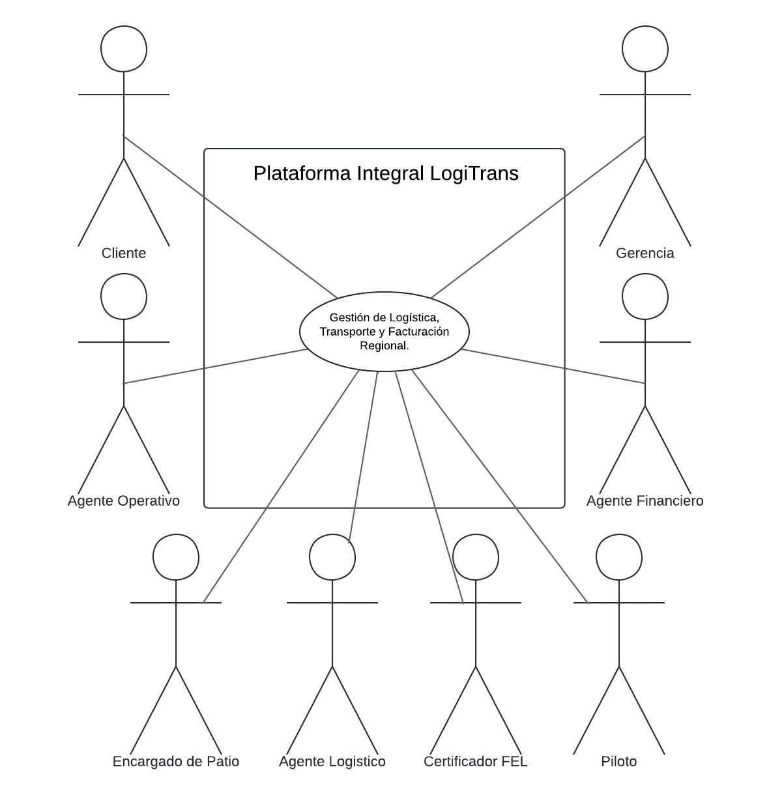
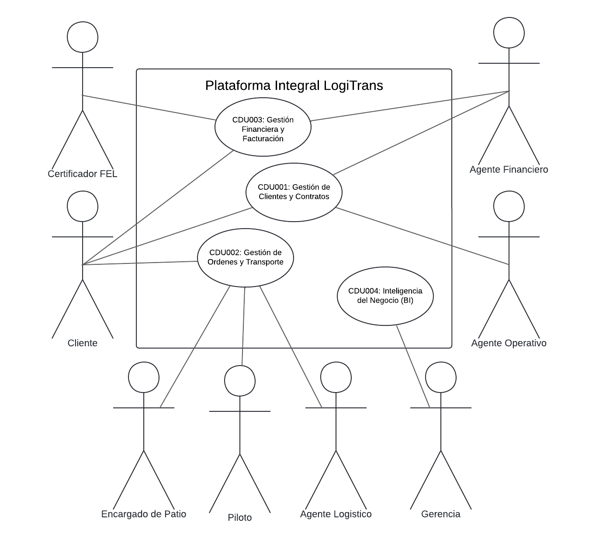
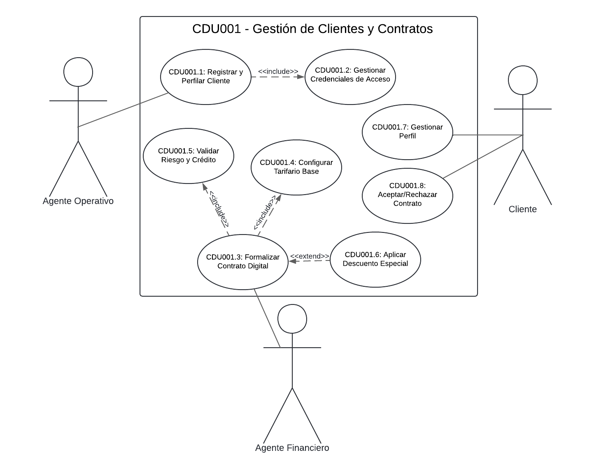
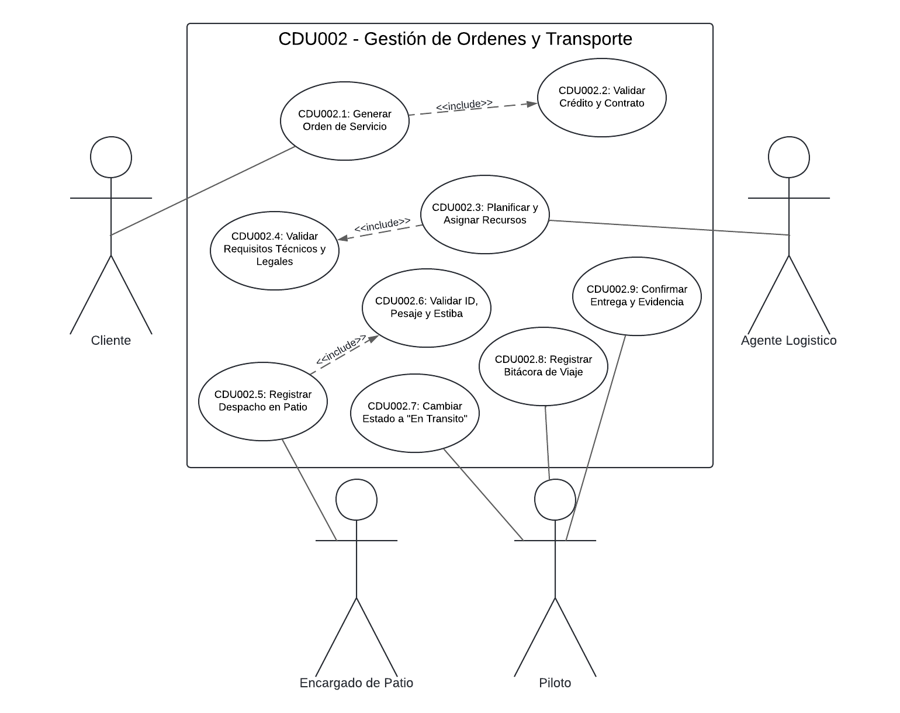
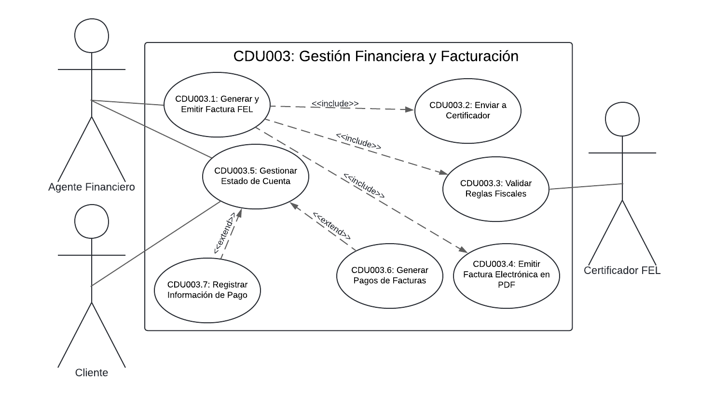
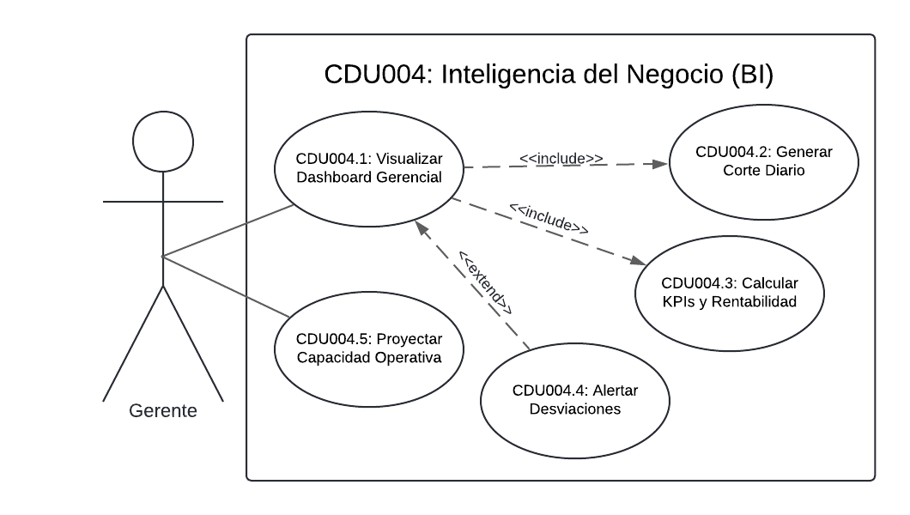

# Documento de Decisión de Arquitectura (DDA)

---

## Índice

- [Documento de Decisión de Arquitectura (DDA)](#documento-de-decisión-de-arquitectura-dda)
  - [Índice](#índice)
  - [1. Caso del Negocio](#1-caso-del-negocio)
    - [Actores del Sistema](#actores-del-sistema)
    - [Diagrama de Casos de Uso de Negocio — Alto Nivel](#diagrama-de-casos-de-uso-de-negocio--alto-nivel)
    - [Primera Descomposición](#primera-descomposición)
  - [2. Listado de Stakeholders y Preocupaciones Arquitectónicas](#2-listado-de-stakeholders-y-preocupaciones-arquitectónicas)
  - [3. Características del Sistema Priorizadas](#3-características-del-sistema-priorizadas)
    - [Prioridad 1: Críticas (Mandatorias para el éxito del negocio)](#prioridad-1-críticas-mandatorias-para-el-éxito-del-negocio)
    - [Prioridad 2: Altas (Necesarias para la expansión regional)](#prioridad-2-altas-necesarias-para-la-expansión-regional)
    - [Prioridad 3: Medias (Soporte a la operación diaria)](#prioridad-3-medias-soporte-a-la-operación-diaria)
  - [4. Drivers de Requisitos Funcionales](#4-drivers-de-requisitos-funcionales)
    - [4.1. Requisitos Funcionales](#41-requisitos-funcionales)
    - [4.2. CDU001 – Gestión Comercial y Contratos](#42-cdu001--gestión-comercial-y-contratos)
    - [4.3. CDU002 – Gestión de Órdenes y Transporte](#43-cdu002--gestión-de-órdenes-y-transporte)
    - [4.4. CDU003 – Gestión Financiera y Facturación](#44-cdu003--gestión-financiera-y-facturación)
    - [4.5. CDU004 – Inteligencia de Negocio y Reportes](#45-cdu004--inteligencia-de-negocio-y-reportes)
  - [5. Drivers de Calidad](#5-drivers-de-calidad)
    - [5.1. Requisitos No Funcionales](#51-requisitos-no-funcionales)
    - [5.2. EAC-01: Disponibilidad (Crítico)](#52-eac-01-disponibilidad-crítico)
    - [5.3. EAC-02: Escalabilidad y Rendimiento (Crítico)](#53-eac-02-escalabilidad-y-rendimiento-crítico)
    - [5.4. EAC-03: Seguridad y Auditabilidad (Alto)](#54-eac-03-seguridad-y-auditabilidad-alto)
    - [5.5. EAC-04: Modificabilidad (Alto)](#55-eac-04-modificabilidad-alto)
    - [5.6. EAC-05: Interoperabilidad (Medio)](#56-eac-05-interoperabilidad-medio)
    - [5.7. EAC-06: Portabilidad / Eficiencia de Costos (Restricción Técnica)](#57-eac-06-portabilidad--eficiencia-de-costos-restricción-técnica)
  - [6. Drivers de Restricción](#6-drivers-de-restricción)
  - [7. Matrices de Trazabilidad](#7-matrices-de-trazabilidad)
    - [7.1. Matriz RF vs. Stakeholders](#71-matriz-rf-vs-stakeholders)
    - [7.2. Matriz RF vs. RNF](#72-matriz-rf-vs-rnf)
    - [7.3. Matriz CDU vs. EAC](#73-matriz-cdu-vs-eac)
    - [7.4. Matriz CDU vs. Actores](#74-matriz-cdu-vs-actores)

---

## 1. Caso del Negocio

### Actores del Sistema

| Actor | Descripción |
|---|---|
| Cliente | Empresa externa que solicita servicios de transporte, consulta el estado de sus envíos y gestiona sus contratos. |
| Agente Operativo | Encargado de la gestión comercial: registra clientes, perfila riesgos y formaliza los contratos y tarifas. |
| Agente Logístico | Responsable de la operación de transporte: asigna pilotos, selecciona vehículos y planifica las rutas de las órdenes generadas. |
| Encargado de Patio | Personal en sitio responsable del despacho físico, validación de seguridad, pesaje y estiba de la carga. |
| Piloto | Conductor de la unidad de transporte encargado de la ejecución del viaje, reporte de bitácora y confirmación de entrega. |
| Agente Financiero | Responsable de la configuración de precios base, facturación electrónica y gestión de cobros. |
| Certificador FEL | Entidad externa autorizada por la SAT para validar, firmar digitalmente y certificar los Documentos Tributarios Electrónicos (DTE) en el proceso de Facturación Electrónica en Línea. |
| Gerencia | Usuario estratégico que visualiza reportes de rendimiento y KPIs para la toma de decisiones. |

### Diagrama de Casos de Uso de Negocio — Alto Nivel

### Primera Descomposición

---

## 2. Listado de Stakeholders y Preocupaciones Arquitectónicas

| Stakeholder | Visión / Interés Principal | Preocupación Arquitectónica |
|---|---|---|
| Gerente General (Patrocinador) | Enfoque estratégico y financiero; busca minimizar costos iniciales y asegurar un retorno de inversión corto. | **Costo y Viabilidad Económica:** Rechazará propuestas con gastos excesivos que no aporten beneficio inmediato. |
| Gerente de TI (Responsabilidad Técnica) | Heredar una arquitectura robusta, mantenible y escalable. | **Calidad Estructural y Escalabilidad:** Teme a soluciones "parche" y prioriza la calidad sobre las prisas. |
| Jefe de Operaciones (Voz Operativa) | Prioriza la rapidez operativa y la simplicidad de uso en sedes y puertos. | **Usabilidad y Rendimiento:** Un sistema lento o complejo para los usuarios operativos se considera un fracaso. |
| Área Financiera (Control Económico) | Blindaje del presupuesto, evitando sobrecostos y licenciamientos costosos. | **Reutilización de Recursos:** Exigen una solución austera que aproveche al máximo la infraestructura (servidores) que la empresa ya posee. |
| Clientes Corporativos (Exigencia de Mercado) | Confianza en el servicio mediante el conocimiento en tiempo real de la ubicación de su carga. | **Disponibilidad y Trazabilidad:** Exigen que el sistema esté activo 24/7 y ofrezca trazabilidad total de órdenes. |
| Equipo de Desarrollo (Implementadores) | Construir la solución en un plazo máximo estricto de 4 semanas. | **Riesgo Técnico y Familiaridad:** Necesidad de utilizar tecnologías conocidas; aversión a innovaciones experimentales que retrasen la entrega. |

---

## 3. Características del Sistema Priorizadas

### Prioridad 1: Críticas (Mandatorias para el éxito del negocio)

- **Disponibilidad:** Alta exigencia del mercado para operar 24/7. Existe un compromiso de disponibilidad del 99.5% y una exigencia de recuperación total del servicio en menos de 10 minutos para evitar camiones detenidos.

- **Escalabilidad:** El sistema debe soportar la ambición del negocio de triplicar la operación en tres años. Debe absorber un aumento del 200% en el volumen de transacciones sin degradar la velocidad de respuesta.

- **Eficiencia de Costos:** Restricción directa de la Gerencia y el Área Financiera para respetar un presupuesto ajustado, priorizando la reutilización de servidores actuales físicos (on-premise) antes de nuevas inversiones.

- **Seguridad (Security):** Se manejan datos contractuales, tarifarios y financieros sensibles. Se requiere control de acceso por rol y auditoría total (quién hizo qué y cuándo).

### Prioridad 2: Altas (Necesarias para la expansión regional)

- **Modificabilidad:** La plataforma debe permitir evolucionar para soportar la internacionalización. Debe ser posible agregar módulos independientes (ej. para aduanas de Honduras o El Salvador) sin poner en riesgo la operación actual.

- **Rendimiento:** Tiempo de respuesta aceptable para operadores en campo (despachadores, pilotos). El Jefe de Operaciones exige simplicidad y rapidez.

- **Interoperabilidad:** La solución no debe ser una isla; debe estar lista para intercambiar datos en tiempo real con sistemas externos, como sistemas de aduanas y ERPs.

- **Portabilidad:** Despliegue inicial on-premise pero con diseño cloud-ready para migración futura.

- **Auditabilidad:** Trazabilidad total de contratos, órdenes y facturas electrónicas ante la SAT.

### Prioridad 3: Medias (Soporte a la operación diaria)

- **Confiabilidad:** Consistencia de datos en los 4 módulos (Contratos – Órdenes – Facturación – Reportes).

- **Mantenibilidad:** Arquitectura limpia que el Gerente de TI pueda sostener en el tiempo.

- **Usabilidad:** Experiencia de usuario que facilite la logística en patio y rutas sin comprometer los datos, siendo simple para despachadores y pilotos.

---

## 4. Drivers de Requisitos Funcionales

### 4.1. Requisitos Funcionales

| ID | Módulo | Nombre del Requisito | Descripción | Actor(es) | Prioridad |
|---|---|---|---|---|---|
| **RF-01** | CDU001 | Registro y Perfilamiento de Clientes | Captura de datos fiscales, comerciales y de contacto del cliente, incluyendo validación de NIT ante la SAT y verificación de listas negras. | Agente Operativo | Alta |
| **RF-02** | CDU001 | Gestión de Credenciales de Acceso | Generación y envío automático de credenciales cifradas al cliente, con obligación de cambio de contraseña en el primer inicio de sesión. | Agente Operativo, Cliente | Alta |
| **RF-03** | CDU001 | Formalización de Contrato Digital | Creación de propuesta legal con definición de rutas, plazos y tarifas, firma digital y aceptación/rechazo por parte del cliente. | Agente Operativo, Cliente | Alta |
| **RF-04** | CDU001 | Configuración de Tarifario Base | Parametrización de precios diferenciados por tipo de unidad (Ligera 3.5T, Pesada 10-12T, Cabezal 22T+) y aplicación de descuentos especiales con justificación. | Agente Financiero | Alta |
| **RF-05** | CDU001 | Validación de Riesgo y Crédito | Evaluación automática de solvencia del cliente antes de formalizar contratos u órdenes; bloqueo ante mora o límite de crédito excedido. | Sistema (automático) | Alta |
| **RF-06** | CDU002 | Generación de Orden de Servicio | Creación de órdenes de transporte por parte del cliente, condicionada a contrato vigente y crédito disponible. | Cliente | Alta |
| **RF-07** | CDU002 | Planificación y Asignación de Recursos | Asignación de piloto y vehículo compatibles con el peso y los requisitos técnico-legales de la orden. | Agente Logístico | Alta |
| **RF-08** | CDU002 | Registro de Despacho en Patio | Validación presencial de identidad del piloto, pesaje real vs. declarado y condición de estiba antes de autorizar la salida. | Encargado de Patio | Alta |
| **RF-09** | CDU002 | Registro de Bitácora de Viaje | Reporte de novedades, cambios de estado y geolocalización por parte del piloto durante el tránsito. | Piloto | Media |
| **RF-10** | CDU002 | Confirmación de Entrega y Evidencia | Registro fotográfico y firma de recepción al entregar la mercancía, dejando la orden lista para facturación. | Piloto | Alta |
| **RF-11** | CDU003 | Generación y Emisión de Factura FEL | Emisión automática de la factura con validación fiscal, certificación DTE ante la SAT a través del Certificador FEL y generación de representación gráfica (PDF). | Agente Financiero, Certificador FEL | Alta |
| **RF-12** | CDU003 | Gestión de Estado de Cuenta | Visualización de saldo, facturas pendientes y fechas de vencimiento para clientes y agentes financieros. | Agente Financiero, Cliente | Alta |
| **RF-13** | CDU003 | Registro y Aplicación de Pagos | Reporte de depósito/transferencia por parte del cliente y confirmación/contabilización por parte del agente financiero con número de autorización bancaria. | Agente Financiero, Cliente | Alta |
| **RF-14** | CDU004 | Visualización de Dashboard Gerencial | Corte diario consolidado de las tres sedes con cálculo de KPIs, márgenes de rentabilidad y tiempos de entrega. | Gerencia | Media |
| **RF-15** | CDU004 | Proyección de Capacidad Operativa | Simulación de crecimiento de flota e infraestructura requerida bajo distintos escenarios de expansión regional. | Gerencia | Baja |
| **RF-16** | CDU004 | Alertas de Desviaciones | Notificación automática al detectar caídas de ingresos ≥ 15% semanal u otros umbrales configurables, con enlace directo al elemento problemático. | Gerencia | Media |

---

### 4.2. CDU001 – Gestión Comercial y Contratos

| Campo | Descripción |
|---|---|
| **Nombre** | Gestión Comercial y Contratos |
| **Código** | CDU001 |
| **Actores** | **Primarios:** Agente Operativo, Agente Financiero. **Secundarios:** Cliente. |
| **Descripción** | Gestiona el ciclo de vida de la relación comercial, abarcando desde la parametrización de tarifas financieras y el registro de nuevos clientes (con su respectiva validación de riesgo y generación de accesos), hasta la formalización y aceptación legal de contratos digitales que habilitan la operación logística. |
| **Precondiciones** | 1. El Agente Financiero y Operativo deben estar autenticados en el sistema. 2. No debe existir un contrato vigente duplicado para el mismo cliente. |
| **Post Condiciones** | **Éxito:** Cliente registrado con usuario activo y un Contrato Digital en estado "Vigente" aceptado por ambas partes. **Fallo:** Cliente registrado pero inhabilitado por riesgo financiero o falta de aceptación del contrato. |
| **Flujo Principal** | 1. El Agente Financiero mantiene actualizado el esquema de precios en Configurar Tarifario Base (CDU001.4). 2. El Agente Operativo realiza el Registro y Perfilamiento del cliente (CDU001.1), capturando datos fiscales y contactos. 3. El sistema genera y envía automáticamente las claves mediante Gestionar Credenciales de Acceso (CDU001.2). 4. El Cliente ingresa al sistema y puede Gestionar su Perfil (CDU001.7) para actualizar datos seguros. 5. El Agente Operativo crea una propuesta legal mediante Formalizar Contrato Digital (CDU001.3), definiendo rutas y plazos. 6. El sistema ejecuta la Validación de Riesgo y Crédito (CDU001.5) para asegurar la solvencia del cliente. 7. El Cliente recibe la propuesta y procede a Aceptar el Contrato (CDU001.8), finalizando el acuerdo legal. |
| **Flujos Alternos** | **FA1: Rechazo por Riesgo Crediticio** — Si en el paso 6 la validación detecta mora o riesgo alto, el sistema bloquea la creación del contrato y notifica a Gerencia. **FA2: Negociación de Tarifas (Descuentos)** — Durante el paso 5, el Agente puede activar Aplicar Descuento Especial (CDU001.6), lo cual requiere una justificación y recalcula los montos del contrato antes de enviarlo al cliente. **FA3: Rechazo de Contrato por el Cliente** — En el paso 7, el Cliente puede Rechazar el Contrato (CDU001.8) si no está de acuerdo con las tarifas, regresando el flujo al Agente Operativo para renegociación. |
| **Reglas de Negocio** | • **Validación Fiscal:** El sistema debe validar que el NIT del cliente cumpla con el algoritmo de la SAT y no esté en listas negras. • **Parametrización Financiera:** Las tarifas base deben diferenciar entre Unidad Ligera (3.5 Ton), Camión Pesado (10-12 Ton) y Cabezal (22 Ton+). • **Bloqueo Automático:** El sistema impedirá cualquier operación si el cliente excede su límite de crédito o tiene facturas vencidas según los plazos pactados (15, 30, 45 días). |
| **Reglas de Calidad** | • **Seguridad:** Las credenciales de acceso (CDU001.2) deben enviarse encriptadas y el sistema debe forzar un cambio de contraseña en el primer inicio de sesión. • **Disponibilidad:** El módulo de aceptación de contratos por parte del Cliente (CDU001.8) debe estar disponible 24/7 para no retrasar la operación logística. • **Auditabilidad:** Toda modificación en el tarifario o aceptación de contrato debe registrar fecha, hora, IP y usuario responsable. |

### 4.3. CDU002 – Gestión de Órdenes y Transporte

| Campo | Descripción |
|---|---|
| **Nombre** | Gestión de Órdenes y Transporte |
| **Código** | CDU002 |
| **Actores** | **Primarios:** Cliente, Agente Logístico, Encargado de Patio, Piloto. |
| **Descripción** | Gestiona el flujo operativo del transporte. Inicia con la solicitud del cliente, pasa por la asignación de recursos (piloto/camión) por parte del área logística, el despacho físico en patio, y el monitoreo del viaje hasta la entrega final. |
| **Precondiciones** | 1. El Cliente debe tener un contrato vigente y crédito disponible. 2. Deben existir unidades y pilotos disponibles en el sistema. |
| **Post Condiciones** | **Éxito:** Mercancía entregada, evidencia registrada y orden lista para facturación. **Fallo:** Orden rechazada por crédito o detenida en patio por incumplimiento de normas de seguridad. |
| **Flujo Principal** | 1. El Cliente ingresa al sistema y ejecuta Generar Orden de Servicio (CDU002.1). 2. El sistema realiza automáticamente Validar Crédito y Contrato (CDU002.2). 3. El Agente Logístico recibe la solicitud y procede a Planificar y Asignar Recursos (CDU002.3). 4. El sistema ejecuta Validar Requisitos Técnicos y Legales (CDU002.4) para asegurar la compatibilidad del camión y licencia del piloto. 5. En la salida, el Encargado de Patio ejecuta Registrar Despacho en Patio (CDU002.5). 6. El sistema fuerza la validación Validar ID, Pesaje y Estiba (CDU002.6). 7. Al salir, el Piloto actualiza el estado mediante Cambiar Estado a "En Tránsito" (CDU002.7). 8. Durante el viaje, el Piloto realiza Registrar Bitácora de Viaje (CDU002.8) para reportar novedades. 9. Al llegar al destino, el Piloto finaliza con Confirmar Entrega y Evidencia (CDU002.9). |
| **Flujos Alternos** | **FA1: Cliente Moroso (Paso 2)** — Si la validación de crédito falla, el sistema bloquea la orden y notifica al cliente que contacte a Cobros. **FA2: Recursos Insuficientes (Paso 4)** — Si el Agente Logístico asigna un camión con capacidad menor al peso de la orden, el sistema impide la asignación. **FA3: Rechazo en Patio (Paso 6)** — Si el pesaje real difiere de lo declarado o la estiba es insegura, el Encargado de Patio no puede autorizar la salida hasta corregirlo. |
| **Reglas de Negocio** | • **Validación de Crédito:** No se permiten órdenes si el cliente ha excedido su límite de crédito o tiene facturas vencidas. • **Normativa de Peso:** El sistema no permitirá despachar una unidad si el peso ingresado en patio supera la capacidad técnica del vehículo (Ligera 3.5T, Pesada 12T, Trailer 22T+). |
| **Reglas de Calidad** | • **Trazabilidad:** Cada cambio de estado (Despachado, En Tránsito, Entregado) debe registrar fecha, hora y geolocalización. • **Usabilidad:** La interfaz del Piloto (Bitácora y Entrega) debe ser optimizada para móviles y funcionar con baja conectividad (modo offline-sync). |

---

### 4.4. CDU003 – Gestión Financiera y Facturación

| Campo | Descripción |
|---|---|
| **Nombre** | Gestión Financiera y Facturación |
| **Código** | CDU003 |
| **Actores** | **Primarios:** Agente Financiero, Cliente. **Secundarios:** Certificador FEL. |
| **Descripción** | Módulo que centraliza las operaciones fiscales y de tesorería. Permite la emisión automática de facturas (FEL) asegurando el cumplimiento tributario mediante la integración con el Certificador FEL autorizado por la SAT, y habilita un portal de gestión de cuentas donde clientes y agentes interactúan para el reporte y conciliación de pagos. |
| **Precondiciones** | 1. Existir una Orden de Servicio con estado "Entregado". 2. El Cliente debe tener un NIT válido registrado en el sistema. |
| **Post Condiciones** | **Éxito:** Factura emitida y entregada; saldos de cuenta actualizados tras el registro del pago. **Fallo:** Emisión detenida por error fiscal o pago no procesado por falta de fondos. |
| **Flujo Principal A (Emisión de Factura)** | 1. El Agente Financiero inicia el proceso en Generar y Emitir Factura FEL (CDU003.1). 2. El sistema ejecuta Validar Reglas Fiscales (CDU003.2) verificando montos y NIT. 3. El sistema envía el DTE al Certificador FEL, quien ejecuta Certificar DTE ante SAT (CDU003.3), validando, firmando digitalmente y devolviendo la certificación electrónica. 4. El sistema finaliza con Emitir Factura Física (CDU003.4), generando y enviando la representación gráfica (PDF). |
| **Flujo Principal B (Gestión de Cuentas)** | 1. El Cliente o Agente Financiero acceden a Gestionar Estado de Cuenta (CDU003.5). 2. El sistema muestra el saldo actual y facturas pendientes. 3. Se pueden ejecutar las extensiones de pago (ver Flujos Alternos). |
| **Flujos Alternos** | **FA1: Reporte de Pago del Cliente (Extensión CDU003.7)** — Desde el Estado de Cuenta, el Cliente ejecuta Registrar Información de Pago. Sube la boleta de depósito o transferencia. El sistema marca la factura como "Pago en Revisión". **FA2: Aplicación del Pago (Extensión CDU003.6)** — El Agente Financiero revisa la información y ejecuta Generar Pagos de Facturas. El sistema valida el monto y rebaja el saldo de la deuda del cliente. |
| **Reglas de Negocio** | • **Validación Fiscal:** El sistema no permitirá certificar (CDU003.3) si el NIT no cumple con el algoritmo de la SAT. • **Bloqueo por Mora:** Si el Estado de Cuenta (CDU003.5) muestra facturas con más de 45 días de vencimiento, se bloquean nuevos servicios automáticamente. • **Traza Bancaria:** Para registrar un pago (CDU003.7/3.6) es obligatorio ingresar el Banco de Origen y Número de Autorización. |
| **Reglas de Calidad** | • **Integridad:** La Factura Física (PDF) debe ser idéntica a los datos certificados en el XML de la SAT. • **Seguridad:** El Cliente puede registrar información de pago, pero solo el Agente Financiero tiene permisos para confirmar y "Generar el Pago" real en el libro contable. • **Interoperabilidad:** La comunicación con el Certificador FEL (CDU003.3) debe realizarse mediante APIs estándar, garantizando la certificación en tiempo real del DTE y el manejo adecuado de errores o indisponibilidad del servicio externo. |

---

### 4.5. CDU004 – Inteligencia de Negocio y Reportes

| Campo | Descripción |
|---|---|
| **Nombre** | Inteligencia de Negocio y Reportes |
| **Código** | CDU004 |
| **Actores** | **Primarios:** Gerente. |
| **Descripción** | Módulo de soporte a la decisión que centraliza la data operativa. Provee un Dashboard Gerencial para monitorear el rendimiento diario y una herramienta de simulación para proyectar el crecimiento de la flota y la infraestructura necesaria para la expansión regional. |
| **Precondiciones** | 1. Existir datos históricos de órdenes y facturas procesadas. 2. El usuario debe tener rol de "Alta Gerencia". |
| **Post Condiciones** | **Éxito:** Visualización correcta de indicadores y generación de escenarios de proyección. **Fallo:** Inconsistencia en los datos mostrados o fallo en el motor de cálculo de proyecciones. |
| **Flujo Principal A (Visualización Dashboard)** | 1. El Gerente accede al módulo y selecciona Visualizar Dashboard Gerencial (CDU004.1). 2. El sistema ejecuta obligatoriamente Generar Corte Diario (CDU004.2), consolidando la data de las tres sedes. 3. El sistema ejecuta Calcular KPIs y Rentabilidad (CDU004.3), procesando márgenes y tiempos de entrega. 4. El sistema despliega el tablero de control con los gráficos actualizados. |
| **Flujo Principal B (Proyección)** | 1. El Gerente selecciona la herramienta Proyectar Capacidad Operativa (CDU004.5). 2. El sistema solicita variables (ej. % crecimiento anual, nuevos territorios). 3. El Gerente ingresa los parámetros de simulación. 4. El sistema calcula los recursos necesarios y muestra el reporte de estimación de flota. |
| **Flujos Alternos** | **FA1: Detección de Anomalías (Extensión CDU004.4)** — Si durante el cálculo de KPIs (Paso 3 del Flujo A) el sistema detecta valores fuera de rango (ej. Rentabilidad < 10% o Retrasos > 5%), se ejecuta Alertar Desviaciones. El sistema superpone una notificación crítica y resalta en rojo las rutas afectadas en el mapa. **FA2: Sin Datos para Proyección** — Si en el Flujo B no existe suficiente historial (menos de 6 meses), el sistema advierte que la proyección tendrá un margen de error alto. |
| **Reglas de Negocio** | • **Corte Diario:** Debe integrar transacciones hasta las 23:59 del día anterior de todas las sucursales. • **Umbrales de Alerta:** Las desviaciones se configuran paramétricamente; por defecto, cualquier caída de ingresos del 15% semanal dispara la extensión. • **Privacidad:** La información de rentabilidad es confidencial y solo visible para roles de Gerencia General y Financiera. |
| **Reglas de Calidad** | • **Rendimiento:** El tiempo de carga del Dashboard (CDU004.1) no debe exceder los 5 segundos. • **Usabilidad:** Las alertas de desviación (CDU004.4) deben ser "accionables", permitiendo al usuario hacer clic en la alerta para ir directamente a la orden o contrato problemático. |

---

## 5. Drivers de Calidad

### 5.1. Requisitos No Funcionales

| ID | Atributo de Calidad | Descripción del Requisito No Funcional | Escenario de Validación |
|---|---|---|---|
| **RNF-01** | Disponibilidad | El sistema debe garantizar un tiempo de actividad del 99.5% anual en todas sus sedes y contar con un plan de recuperación ante desastres que levante el servicio en menos de 10 minutos. | Ver EAC-01 |
| **RNF-02** | Escalabilidad / Rendimiento | La plataforma debe ser capaz de absorber un crecimiento proyectado del 200% en el volumen transaccional en un periodo de tres años, manteniendo tiempos de respuesta menores a 3 segundos. | Ver EAC-02 |
| **RNF-03** | Seguridad / Auditabilidad | El sistema debe implementar un control de acceso estricto basado en roles para proteger datos tarifarios y mantener una bitácora de auditoría inalterable de todas las transacciones. | Ver EAC-03 |
| **RNF-04** | Modificabilidad | La arquitectura debe poseer un bajo acoplamiento que permita agregar nuevos módulos regionales (ej. aduanas) sin alterar el núcleo central de operaciones logísticas. | Ver EAC-04 |
| **RNF-05** | Interoperabilidad | La plataforma debe exponer interfaces (APIs) que permitan el intercambio seguro de datos de geolocalización y estado de órdenes en tiempo real con ERPs externos. | Ver EAC-05 |
| **RNF-06** | Portabilidad / Restricción Técnica | La solución debe desplegarse en una primera fase reutilizando la infraestructura física existente (on-premise), pero su diseño debe ser nativo para la nube (Cloud-ready). | Ver EAC-06 |

---

### 5.2. EAC-01: Disponibilidad (Crítico)

Este escenario responde a la exigencia del mercado y de operaciones para evitar camiones detenidos.

| Componente | Descripción |
|---|---|
| **Fuente** | Falla interna (hardware) o proveedor de red. |
| **Estímulo** | El servidor físico principal (on-premise) en la sede de Ciudad de Guatemala sufre una caída abrupta. |
| **Artefacto** | Sistema completo (Módulos de Órdenes, Contratos y Facturación). |
| **Entorno** | Horario pico de operaciones simultáneas en Guatemala, Xela y Puerto Barrios. |
| **Respuesta** | El sistema detecta la falla y conmuta automáticamente el tráfico hacia un nodo secundario o de respaldo (Failover), notificando al equipo de TI. |
| **Medida de Respuesta** | La recuperación total del servicio ocurre en menos de 10 minutos y la disponibilidad general se mantiene en un 99.5% anual. |

---

### 5.3. EAC-02: Escalabilidad y Rendimiento (Crítico)

Este escenario garantiza que el sistema no sea el cuello de botella para la expansión.

| Componente | Descripción |
|---|---|
| **Fuente** | Usuarios del sistema (Agentes y Clientes externos). |
| **Estímulo** | El volumen de peticiones y creación de órdenes aumenta repentinamente un 200% debido a la apertura de operaciones en Honduras y El Salvador. |
| **Artefacto** | Infraestructura de procesamiento y Base de Datos. |
| **Entorno** | Operación normal bajo crecimiento regional acelerado. |
| **Respuesta** | La arquitectura escala sus recursos (balanceando la carga) para procesar las transacciones concurrentes sin rechazar peticiones o generar bloqueos en la base de datos. |
| **Medida de Respuesta** | El sistema responde con la misma velocidad (ej. tiempo de respuesta por petición menor a 3 segundos) sin degradación del servicio a pesar del incremento del 200% de la carga. |

---

### 5.4. EAC-03: Seguridad y Auditabilidad (Alto)

Este escenario asegura la protección de la "ventaja competitiva" y el blindaje de las finanzas.

| Componente | Descripción |
|---|---|
| **Fuente** | Usuario interno (ej. Piloto o Encargado de Patio) o atacante externo. |
| **Estímulo** | Un usuario intenta acceder para visualizar o modificar un Tarifario Base o un Contrato sin tener el rol financiero o gerencial requerido. |
| **Artefacto** | Módulo de Gestión Comercial y Financiera. |
| **Entorno** | Operación diaria normal. |
| **Respuesta** | El sistema valida los permisos, bloquea inmediatamente la transacción mostrando un mensaje de "Acceso Restringido", y guarda el intento en la bitácora del sistema. |
| **Medida de Respuesta** | El 100% de los accesos no autorizados son denegados, y se genera una pista de auditoría inalterable que detalla quién hizo qué y cuándo. |

---

### 5.5. EAC-04: Modificabilidad (Alto)

Este escenario cubre la necesidad de evolucionar el software sin romper lo actual.

| Componente | Descripción |
|---|---|
| **Fuente** | Equipo de Desarrollo. |
| **Estímulo** | Se solicita desarrollar e integrar un nuevo módulo de control aduanero exclusivo para las fronteras de Honduras y El Salvador. |
| **Artefacto** | Arquitectura del software (Código fuente y despliegue). |
| **Entorno** | Tiempo de diseño, desarrollo y paso a producción. |
| **Respuesta** | El equipo desarrolla el nuevo módulo como un componente independiente que se comunica a través de interfaces (APIs) con el "core" del sistema, sin necesidad de alterar la lógica central de las órdenes. |
| **Medida de Respuesta** | El módulo se acopla de forma independiente sin poner en riesgo lo que ya está funcionando, requiriendo cero tiempo de inactividad para los usuarios de Guatemala durante el despliegue. |

---

### 5.6. EAC-05: Interoperabilidad (Medio)

Garantiza que LogiTrans no sea una "isla tecnológica".

| Componente | Descripción |
|---|---|
| **Fuente** | Sistema externo (Sistemas de Aduanas o ERP de clientes corporativos). |
| **Estímulo** | El ERP del cliente envía una solicitud automatizada para conocer el estado y geolocalización de un despacho en tránsito. |
| **Artefacto** | Capa de integración / Servicios web del sistema. |
| **Entorno** | Operación en tiempo real. |
| **Respuesta** | El sistema recibe la petición, autentica al cliente y devuelve la información de la bitácora estructurada de forma automática, sin requerir la intervención de un agente humano. |
| **Medida de Respuesta** | El intercambio de datos se completa en tiempo real, eliminando la necesidad de correos o llamadas innecesarias para confirmar despachos. |

---

### 5.7. EAC-06: Portabilidad / Eficiencia de Costos (Restricción Técnica)

Este escenario valida el mandato gerencial sobre el hardware y el futuro salto a la nube.

| Componente | Descripción |
|---|---|
| **Fuente** | Gerencia de TI. |
| **Estímulo** | Se decide realizar el "salto a la nube" tras agotar la vida útil de los servidores on-premise reutilizados inicialmente. |
| **Artefacto** | Entorno de despliegue y dependencias de la plataforma. |
| **Entorno** | Ventana de mantenimiento planificada en fin de semana. |
| **Respuesta** | El sistema es paquetizado (ej. mediante contenedores) y trasladado a un proveedor Cloud sin requerir una reescritura significativa de su código base. |
| **Medida de Respuesta** | El sistema demuestra estar "listo para ser migrado a la nube" sin encadenar a la empresa a servidores físicos de forma permanente, con un esfuerzo de migración menor a 1 semana. |

---

## 6. Drivers de Restricción

| ID | Categoría | Descripción de la Restricción | Origen / Stakeholder |
|---|---|---|---|
| **RES-01** | Infraestructura y Costos | **Priorización de la Eficiencia:** Es obligatorio reutilizar los servidores físicos actuales (despliegue on-premise) para minimizar costos iniciales, antes de proponer nuevas inversiones en hardware. | Gerente General / Área Financiera |
| **RES-02** | Arquitectura de Despliegue | **Preparación para el Salto a la Nube:** Aunque el despliegue inicial es físico, el diseño de la arquitectura debe ser Cloud-Ready (contenerización) para permitir una migración futura sin refactorización profunda. | Gerente de TI / Gerencia General |
| **RES-03** | Tiempo de Entrega | **Hoja de Ruta (Time-to-market):** La definición de la arquitectura y la solución funcional debe ser entregada en un plazo estricto máximo de 4 semanas. | Equipo de Desarrollo / Gerencia General |
| **RES-04** | Tecnología y Riesgo | **Tecnologías Conocidas:** Se prohíbe el uso de tecnologías experimentales que pongan en riesgo la fecha límite; se debe optar por stacks tecnológicos maduros y de bajo riesgo técnico. | Equipo de Desarrollo |
| **RES-05** | Cumplimiento Legal | **Facturación Electrónica:** Todo movimiento económico en el sistema debe estar obligatoriamente respaldado por una certificación de Factura Electrónica en Línea (FEL) ante la SAT. | Cumplimiento Legal (SAT) / Área Financiera |
| **RES-06** | Gestión de Configuración | **Metodología y Control de Versiones:** Es obligatorio el uso de un repositorio privado en GitHub (nomenclatura: `AYD2_<seccion>_2S2025_PROYECTO_G<#>`), aplicando la estrategia Git-flow (main, release, develop, feature). | Estándares del Proyecto (Cátedra) |

---

## 7. Matrices de Trazabilidad

### 7.1. Matriz RF vs. Stakeholders

Esta matriz muestra qué requisitos funcionales son impulsados o impactan a cada stakeholder. La marca **●** indica que el stakeholder es actor directo o tiene interés crítico en ese requisito.

| ID | Requisito Funcional | Gerente General | Gerente de TI | Jefe de Operaciones | Área Financiera | Clientes Corporativos | Equipo de Desarrollo |
|---|---|:---:|:---:|:---:|:---:|:---:|:---:|
| RF-01 | Registro y Perfilamiento de Clientes | | | ● | ● | ● | |
| RF-02 | Gestión de Credenciales de Acceso | | | | ● | ● | |
| RF-03 | Formalización de Contrato Digital | ● | | | ● | ● | |
| RF-04 | Configuración de Tarifario Base | ● | | | ● | | |
| RF-05 | Validación de Riesgo y Crédito | ● | | | ● | ● | |
| RF-06 | Generación de Orden de Servicio | | | ● | | ● | |
| RF-07 | Planificación y Asignación de Recursos | | | ● | | ● | |
| RF-08 | Registro de Despacho en Patio | | | ● | | ● | |
| RF-09 | Registro de Bitácora de Viaje | | | ● | | ● | |
| RF-10 | Confirmación de Entrega y Evidencia | | | ● | ● | ● | |
| RF-11 | Generación y Emisión de Factura FEL | ● | | | ● | ● | |
| RF-12 | Gestión de Estado de Cuenta | ● | | | ● | ● | |
| RF-13 | Registro y Aplicación de Pagos | ● | | | ● | ● | |
| RF-14 | Visualización de Dashboard Gerencial | ● | ● | ● | ● | | |
| RF-15 | Proyección de Capacidad Operativa | ● | ● | ● | ● | | |
| RF-16 | Alertas de Desviaciones | ● | ● | ● | ● | | |

---

### 7.2. Matriz RF vs. RNF

Esta matriz indica qué requisitos no funcionales (atributos de calidad) aplican o se ven directamente afectados por cada requisito funcional. La marca **●** indica una relación de impacto directo.

| ID | Requisito Funcional | RNF-01 Disponibilidad | RNF-02 Escalabilidad | RNF-03 Seguridad | RNF-04 Modificabilidad | RNF-05 Interoperabilidad | RNF-06 Portabilidad |
|---|---|:---:|:---:|:---:|:---:|:---:|:---:|
| RF-01 | Registro y Perfilamiento de Clientes | | | ● | | | |
| RF-02 | Gestión de Credenciales de Acceso | | | ● | | | |
| RF-03 | Formalización de Contrato Digital | ● | | ● | | | |
| RF-04 | Configuración de Tarifario Base | | | ● | ● | | |
| RF-05 | Validación de Riesgo y Crédito | ● | | ● | | ● | |
| RF-06 | Generación de Orden de Servicio | ● | ● | | | | |
| RF-07 | Planificación y Asignación de Recursos | ● | ● | | ● | | |
| RF-08 | Registro de Despacho en Patio | ● | | | | | |
| RF-09 | Registro de Bitácora de Viaje | ● | ● | | | ● | |
| RF-10 | Confirmación de Entrega y Evidencia | ● | | ● | | ● | |
| RF-11 | Generación y Emisión de Factura FEL | ● | | ● | | ● | ● |
| RF-12 | Gestión de Estado de Cuenta | ● | ● | ● | | | |
| RF-13 | Registro y Aplicación de Pagos | ● | | ● | | | |
| RF-14 | Visualización de Dashboard Gerencial | ● | ● | ● | ● | | ● |
| RF-15 | Proyección de Capacidad Operativa | | ● | ● | ● | | |
| RF-16 | Alertas de Desviaciones | ● | | | ● | | |

---

### 7.3. Matriz CDU vs. EAC

Esta matriz relaciona los casos de uso (CDU) con los escenarios de atributos de calidad (EAC) que los validan o condicionan. La marca **●** indica que el EAC aplica directamente al CDU.

| CDU | Módulo | EAC-01 Disponibilidad | EAC-02 Escalabilidad | EAC-03 Seguridad | EAC-04 Modificabilidad | EAC-05 Interoperabilidad | EAC-06 Portabilidad |
|---|---|:---:|:---:|:---:|:---:|:---:|:---:|
| CDU001 | Gestión Comercial y Contratos | ● | ● | ● | ● | | ● |
| CDU002 | Gestión de Órdenes y Transporte | ● | ● | | ● | ● | ● |
| CDU003 | Gestión Financiera y Facturación | ● | ● | ● | ● | ● | ● |
| CDU004 | Inteligencia de Negocio y Reportes | ● | ● | ● | ● | | ● |

---

### 7.4. Matriz CDU vs. Actores

Esta matriz muestra qué actores participan en cada caso de uso. La marca **●** indica actor primario (participa directamente en el flujo principal) y **○** indica actor secundario (participa de forma indirecta o en extensiones).

| CDU | Módulo | Cliente | Agente Operativo | Agente Logístico | Encargado de Patio | Piloto | Agente Financiero | Certificador FEL | Gerencia |
|---|---|:---:|:---:|:---:|:---:|:---:|:---:|:---:|:---:|
| CDU001 | Gestión Comercial y Contratos | ○ | ● | | | | ● | | |
| CDU002 | Gestión de Órdenes y Transporte | ● | | ● | ● | ● | | | |
| CDU003 | Gestión Financiera y Facturación | ● | | | | | ● | ○ | |
| CDU004 | Inteligencia de Negocio y Reportes | | | | | | | | ● |

> **●** Actor Primario — **○** Actor Secundario

