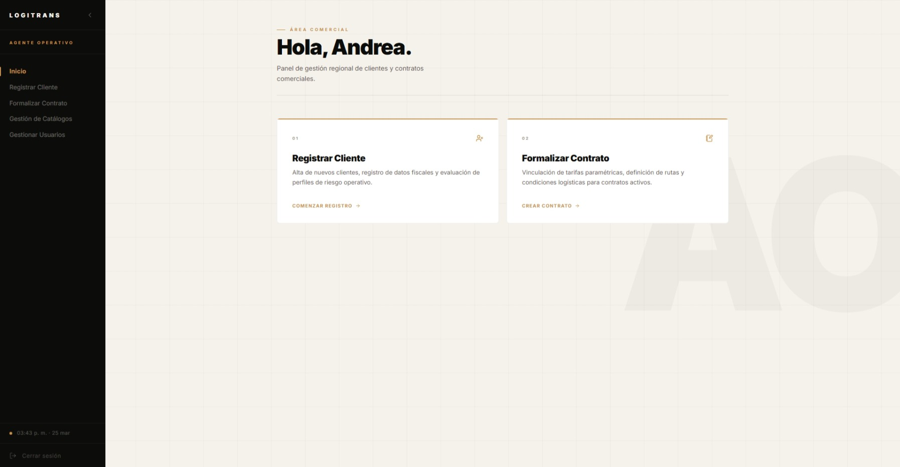
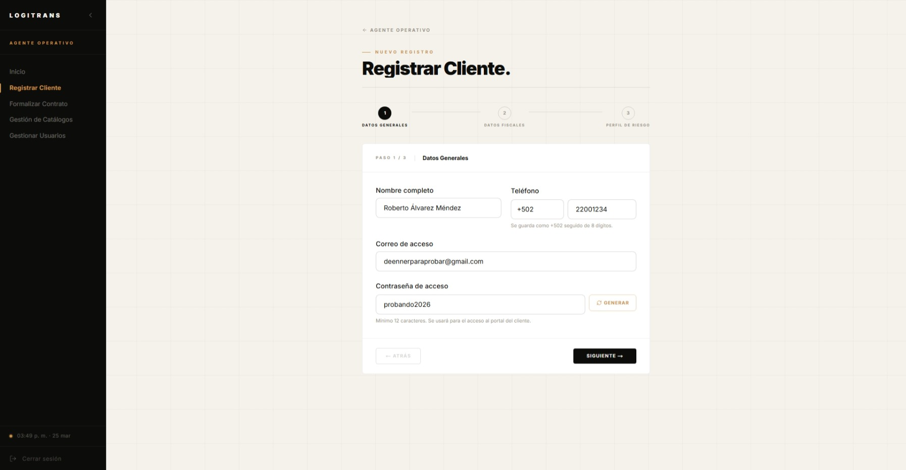
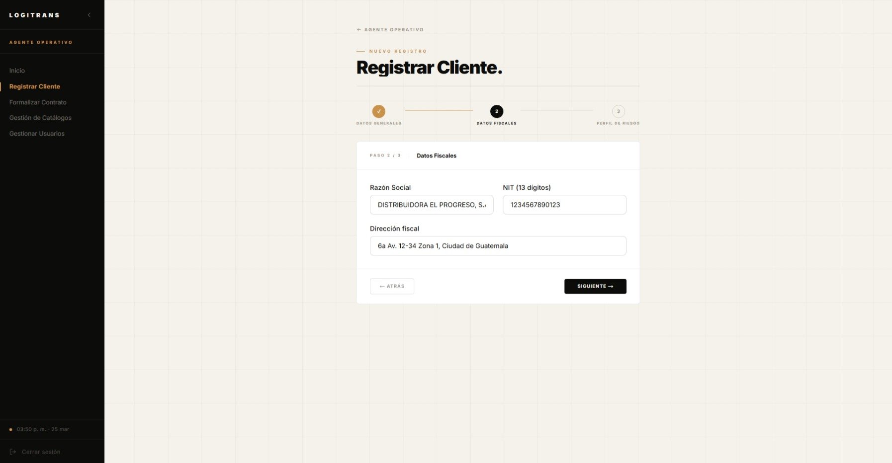
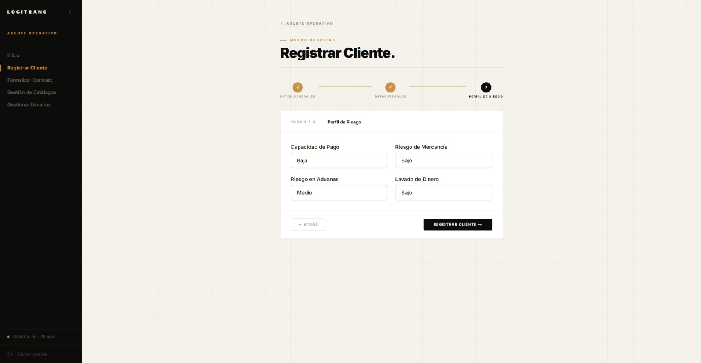
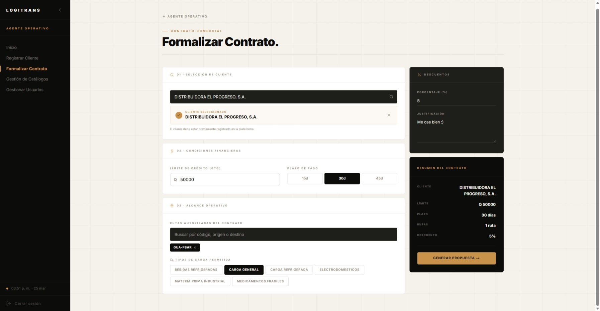
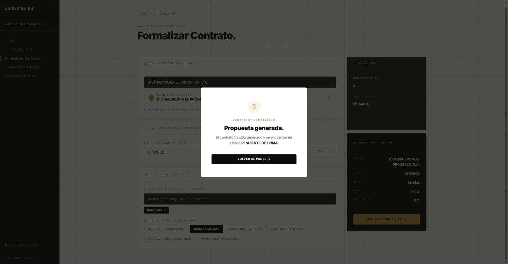
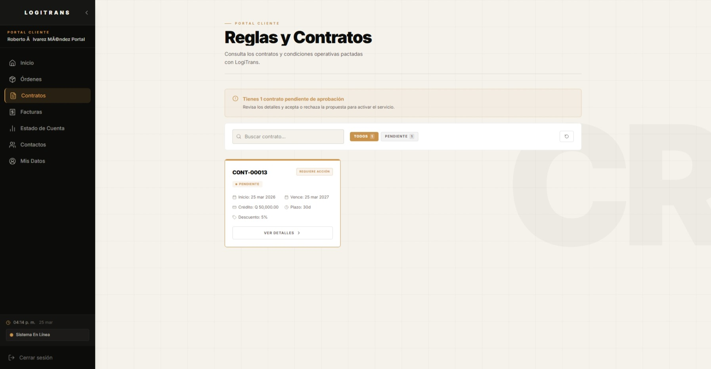
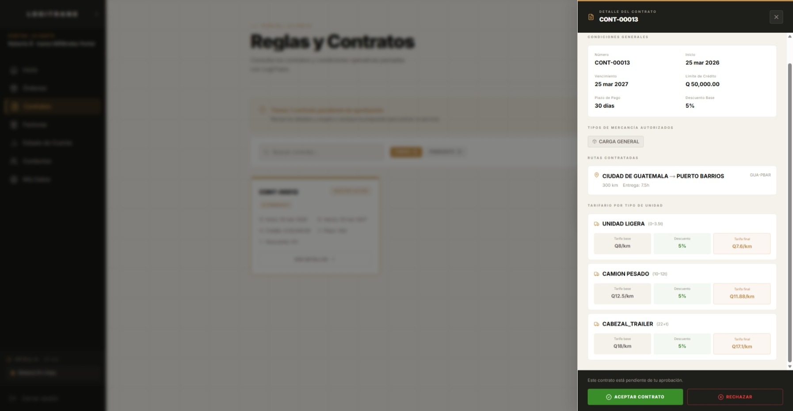
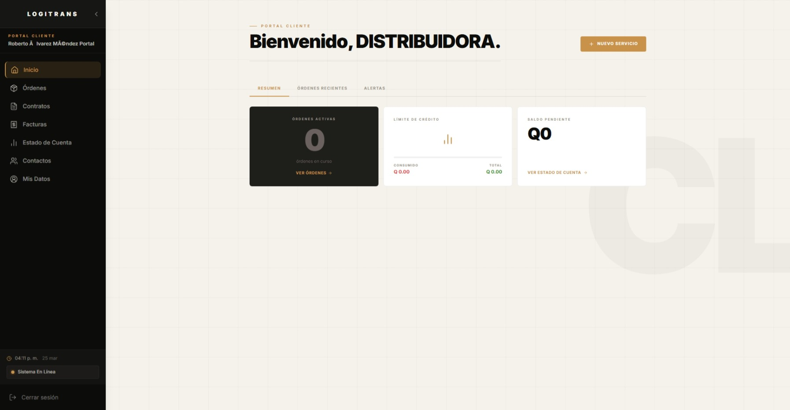

# LogiTrans Guatemala — Manual de Usuario: Happy Path MVP

> **Propósito**: Este documento es un manual paso a paso que describe el flujo completo del MVP de LogiTrans, desde la pantalla de inicio hasta el pago de una factura y su reflejo en el dashboard gerencial. Sigue cada sección en orden, captura una pantalla en cada `📸 CAPTURA` y pégala en la sección correspondiente.
>
> **Acceso al sistema**: Portal de Clientes LogiTrans (según ambiente configurado)
>
> **Credenciales de referencia**: Consultar `docs/mvp_accessos_usuarios.md`

---

## Índice del Flujo

| # | Actor | Paso |
|---|-------|------|
| 1 | — | Pantalla de inicio y login |
| 2 | Agente Operativo | Registrar un nuevo cliente |
| 3 | Agente Operativo | Formalizar contrato |
| 4 | Cliente | Crear una orden de servicio |
| 5 | Agente Logístico | Asignar binomio piloto-vehículo |
| 6 | Encargado de Patio | Registrar despacho en patio |
| 7 | Piloto | Iniciar tránsito y registrar bitácora |
| 8 | Piloto | Confirmar entrega con evidencia |
| 9 | Agente Financiero | Revisar borrador y enviar a certificador |
| 10 | Certificador FEL | Validar NIT y certificar factura |
| 11 | Cliente | Registrar pago |
| 12 | Agente Financiero | Aprobar el pago |
| 13 | Gerencia | Ver dashboard y rentabilidad |

---

## 1. Pantalla de Inicio y Login

### 1.1 Pantalla Principal

Al ingresar al Portal de Clientes LogiTrans, verás la pantalla de bienvenida de **LogiTrans Guatemala**.

- En el centro de la pantalla aparece lo que puede hacer este sistema.

- El fondo muestra los colores corporativos del sistema.


---

### 1.2 Formulario de Login

Al presionar "Iniciar Sesión", aparece el formulario de autenticación con dos campos:
- **Correo electrónico**
- **Contraseña**


---

## 2. Módulo Comercial — Registrar un Nuevo Cliente
**Actor**: Agente Operativo
**Credenciales**:
- Email: `2895884051401+v@ingenieria.usac.edu.gt`
- Password: `LogiVentas`

### 2.1 Login como Agente Operativo

1. En el formulario de login, ingresa las credenciales del Agente Operativo.
2. Presiona **"Iniciar Sesión"**.
3. Serás redirigido al **Dashboard del Agente Operativo**, que muestra lo que se puede hacer dentro de este módulo


---

### 2.2 Navegar a "Registrar Cliente"

1. En el menú lateral izquierdo, haz clic en **"Clientes"** o en la opción de navegación correspondiente.
2. Haz clic en el botón **"Nuevo Cliente"** o **"Registrar Cliente"** (botón destacado en la esquina superior derecha).




---

### 2.3 Rellenar el Formulario de Nuevo Cliente

Ingresa los siguientes datos de ejemplo para el nuevo cliente:

| Campo | Valor de ejemplo |
|-------|-------------------|
| Nombre Legal / Razón Social | `DISTRIBUIDORA EL PROGRESO, S.A.` |
| NIT | `1234567890123` |
| Dirección Fiscal | `6a Av. 12-34 Zona 1, Ciudad de Guatemala` |
| Nombre Contacto Principal | `Roberto Álvarez Méndez` |
| Email Contacto | `deennerparaprobar@gmail.com` |
| Contraseña | `probando2026` |
| Teléfono Contacto | `+502` + `22001234` |
| Riesgo de Pago | `BAJO` |
| Riesgo en Aduanas | `MEDIO` |
| Riesgo de Mercancía | `BAJO` |
| Riesgo Lavado de Dinero | `BAJO` |

> Nota: el teléfono se captura en dos partes (prefijo país y número local), y se almacena en formato canónico `+50222001234` (también aplica para `+503` y `+504`).

4. Una vez completado, presiona el botón **"Guardar"** o **"Registrar"**.
5. El sistema mostrará un mensaje de confirmación: _"Cliente registrado exitosamente"_.






### 2.4 Gestión de usuario

En esta pantalla, se pueden observar todos los usuario dentro de la plataforma y filtrar a gusto.

Y también se mostrarán las opciones de editar y eliminar usuario, así como activarlo o desactivarlo.


### 2.5 Gestión de catálogo

En esta pantalla se administran rutas y tipos de carga permitidos.

1. Desde el menú lateral, ingresa a **"Gestión de Catálogos"**.
2. Verifica la vista general con ambos paneles: rutas y tipos de carga.
3. Prueba agregar un tipo de carga y confirma el mensaje de éxito.
4. Prueba agregar una ruta y confirma el mensaje de éxito.
5. Prueba eliminar un tipo de carga y confirma el mensaje de éxito.
6. Prueba editar un registro existente (ruta o tipo de carga).


---

## 3. Módulo Comercial — Formalizar Contrato
**Actor**: Agente Operativo (misma sesión)

### 3.1 Navegar al módulo de Contratos

1. Desde el menú lateral, selecciona **"Contratos"** o navega al módulo correspondiente.
2. Verás que el cliente recién creado (`DISTRIBUIDORA EL PROGRESO, S.A.`) aparece en el listado una vez que se coloca su nit.
3. Haz clic en el botón **"Formalizar Contrato"** asociado al cliente.

---

### 3.2 Rellenar los datos del Contrato

Ingresa los siguientes datos para el contrato:

| Campo | Valor de ejemplo |
|-------|-------------------|
| Límite de Crédito del Contrato | `Q 50,000.00` |
| Días de Pago | `30 días` |
| Descuento Especial | `5%` |
| Rutas Autorizadas | `GUA-PBAR` (Ciudad de Guatemala → Puerto Barrios) |
| Tipos de Carga | `CARGA GENERAL` |

4. Presiona **"Generar Propuesta"**.
5. aparecerá un mensaje indicando que la propuesta fue generada correctamente.





---

### 3.3 El cliente acepta el contrato

El cliente debe aceptar la propuesta para que el contrato pase a estado `VIGENTE`.

1. Cierra sesión del Agente Operativo: haz clic en el ícono de usuario o en "Cerrar Sesión".
2. Inicia sesión como el **Cliente** (ver sección 4.1).
3. Navega al módulo **"Contratos"** en el menú del portal cliente.
4. Verás la propuesta en estado `PENDIENTE` con un botón **"Aceptar"**.
5. Presiona **"Aceptar"**.
6. El contrato cambia a estado **`VIGENTE`**.





---

## 4. Portal del Cliente — Crear una Orden de Servicio
**Actor**: Cliente
**Credenciales**:
- Email: `deennerparaprobar@gmail.com`
- Password: `probando2026`

> **Nota**: Si ya iniciaste sesión como cliente en el paso 3.3, puedes continuar directamente.

### 4.1 Login como Cliente

1. Ingresa al Portal de Clientes LogiTrans.
2. Ingresa las credenciales del cliente.
3. Serás redirigido al **Portal del Cliente**, que muestra un resumen de tus órdenes, saldo y contratos.



### 4.1.1 Recuperación de contraseña por token

1. En "¿Olvidaste tu contraseña?", ingresa el correo del usuario.
2. Revisa el correo recibido: incluye un **token de recuperación** (sin enlaces ni botones).
3. Abre la pantalla de "Restablecer contraseña" en el portal.
4. Ingresa manualmente el token, nueva contraseña y confirmación.
5. Confirma el cambio.

> Nota: el token expira en 30 minutos y es de un solo uso.


### 4.1.2 Módulos disponibles para el Cliente

Desde el menú lateral del portal cliente se puede acceder a estos módulos principales:

1. **Órdenes**: historial y creación de nuevas órdenes.
2. **Contratos**: visualización de contratos y estado vigente.
3. **Facturas**: historial de facturación FEL.
4. **Estado de Cuenta**: resumen de crédito y saldos.
5. **Contactos**: administración de contactos clave.
6. **Mis Datos**: perfil empresarial y seguridad de cuenta.


### 4.1.3 Gestión de contactos del Cliente

1. Ingresa a **"Contactos"**.
2. Presiona **"Agregar Contacto"** para registrar un nuevo contacto.
3. Verifica que aparezca en el listado con mensaje de confirmación.
4. También puedes editar un contacto existente desde el mismo módulo.


---

### 4.2 Crear una Nueva Orden de Servicio

1. En el menú lateral, haz clic en **"Nuevo Servicio"** u **"Órdenes"** → **"Solicitar Servicio"**.
2. Se presenta el formulario de solicitud de orden.
3. El sistema aplica automáticamente el **contrato vigente más reciente** del cliente autenticado.
4. El selector de mercancía solo muestra **tipos autorizados por ese contrato vigente**.

Ingresa los siguientes datos:

| Campo | Valor de ejemplo |
|-------|-------------------|
| Contrato | `Aplicado automáticamente por el sistema` |
| Tipo de Carga | `CARGA GENERAL` |
| Descripción de la Carga | `Electrodomésticos para distribución` |
| Peso Declarado | `8.5 Ton` |
| Dirección de Recogida | `6a Av. 12-34 Zona 1, Ciudad de Guatemala` |
| Dirección de Entrega | `Puerto Barrios, Izabal - Almacén Central` |

5. Confirma presionando **"Solicitar Servicio"** o **"Crear Orden"**.
6. La orden será creada con estado **`REGISTRADA`** y se notifica al equipo logístico.


> En esta imagen, no se puede generar una nueva orden debido a que, en este caso, no se ha aceptado aún algún contrato


---

## 5. Módulo Logístico — Asignar Binomio Piloto-Vehículo
**Actor**: Agente Logístico
**Credenciales**:
- Email: `2895884051401+l@ingenieria.usac.edu.gt`
- Password: `LogiLogistica`

### 5.1 Login como Agente Logístico

1. Cierra sesión del cliente.
2. Inicia sesión con las credenciales del Agente Logístico.
3. Tu dashboard mostrará las **órdenes pendientes de asignación**.

> 📸 **CAPTURA**: Captura el dashboard del Agente Logístico con el resumen de órdenes por estado.

---

### 5.2 Seleccionar la Orden y Asignar Binomio

1. En el menú, navega a **"Órdenes"** o **"Asignación de Rutas"**.
2. Localiza la orden recién creada de `DISTRIBUIDORA EL PROGRESO, S.A.` en estado **`REGISTRADA`**.
3. Haz clic en la orden para ver su detalle.
4. Verás un botón **"Asignar Binomio"** o similar.
5. El sistema muestra la lista de binomios disponibles (pares piloto-vehículo). Selecciona:
   - **Piloto**: Carlos Méndez
   - **Vehículo**: Camión Pesado con capacidad suficiente para 8.5 Ton
6. El sistema valida automáticamente que:
   - La capacidad del camión ≥ 8.5 Ton ✅
   - La licencia del piloto esté vigente ✅
   - Los documentos del vehículo estén vigentes ✅
7. Confirma la asignación. La orden cambia a estado **`ASIGNADA`**.

> 📸 **CAPTURA**: Captura la pantalla de selección de binomio mostrando los filtros de compatibilidad y el binomio seleccionado.

> 📸 **CAPTURA**: Captura el detalle de la orden ya en estado `ASIGNADA` con el binomio asignado visible.

---

## 6. Encargado de Patio — Registrar Despacho
**Actor**: Encargado de Patio
**Credenciales**:
- Email: `2895884051401+p@ingenieria.usac.edu.gt`
- Password: `LogiPatio`

### 6.1 Login como Encargado de Patio

1. Cierra sesión del Agente Logístico.
2. Inicia sesión con las credenciales del Encargado de Patio.
3. Serás llevado al **Dashboard de Patio** con las órdenes listas para despacho.

> 📸 **CAPTURA**: Captura el dashboard del Encargado de Patio.

---

### 6.2 Registrar el Despacho de la Orden

1. Navega a **"Cargas"** o **"Órdenes en Patio"**.
2. Localiza la orden de `DISTRIBUIDORA EL PROGRESO, S.A.` en estado **`ASIGNADA`**.
3. Haz clic en **"Registrar Despacho"** o **"Iniciar Checklist de Patio"**.
4. El sistema solicita:

| Campo | Valor |
|-------|-------|
| Verificación de ID del Piloto | Confirmar que el piloto en patio coincide con el asignado ✅ |
| Peso real cargado | `8.2 Ton` *(dentro del rango del camión)* |
| Estiba confirmada | `Sí` ✅ |
| Unidad sellada | `Sí` ✅ |

5. Completa el checklist y presiona **"Autorizar Despacho"**.
6. La orden cambia a estado **`LISTA_PARA_DESPACHO`**.

> 📸 **CAPTURA**: Captura el formulario de despacho en patio con los campos completados.

> 📸 **CAPTURA**: Captura la orden ya en estado `LISTA_PARA_DESPACHO`.

---

## 7. Piloto — Iniciar Tránsito y Registrar Bitácora
**Actor**: Piloto
**Credenciales**:
- Email: `2895884051401+t@ingenieria.usac.edu.gt`
- Password: `LogiPiloto`

### 7.1 Login como Piloto

1. Cierra sesión del Encargado de Patio.
2. Inicia sesión con las credenciales del Piloto.
3. Verás el **Dashboard del Piloto** con tu orden asignada.

> 📸 **CAPTURA**: Captura el dashboard del Piloto mostrando la orden activa.

---

### 7.2 Iniciar el Viaje (Cambiar a "En Tránsito")

1. Navega a **"Mi Viaje"** o **"Mis Órdenes"**.
2. Selecciona la orden de `DISTRIBUIDORA EL PROGRESO, S.A.`.
3. Haz clic en **"Iniciar Viaje"** o **"Cambiar a En Tránsito"**.
4. La orden cambia a estado **`EN_TRANSITO`**.

> 📸 **CAPTURA**: Captura el momento en que la orden está en estado `EN_TRANSITO` en la vista del piloto.

---

### 7.3 Registrar un Punto de Control en la Bitácora

1. En el mismo detalle de la orden activa, ve a la sección **"Bitácora"** o **"Registrar Evento"**.
2. Ingresa un nuevo evento:

| Campo | Valor |
|-------|-------|
| Tipo de Evento | `PUNTO_CONTROL` |
| Descripción | `Paso por zona 6 de Barberena sin novedades, ruta libre.` |

3. Presiona **"Registrar"** o **"Agregar Evento"**.
4. El evento aparece en el historial de la bitácora con la hora automática del sistema.

> 📸 **CAPTURA**: Captura la bitácora del viaje mostrando el evento de punto de control recién registrado.

---

## 8. Piloto — Confirmar Entrega con Evidencia

### 8.1 Confirmar la Entrega

1. Al llegar al destino, en el detalle de la orden activa, haz clic en **"Confirmar Entrega"** o **"Finalizar Viaje"**.
2. El sistema solicita:

| Campo | Valor |
|-------|-------|
| Nombre del receptor | `Almacén Central Puerto Barrios` |
| Firma del receptor | *(Captura o confirmación digital)* |
| Fotografía de evidencia | *(Adjunta una imagen de la entrega)* |

3. Completa los campos y presiona **"Confirmar Entrega"**.
4. La orden cambia a estado **`ENTREGADA`**.
5. **Automáticamente**, el sistema genera un **borrador de factura (FEL)** en estado `BORRADOR` para que Finanzas lo revise. Este borrador aparece en la bandeja del Agente Financiero sin descripción de servicio ni fecha de vencimiento (pendientes de completar).

> 📸 **CAPTURA**: Captura el formulario de confirmación de entrega con el nombre del receptor visible.

> 📸 **CAPTURA**: Captura el estado final de la orden en `ENTREGADA`.

---

## 9. Módulo Financiero — Revisar Borrador y Enviar a Certificador
**Actor**: Agente Financiero
**Credenciales**:
- Email: `2895884051401+f@ingenieria.usac.edu.gt`
- Password: `LogiFinanzas`

### 9.1 Login como Agente Financiero

1. Cierra sesión del Piloto.
2. Inicia sesión con las credenciales del Agente Financiero.
3. El dashboard muestra el **resumen financiero**: facturas por certificar, pagos por conciliar, y facturas emitidas.

> 📸 **CAPTURA**: Captura el dashboard del Agente Financiero mostrando las métricas de facturas y pagos.

---

### 9.2 Revisar el Borrador de Factura

1. Navega a **"Facturación"** en el menú.
2. Verás la **bandeja de borradores pendientes de revisión** — estas son las facturas `BORRADOR` que aún no tienen descripción de servicio.
3. Localiza la factura de la orden de `DISTRIBUIDORA EL PROGRESO, S.A.`.
4. Haz clic en la factura para ver su detalle. Verás los datos pre-cargados:
   - Cliente: `DISTRIBUIDORA EL PROGRESO, S.A.`
   - NIT: `1234567890123`
   - Subtotal, IVA y Total calculados automáticamente.
5. Los campos **Descripción del Servicio** y **Fecha de Vencimiento** estarán vacíos — debes completarlos.

> 📸 **CAPTURA**: Captura la bandeja de facturación mostrando el borrador pendiente.

> 📸 **CAPTURA**: Captura el detalle de la factura mostrando los campos vacíos de descripción y fecha.

---

### 9.3 Completar y Enviar a Certificador

1. En el formulario de la factura, ingresa:

| Campo | Valor |
|-------|-------|
| Descripción del Servicio | `Servicio logístico de transporte terrestre Ciudad de Guatemala → Puerto Barrios. Orden ORD-000001. Carga general 8.2 Ton.` |
| Fecha de Vencimiento | `2026-05-11` *(30 días plazo de pago del contrato)* |

2. Presiona el botón **"Enviar a Certificador"**.
3. El sistema valida que los campos estén completos y la factura desaparece de la bandeja de Finanzas.
4. La factura ahora es visible únicamente en la **bandeja del Certificador FEL**.

> 📸 **CAPTURA**: Captura el formulario con la descripción y fecha de vencimiento ya completadas, antes de presionar "Enviar a Certificador".

> 📸 **CAPTURA**: Captura la bandeja de Finanzas ya vacía (o mostrando que la factura fue enviada).

---

## 10. Módulo Certificador FEL — Validar NIT y Certificar
**Actor**: Certificador FEL
**Credenciales**:
- Email: `2895884051401+s@ingenieria.usac.edu.gt`
- Password: `LogiSAT`

### 10.1 Login como Certificador FEL

1. Cierra sesión del Agente Financiero.
2. Inicia sesión con las credenciales del Certificador FEL.
3. Tu dashboard muestra las **facturas pendientes de certificación**.

> 📸 **CAPTURA**: Captura el dashboard del Certificador FEL mostrando el resumen y la bandeja de facturas.

---

### 10.2 Validar NIT

1. Navega a **"Bandeja FEL"** o **"Certificación"**.
2. Verás la factura de `DISTRIBUIDORA EL PROGRESO, S.A.` recién enviada por Finanzas.
3. Abre el detalle de la factura.
4. Haz clic en **"Validar NIT"**.
5. El sistema verifica que el NIT `1234567890123` tiene exactamente 13 dígitos numéricos.
6. Aparece una confirmación: _"NIT validado correctamente"_.

> 📸 **CAPTURA**: Captura el detalle de la factura en la bandeja del Certificador con el botón "Validar NIT" visible.

> 📸 **CAPTURA**: Captura el mensaje de confirmación de NIT validado.

---

### 10.3 Certificar la Factura

1. Después de validar el NIT, aparece el botón **"Certificar"** o **"Certificar DTE"**.
2. Presiona **"Certificar"**.
3. El sistema genera automáticamente:
   - Un **UUID de autorización FEL** (ej.: `FEL-A3B2C1D4-...`)
   - La fecha y hora de certificación
4. La factura cambia de estado `BORRADOR` → **`ENVIADA`** (incluye certificación FEL y envío automático).
5. El sistema envía automáticamente la notificación de factura al correo del cliente al momento de certificar.

> 📸 **CAPTURA**: Captura la factura en estado `ENVIADA` mostrando el UUID FEL generado y la fecha de certificación.

> 📸 **CAPTURA**: Captura evidencia del correo de factura recibido por el cliente después de certificar.

---

## 11. Portal del Cliente — Registrar Pago
**Actor**: Cliente
**Credenciales**:
- Email: `deennerparaprobar@gmail.com`
- Password: `probando2026`

### 11.1 Login como Cliente y ver Estado de Cuenta

1. Cierra sesión del Certificador.
2. Inicia sesión como el Cliente.
3. Navega a **"Estado de Cuenta"** o **"Mis Facturas"**.
4. Verás la factura de la orden `ORD-000001` en estado `ENVIADA` con el monto a pagar.

> 📸 **CAPTURA**: Captura el estado de cuenta del cliente mostrando la factura pendiente de pago.

---

### 11.2 Registrar el Pago

1. Haz clic en la factura y luego en **"Registrar Pago"** o **"Pagar"**.
2. Ingresa los datos del pago:

| Campo | Valor |
|-------|-------|
| Método de Pago | `TRANSFERENCIA` |
| Banco de Origen | `BAC CREDOMATIC` |
| Número de Cuenta | `0100-2000-789` |
| Número de Autorización Bancaria | `TRF-20260411-001` |
| Monto | `Q 3,990.00` *(debe coincidir exactamente con el total de la factura)* |
| Documento de soporte | *(Adjuntar boleta de depósito)* |

3. Presiona **"Confirmar Pago"**.
4. El pago queda registrado en estado **`PENDIENTE`** (a la espera de aprobación del Agente Financiero).

> 📸 **CAPTURA**: Captura el formulario de registro de pago con los datos de ejemplo completados.

> 📸 **CAPTURA**: Captura la confirmación de que el pago quedó en estado `PENDIENTE`.

---

## 12. Módulo Financiero — Aprobar el Pago
**Actor**: Agente Financiero
**Credenciales**:
- Email: `2895884051401+f@ingenieria.usac.edu.gt`
- Password: `LogiFinanzas`

### 12.1 Revisar Pagos por Conciliar

1. Inicia sesión como el Agente Financiero.
2. En el dashboard principal verás la sección **"Pagos por Conciliar"** — estos son todos los pagos en estado `PENDIENTE`.
3. Navega a **"Pagos"** → **"Pagos Pendientes"** o similar.
4. Verás el pago de la transferencia registrado por el cliente.

> 📸 **CAPTURA**: Captura la sección de "Pagos por Conciliar" en el dashboard mostrando el pago pendiente.

---

### 12.2 Aprobar el Pago

1. Haz clic en el pago de `DISTRIBUIDORA EL PROGRESO, S.A.`.
2. Revisa el documento de soporte adjunto (boleta de depósito).
3. Presiona **"Aprobar Pago"**.
4. El sistema ejecuta las siguientes acciones automáticamente:
   - El pago cambia a estado **`APROBADO`**.
   - La factura cambia a estado **`PAGADA`**.
   - El límite de crédito del cliente se **libera**.

> 📸 **CAPTURA**: Captura el detalle del pago con el botón "Aprobar" visible.

> 📸 **CAPTURA**: Captura la confirmación de pago aprobado y la factura en estado `PAGADA`.

---

## 13. Dashboard Gerencial — Ver Rentabilidad y KPIs
**Actor**: Gerencia
**Credenciales**:
- Email: `2895884051401@ingenieria.usac.edu.gt`
- Password: `LogiGerencia`

### 13.1 Login como Gerencia

1. Cierra sesión del Agente Financiero.
2. Inicia sesión con las credenciales de Gerencia.
3. Serás llevado directamente al **Dashboard Gerencial**.

> 📸 **CAPTURA**: Captura el dashboard gerencial completo mostrando los KPIs principales.

---

### 13.2 Revisar el Dashboard Principal

El Dashboard Gerencial muestra:

- **Resumen de Operaciones**: Total de órdenes por estado (Registradas, En Tránsito, Entregadas).
- **Facturación por Sede**: Corte diario de Guatemala, Quetzaltenango y Puerto Barrios.
- **KPIs de Cumplimiento**: % de entregas a tiempo vs. con retraso.
- **Alertas de Desviación**: Órdenes con incidentes activos en ruta.

> 📸 **CAPTURA**: Captura el panel de KPIs mostrando el porcentaje de cumplimiento de entregas.

> 📸 **CAPTURA**: Captura el panel de alertas mostrando las órdenes con incidentes activos.

---

### 13.3 Revisar la Rentabilidad

1. Navega a **"Rentabilidad"** en el menú lateral.
2. Verás el análisis por contrato:
   - **Ingresos (Facturación)** vs. **Costos Operativos** (combustible + viáticos + mantenimiento)
   - **Margen bruto** de cada contrato
3. La transacción de `DISTRIBUIDORA EL PROGRESO, S.A.` ya refleja el ingreso de la orden recién completada.

> 📸 **CAPTURA**: Captura la pantalla de rentabilidad mostrando el análisis por contrato con ingresos, costos y margen.

---

## Resumen del Flujo Completo

```
[Login] → [Operativo: Registrar Cliente] → [Operativo: Formalizar Contrato]
       → [Cliente: Aceptar Contrato] → [Cliente: Crear Orden]
       → [Logístico: Asignar Binomio] → [Patio: Registrar Despacho]
       → [Piloto: Iniciar Tránsito + Bitácora] → [Piloto: Confirmar Entrega]
       → [Sistema: Genera Borrador FEL automáticamente]
       → [Finanzas: Completar Descripción + Enviar a Certificador]
       → [Certificador: Validar NIT + Certificar] → [Sistema: Factura ENVIADA]
       → [Cliente: Registrar Pago] → [Finanzas: Aprobar Pago]
       → [Sistema: Factura PAGADA + Crédito liberado]
       → [Gerencia: Ver Dashboard + Rentabilidad]
```

---

## Notas para el Presentador

- Todo el flujo anterior puede ejecutarse en la aplicación local corriendo con:
  ```bash
  docker-compose up -d
  ```
- El acceso se realiza en el Portal de Clientes LogiTrans según el ambiente configurado.
- Los datos del seed ya contienen órdenes en diferentes etapas del flujo para enriquecer la demostración; no es necesario crear todo desde cero.
- Para una demostración más rápida del MVP, puedes saltar al **paso 9** usando una factura `BORRADOR` ya existente en la bandeja de Finanzas (creada por el seed).
- Las credenciales completas están en `docs/mvp_accessos_usuarios.md`.
