# LogiTrans Guatemala — Manual de Usuario: Happy Path MVP

> **Propósito**: Este documento describe el happy path del MVP de LogiTrans desde el acceso inicial hasta el envío de la factura al cliente (`ENVIADA`).
>
> **Acceso al sistema**: Portal de Clientes LogiTrans (según ambiente configurado)
>
> **Credenciales de referencia**: Consultar `docs/mvp_accessos_usuarios.md`

---

## Índice del Flujo

| # | Actor | Paso |
|---|-------|------|
| 1 | — | Pantalla de inicio y login |
| 2 | Agente Operativo | Registrar un nuevo cliente |
| 3 | Agente Operativo | Formalizar contrato |
| 4 | Cliente | Crear una orden de servicio |
| 5 | Agente Logístico | Asignar binomio piloto-vehículo |
| 6 | Encargado de Patio | Registrar despacho en patio |
| 7 | Piloto | Iniciar tránsito y registrar bitácora |
| 8 | Piloto | Confirmar entrega con evidencia |
| 9 | Agente Financiero | Revisar borrador y enviar a certificador |
| 10 | Certificador FEL | Validar NIT y certificar factura |
| 11 | Agente Financiero | Enviar factura al cliente |

---

## 1. Pantalla de Inicio y Login

### 1.1 Pantalla Principal

Al ingresar al Portal de Clientes LogiTrans, verás la pantalla de bienvenida de **LogiTrans Guatemala**.

- En el centro de la pantalla aparece lo que puede hacer este sistema.

- El fondo muestra los colores corporativos del sistema.


---

### 1.2 Formulario de Login

Al presionar "Iniciar Sesión", aparece el formulario de autenticación con dos campos:
- **Correo electrónico**
- **Contraseña**


---

## 2. Módulo Comercial — Registrar un Nuevo Cliente
**Actor**: Agente Operativo
**Credenciales**:
- Email: `2895884051401+v@ingenieria.usac.edu.gt`
- Password: `LogiVentas`

### 2.1 Login como Agente Operativo

1. En el formulario de login, ingresa las credenciales del Agente Operativo.
2. Presiona **"Iniciar Sesión"**.
3. Serás redirigido al **Dashboard del Agente Operativo**, que muestra lo que se puede hacer dentro de este módulo


---

### 2.2 Navegar a "Registrar Cliente"

1. En el menú lateral izquierdo, haz clic en **"Clientes"** o en la opción de navegación correspondiente.
2. Haz clic en el botón **"Nuevo Cliente"** o **"Registrar Cliente"** (botón destacado en la esquina superior derecha).


---

### 2.3 Rellenar el Formulario de Nuevo Cliente

Ingresa los siguientes datos de ejemplo para el nuevo cliente:

| Campo | Valor de ejemplo |
|-------|-------------------|
| Nombre Legal / Razón Social | `DISTRIBUIDORA EL PROGRESO, S.A.` |
| NIT | `1234567890123` |
| Dirección Fiscal | `6a Av. 12-34 Zona 1, Ciudad de Guatemala` |
| Nombre Contacto Principal | `Roberto Álvarez Méndez` |
| Email Contacto | `deennerparaprobar@gmail.com` |
| Contraseña | `deennerparaprobar@gmail.com` |
| Teléfono Contacto | `+502` + `22001234` |
| Riesgo de Pago | `BAJO` |
| Riesgo en Aduanas | `MEDIO` |
| Riesgo de Mercancía | `BAJO` |
| Riesgo Lavado de Dinero | `BAJO` |

> Nota: el teléfono se captura en dos partes (prefijo país y número local), y se almacena en formato canónico `+50222001234` (también aplica para `+503` y `+504`).

4. Una vez completado, presiona el botón **"Guardar"** o **"Registrar"**.
5. El sistema mostrará un mensaje de confirmación: _"Cliente registrado exitosamente"_.


### 2.3.1 Correo de bienvenida con credenciales

Después del registro exitoso, el cliente recibe un correo de bienvenida con sus credenciales de acceso.


### 2.4 Gestión de usuario

En esta pantalla, se pueden observar todos los usuario dentro de la plataforma y filtrar a gusto.

Y también se mostrarán las opciones de editar y eliminar usuario, así como activarlo o desactivarlo.


### 2.5 Gestión de catálogo

En esta pantalla se administran rutas y tipos de carga permitidos.

1. Desde el menú lateral, ingresa a **"Gestión de Catálogos"**.
2. Verifica la vista general con ambos paneles: rutas y tipos de carga.
3. Prueba agregar un tipo de carga y confirma el mensaje de éxito.
4. Prueba agregar una ruta y confirma el mensaje de éxito.
5. Prueba eliminar un tipo de carga y confirma el mensaje de éxito.
6. Prueba editar un registro existente (ruta o tipo de carga).


---

## 3. Módulo Comercial — Formalizar Contrato
**Actor**: Agente Operativo (misma sesión)

### 3.1 Navegar al módulo de Contratos

1. Desde el menú lateral, selecciona **"Contratos"** o navega al módulo correspondiente.
2. Verás que el cliente recién creado (`DISTRIBUIDORA EL PROGRESO, S.A.`) aparece en el listado una vez que se coloca su nit.
3. Haz clic en el botón **"Formalizar Contrato"** asociado al cliente.

---

### 3.2 Rellenar los datos del Contrato

Ingresa los siguientes datos para el contrato:

| Campo | Valor de ejemplo |
|-------|-------------------|
| Límite de Crédito del Contrato | `Q 50,000.00` |
| Días de Pago | `30 días` |
| Descuento Especial | `5%` |
| Rutas Autorizadas | `GUA-PBAR` (Ciudad de Guatemala → Puerto Barrios) |
| Tipos de Carga | `CARGA GENERAL` |

4. Presiona **"Generar Propuesta"**.
5. aparecerá un mensaje indicando que la propuesta fue generada correctamente.


### 3.2.1 Correo de propuesta de contrato

Al generar la propuesta, el cliente recibe un correo con el código de contrato, rutas y pasos para revisión/aceptación.


---

### 3.3 El cliente acepta el contrato

El cliente debe aceptar la propuesta para que el contrato pase a estado `VIGENTE`.

1. Cierra sesión del Agente Operativo: haz clic en el ícono de usuario o en "Cerrar Sesión".
2. Inicia sesión como el **Cliente** (ver sección 4.1).
3. Navega al módulo **"Contratos"** en el menú del portal cliente.
4. Verás la propuesta en estado `PENDIENTE` con un botón **"Aceptar"**.
5. Presiona **"Aceptar"**.
6. El contrato cambia a estado **`VIGENTE`**.


---

## 4. Portal del Cliente — Crear una Orden de Servicio
**Actor**: Cliente
**Credenciales**:
- Email: `deennerparaprobar@gmail.com`
- Password: `probando2026`

> **Nota**: Si ya iniciaste sesión como cliente en el paso 3.3, puedes continuar directamente.

### 4.1 Login como Cliente

1. Ingresa al Portal de Clientes LogiTrans.
2. Ingresa las credenciales del cliente.
3. Serás redirigido al **Portal del Cliente**, que muestra un resumen de tus órdenes, saldo y contratos.


### 4.1.1 Recuperación de contraseña por token

1. En "¿Olvidaste tu contraseña?", ingresa el correo del usuario.
2. Revisa el correo recibido: incluye un **token de recuperación** (sin enlaces ni botones).
3. Abre la pantalla de "Restablecer contraseña" en el portal.
4. Ingresa manualmente el token, nueva contraseña y confirmación.
5. Confirma el cambio.

> Nota: el token expira en 30 minutos y es de un solo uso.


### 4.1.2 Módulos disponibles para el Cliente

Desde el menú lateral del portal cliente se puede acceder a estos módulos principales:

1. **Órdenes**: historial y creación de nuevas órdenes.
2. **Contratos**: visualización de contratos y estado vigente.
3. **Facturas**: historial de facturación FEL.
4. **Estado de Cuenta**: resumen de crédito y saldos.
5. **Contactos**: administración de contactos clave.
6. **Mis Datos**: perfil empresarial y seguridad de cuenta.


### 4.1.3 Gestión de contactos del Cliente

1. Ingresa a **"Contactos"**.
2. Presiona **"Agregar Contacto"** para registrar un nuevo contacto.
3. Verifica que aparezca en el listado con mensaje de confirmación.
4. También puedes editar un contacto existente desde el mismo módulo.


---

### 4.2 Crear una Nueva Orden de Servicio

1. En el menú lateral, haz clic en **"Nuevo Servicio"** u **"Órdenes"** → **"Solicitar Servicio"**.
2. Se presenta el formulario de solicitud de orden.
3. El sistema aplica automáticamente el **contrato vigente más reciente** del cliente autenticado.
4. El selector de mercancía solo muestra **tipos autorizados por ese contrato vigente**.

Si aún no hay contrato vigente, el sistema bloquea la creación y muestra advertencia:


Ingresa los siguientes datos:

| Campo | Valor de ejemplo |
|-------|-------------------|
| Contrato | `Aplicado automáticamente por el sistema` |
| Tipo de Carga | `CARGA GENERAL` |
| Descripción de la Carga | `Sacos de cemento de Dora la exploradora` |
| Peso Declarado | `92 Ton` *(caso extremo para validar disponibilidad logística)* |
| Dirección de Recogida | `Mi casita` |
| Dirección de Entrega | `La casita en puerto barrios` |

5. Confirma presionando **"Solicitar Servicio"** o **"Crear Orden"**.
6. La orden será creada con estado **`REGISTRADA`** y se notifica al equipo logístico.

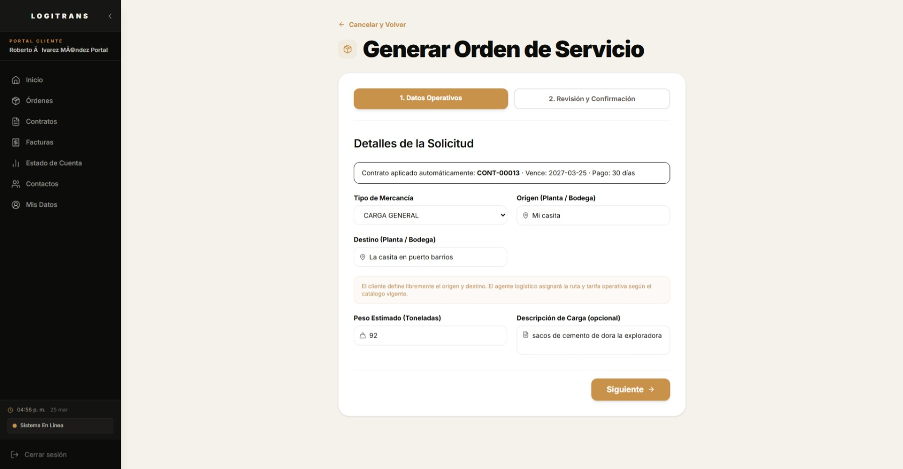
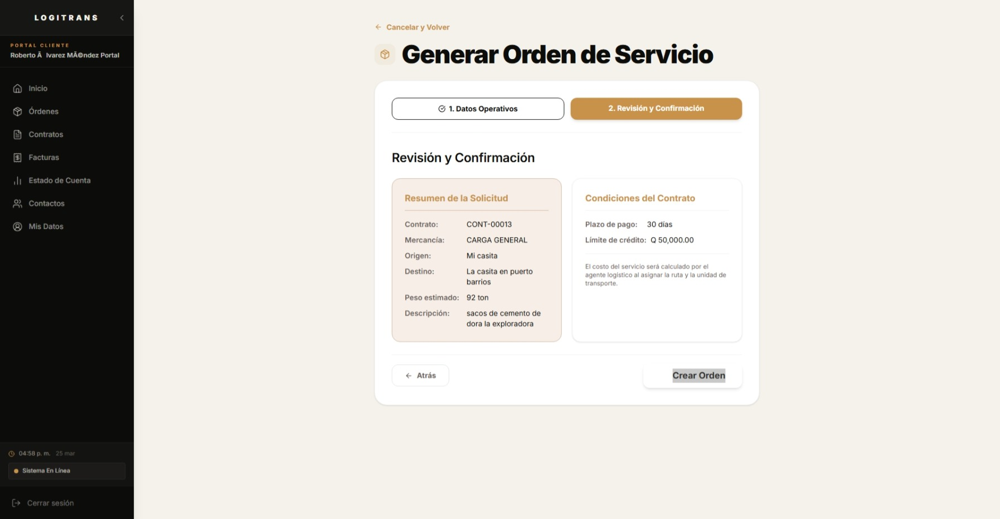
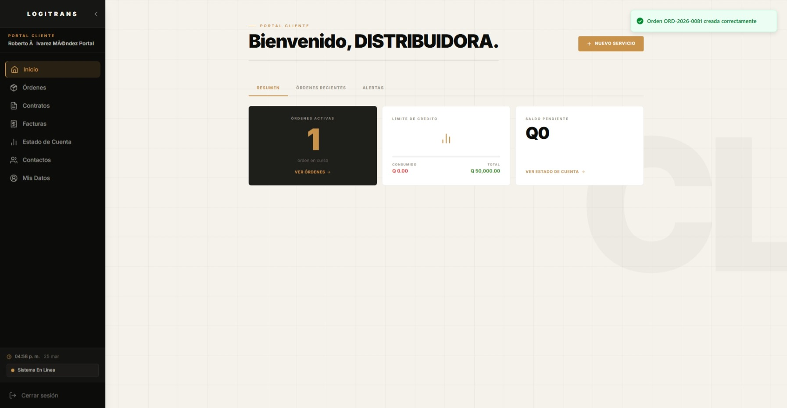
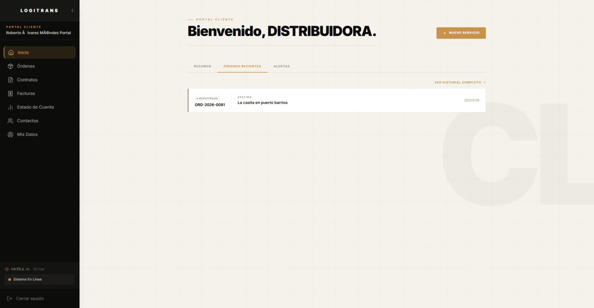

> Nota: este caso se documenta como escenario extremo para validación operativa de asignación. En la versión actual, el formulario de cliente limita el peso máximo permitido a `40 Ton`.

---

## 5. Módulo Logístico — Asignar Binomio Piloto-Vehículo
**Actor**: Agente Logístico
**Credenciales**:
- Email: `2895884051401+l@ingenieria.usac.edu.gt`
- Password: `LogiLogistica`

### 5.1 Login como Agente Logístico

1. Cierra sesión del cliente.
2. Inicia sesión con las credenciales del Agente Logístico.
3. Tu dashboard mostrará las **órdenes pendientes de asignación**.


---

### 5.2 Seleccionar la Orden y Asignar Binomio

1. En el menú, navega a **"Órdenes"** o **"Asignación de Rutas"**.
2. Localiza la orden recién creada de `DISTRIBUIDORA EL PROGRESO, S.A.` en estado **`REGISTRADA`**.
3. Haz clic en la orden para ver su detalle.
4. Verás un botón **"Asignar Binomio"** o similar.
5. Para este caso de `40 Ton`, filtra la orden por cliente y verifica que el peso declarado coincide.
6. Al abrir **"Asignar Binomio"**, selecciona la ruta del contrato, el binomio compatible y la fecha/hora de salida.
7. Confirma la asignación.
8. El sistema muestra confirmación y la orden cambia a estado **`ASIGNADA`** con unidad y piloto visibles en el detalle.


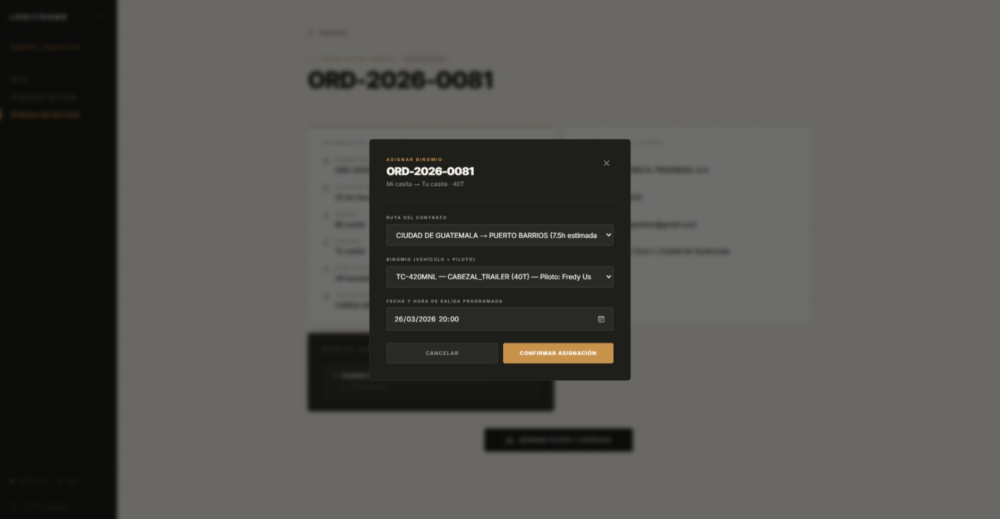

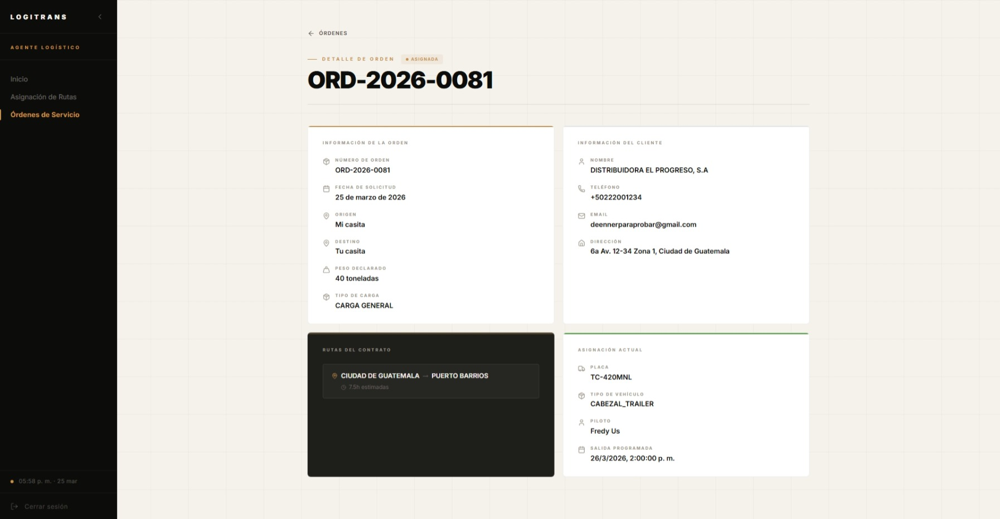

> Resultado esperado del caso: la aplicación permite asignar correctamente cuando existe una unidad compatible de 40 Ton.

---

## 6. Encargado de Patio — Registrar Despacho
**Actor**: Encargado de Patio
**Credenciales**:
- Email: `2895884051401+p@ingenieria.usac.edu.gt`
- Password: `LogiPatio`

### 6.1 Login como Encargado de Patio

1. Cierra sesión del Agente Logístico.
2. Inicia sesión con las credenciales del Encargado de Patio.
3. Serás llevado al **Dashboard de Patio** con las órdenes listas para despacho.


---

### 6.2 Registrar el Despacho de la Orden

1. Navega a **"Cargas"** o **"Órdenes en Patio"**.
2. Localiza la orden de `DISTRIBUIDORA EL PROGRESO, S.A.` en estado **`ASIGNADA`**.
3. Haz clic en **"Registrar Despacho"** o **"Iniciar Checklist de Patio"**.
4. El sistema solicita:

| Campo | Valor |
|-------|-------|
| Verificación de ID del Piloto | Confirmar que el piloto en patio coincide con el asignado ✅ |
| Peso real cargado | `40.02 Ton` *(dentro de tolerancia respecto al declarado de 40.00 Ton)* |
| Estiba confirmada | `Sí` ✅ |
| Unidad sellada | `Sí` ✅ |

5. Completa el checklist y presiona **"Autorizar Despacho"**.
6. La orden cambia a estado **`LISTA_PARA_DESPACHO`**.
7. Si el peso cargado no cumple la tolerancia, el sistema muestra alerta y no formaliza hasta corregir el dato.


---

## 7. Piloto — Iniciar Tránsito y Registrar Bitácora
**Actor**: Piloto
**Credenciales**:
- Email: `2895884051401+t@ingenieria.usac.edu.gt`
- Password: `LogiPiloto`

Pero puede variar dependiendo del piloto al cual fue asignado todo esto. Refiérase a mvp_accesssos_usuario.md

### 7.1 Login como Piloto

1. Cierra sesión del Encargado de Patio.
2. Inicia sesión con las credenciales del Piloto.
3. Verás el **Dashboard del Piloto** con tu orden asignada.

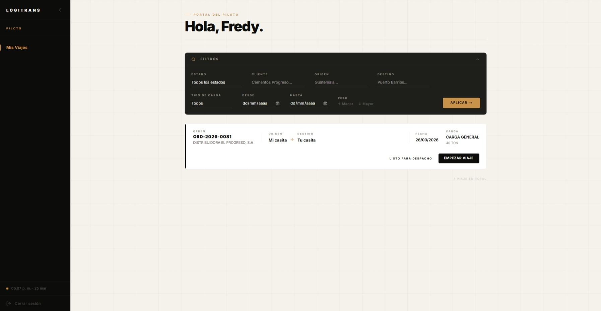

---

### 7.2 Iniciar el Viaje (Cambiar a "En Tránsito")

1. Navega a **"Mi Viaje"** o **"Mis Órdenes"**.
2. Selecciona la orden de `DISTRIBUIDORA EL PROGRESO, S.A.`.
3. Haz clic en **"Iniciar Viaje"** o **"Cambiar a En Tránsito"**.
4. La orden cambia a estado **`EN_TRANSITO`**.


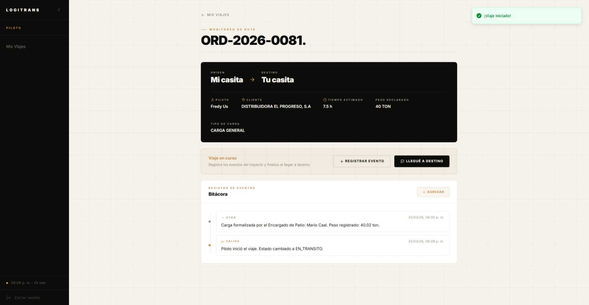

---

### 7.3 Registrar un Punto de Control en la Bitácora

1. En el mismo detalle de la orden activa, ve a la sección **"Bitácora"** o **"Registrar Evento"**.
2. Ingresa un nuevo evento:

| Campo | Valor |
|-------|-------|
| Tipo de Evento | `PUNTO_CONTROL` |
| Descripción | `Paso por zona 6 de Barberena sin novedades, ruta libre.` |

3. Presiona **"Registrar"** o **"Agregar Evento"**.
4. El evento aparece en el historial de la bitácora con la hora automática del sistema.


Mientras el piloto registra eventos, el cliente puede visualizar el tracking en paralelo:


---

## 8. Piloto — Confirmar Entrega con Evidencia

### 8.1 Confirmar la Entrega

1. Al llegar al destino, en el detalle de la orden activa, haz clic en **"Confirmar Entrega"** o **"Finalizar Viaje"**.
2. El sistema solicita:

| Campo | Valor |
|-------|-------|
| Nombre del receptor | `Almacén Central Puerto Barrios` |
| Firma del receptor | *(Captura o confirmación digital)* |
| Fotografía de evidencia | *(Adjunta una imagen de la entrega)* |

3. Completa los campos y presiona **"Confirmar Entrega"**.
4. La orden cambia a estado **`ENTREGADA`**.
5. **Automáticamente**, el sistema genera un **borrador de factura (FEL)** en estado `BORRADOR` para que Finanzas lo revise. Este borrador aparece en la bandeja del Agente Financiero sin descripción de servicio ni fecha de vencimiento (pendientes de completar).


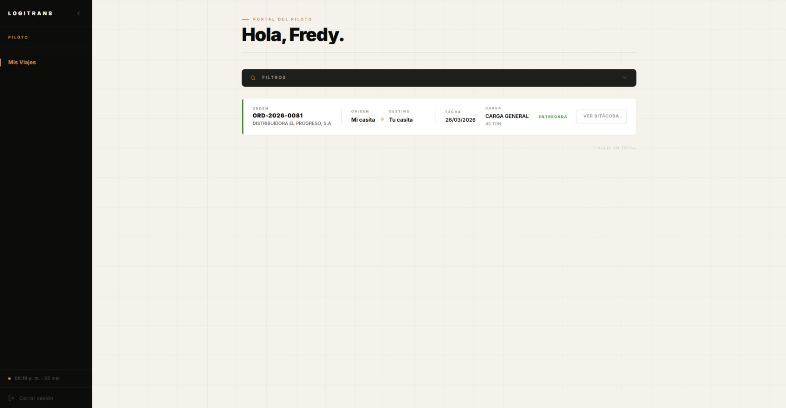


---

## 9. Módulo Financiero — Revisar Borrador y Enviar a Certificador
**Actor**: Agente Financiero
**Credenciales**:
- Email: `2895884051401+f@ingenieria.usac.edu.gt`
- Password: `LogiFinanzas`

### 9.1 Revisar el borrador generado por la entrega

1. Cierra sesión del Piloto e inicia sesión como Agente Financiero.
2. Entra a **"Bandeja de Facturación"**.
3. Verifica que la factura de la orden `ORD-2026-0081` aparece en sección **BORRADORES** como `FAC-000065`.
4. Abre la factura para revisión comercial y tributaria.

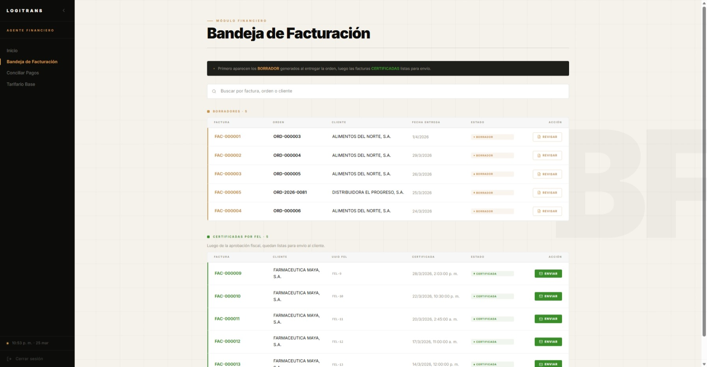
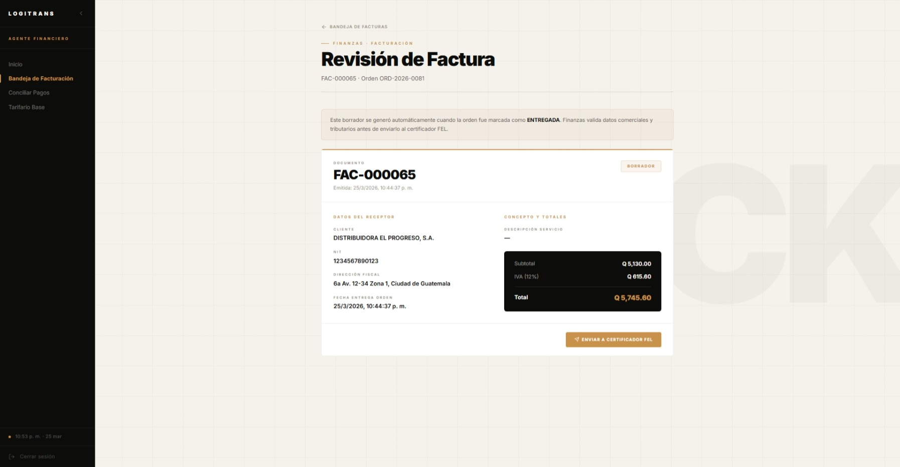

### 9.2 Enviar borrador al Certificador FEL

1. Desde la vista de revisión, valida los datos del cliente, NIT y totales.
2. Presiona **"Enviar a Certificador FEL"**.
3. La factura deja la etapa de borrador en Finanzas y pasa a la bandeja FEL.


---

## 10. Módulo Certificador FEL — Validar NIT, Rechazar/Certificar
**Actor**: Certificador FEL
**Credenciales**:
- Email: `2895884051401+s@ingenieria.usac.edu.gt`
- Password: `LogiSAT`

### 10.1 Ver factura pendiente en bandeja de aprobación

1. Cierra sesión de Finanzas.
2. Inicia sesión como Certificador FEL y abre **"Bandeja de Aprobación"**.
3. Verifica que `FAC-000065` de `DISTRIBUIDORA EL PROGRESO, S.A.` está pendiente.

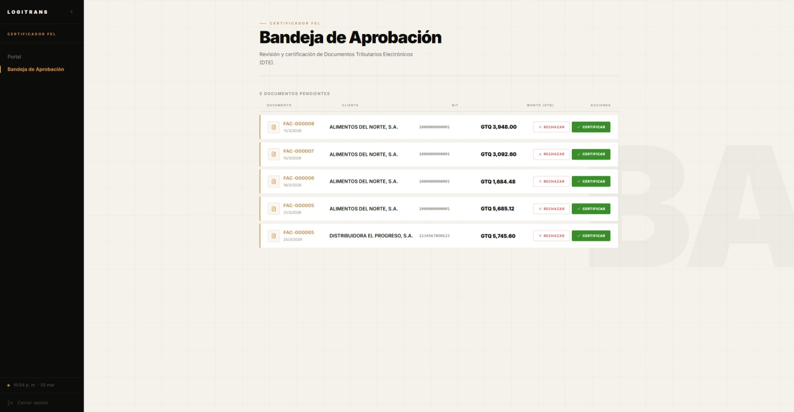

### 10.2 Flujo de validación de NIT y certificación

1. Haz clic en **"Certificar"** para abrir el modal.
2. Presiona **"Verificar NIT"**.
3. Confirma que aparece el mensaje **"NIT validado correctamente"** y se habilita la acción final.
4. Presiona **"Confirmar y Certificar"**.
5. El sistema muestra confirmación de éxito y la factura sale de pendientes.

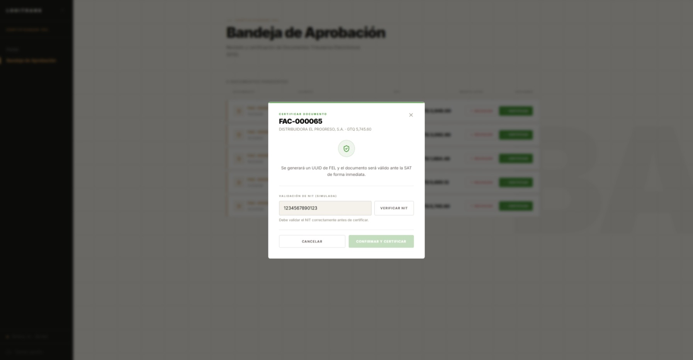
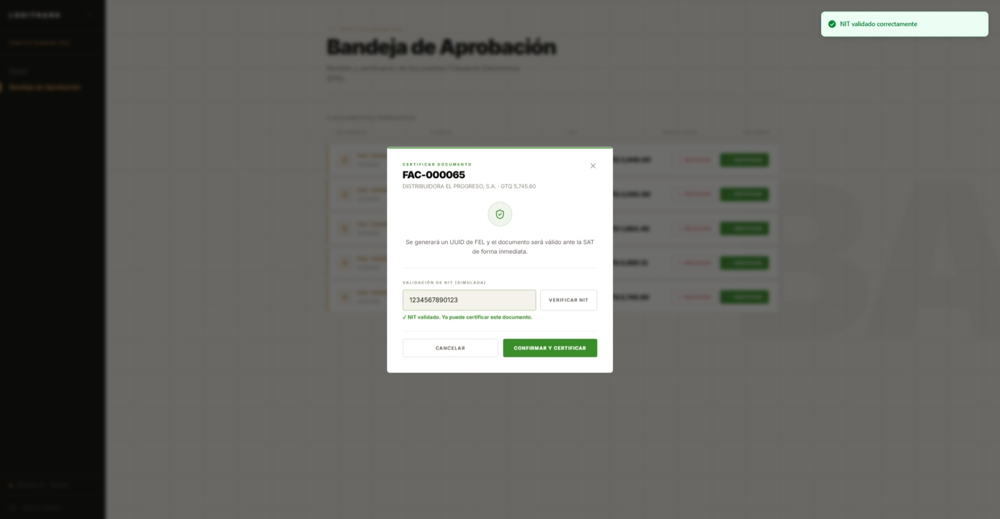
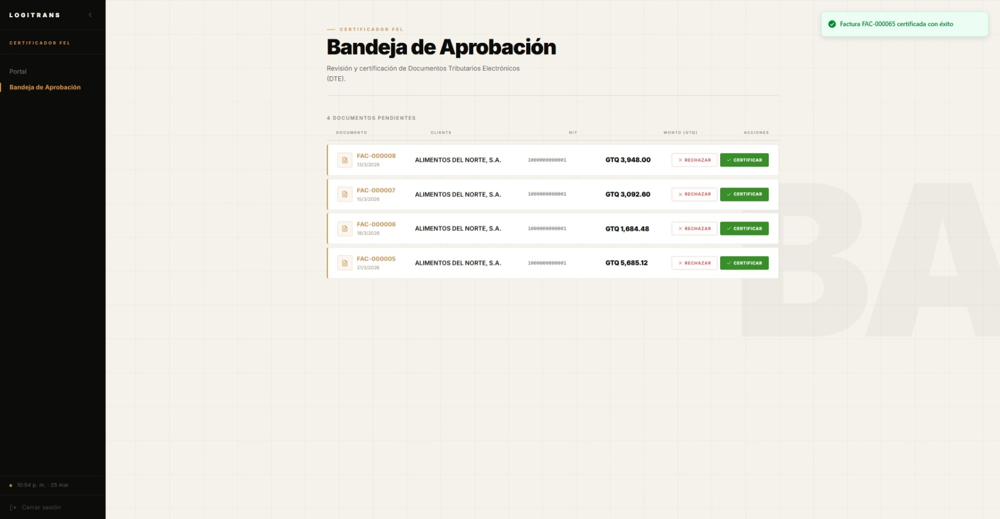

### 10.3 Flujo alterno de rechazo documentado

Este escenario alterno también quedó registrado para evidenciar control tributario:

1. Abrir el modal de **rechazo**.
2. Ingresar motivo (ejemplo: `NIT no valido`).
3. Confirmar rechazo y validar que desaparece de pendientes.


---

## 11. Módulo Financiero — Enviar Factura al Cliente
**Actor**: Agente Financiero

### 11.1 Identificar factura certificada lista para envío

1. Regresa a la sesión de Finanzas.
2. Abre **"Bandeja de Facturación"**.
3. Verifica que `FAC-000065` aparece en sección **CERTIFICADAS POR FEL** con botón **"Enviar"** habilitado.

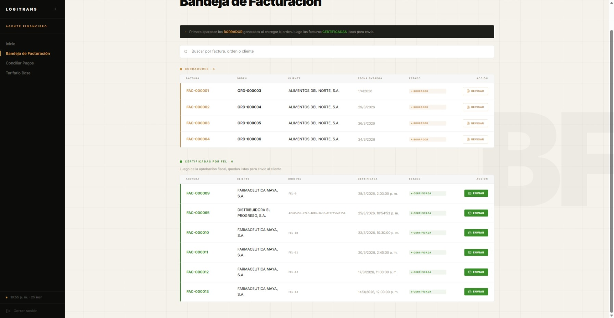

### 11.2 Confirmar envío al cliente

1. Presiona **"Enviar"** sobre `FAC-000065`.
2. En el modal, confirma con **"Confirmar envío"**.
3. El sistema muestra toast de éxito: **"Factura FAC-000065 enviada al cliente"**.
4. La factura queda en estado **`ENVIADA`**.

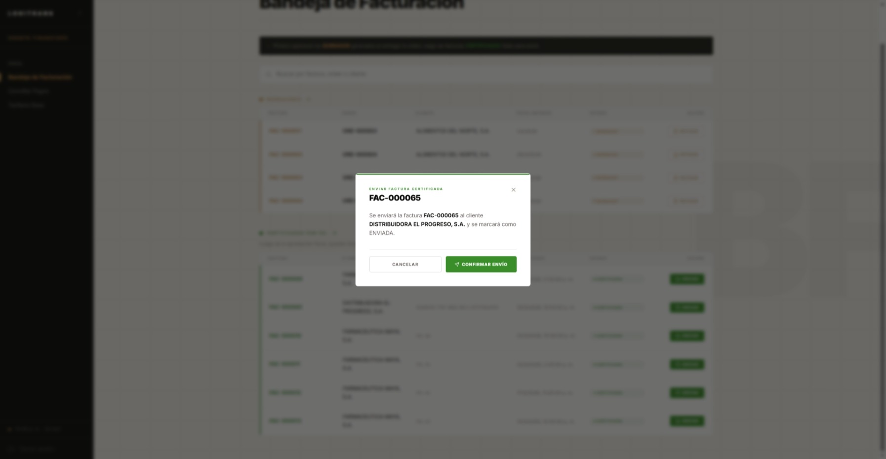
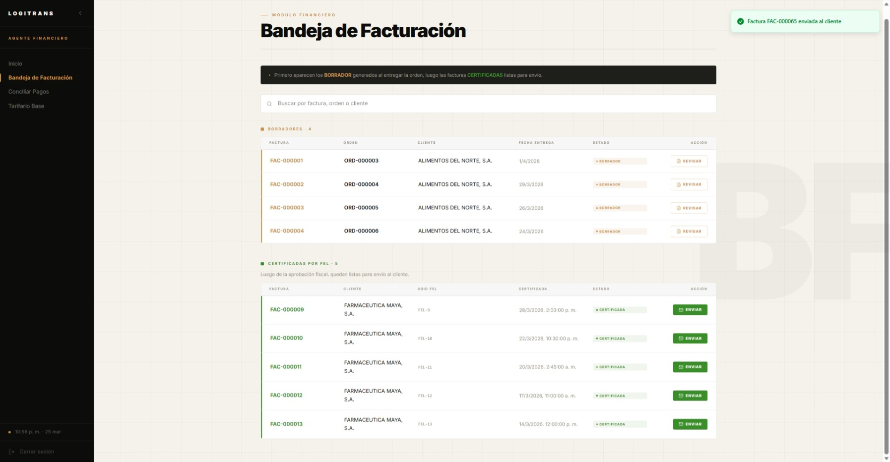

> Alcance de esta corrida: el flujo documentado termina en `ENVIADA`. La fase de pago/conciliación se documentará en una corrida posterior.

---

## Resumen del Flujo Completo

```
[Login] → [Operativo: Registrar Cliente] → [Operativo: Formalizar Contrato]
   → [Cliente: Aceptar Contrato] → [Cliente: Crear Orden]
   → [Logístico: Asignar Binomio] → [Patio: Registrar Despacho]
   → [Piloto: Iniciar Tránsito + Bitácora] → [Piloto: Confirmar Entrega]
   → [Sistema: Genera Borrador FEL automáticamente]
   → [Finanzas: Revisar Borrador + Enviar a Certificador]
   → [FEL: Validar NIT + Certificar / Rechazar]
   → [Finanzas: Enviar factura al cliente (ENVIADA)]
```

---

## Notas para el Presentador

- Todo el flujo anterior puede ejecutarse en la aplicación local corriendo con:
  ```bash
  docker-compose up -d
  ```
- El acceso se realiza en el Portal de Clientes LogiTrans según el ambiente configurado.
- Los datos del seed ya contienen órdenes en diferentes etapas del flujo para enriquecer la demostración; no es necesario crear todo desde cero.
- Para una demostración más rápida del MVP, puedes saltar al **paso 9** usando una factura `BORRADOR` ya existente en la bandeja de Finanzas (creada por el seed).
- Las credenciales completas están en `docs/mvp_accessos_usuarios.md`.
