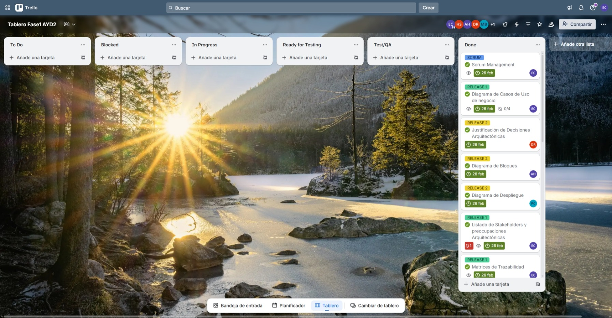
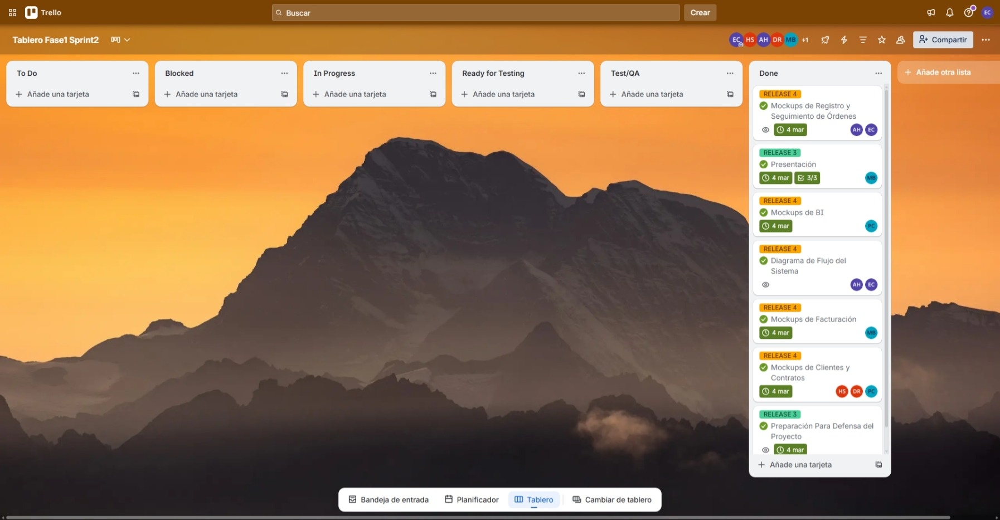
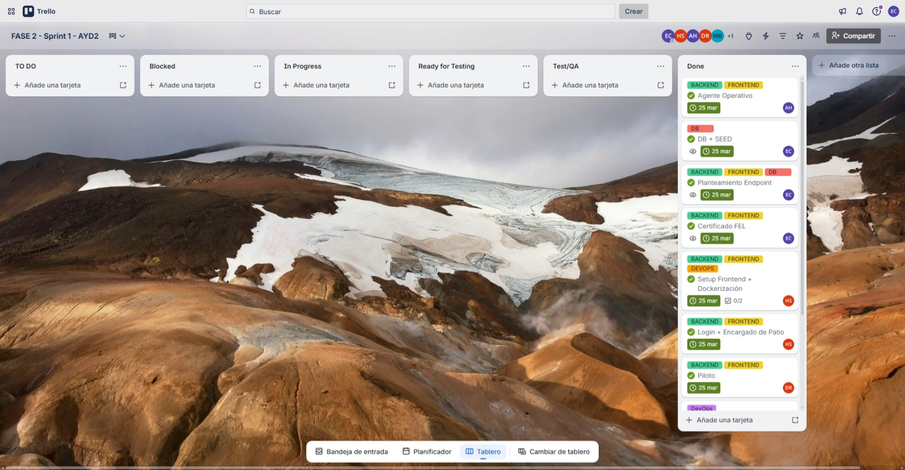
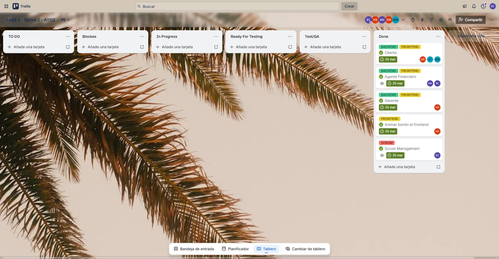
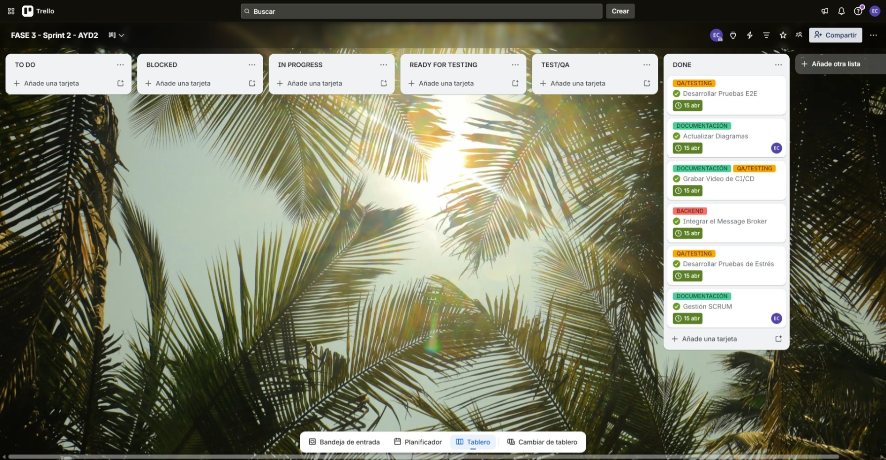
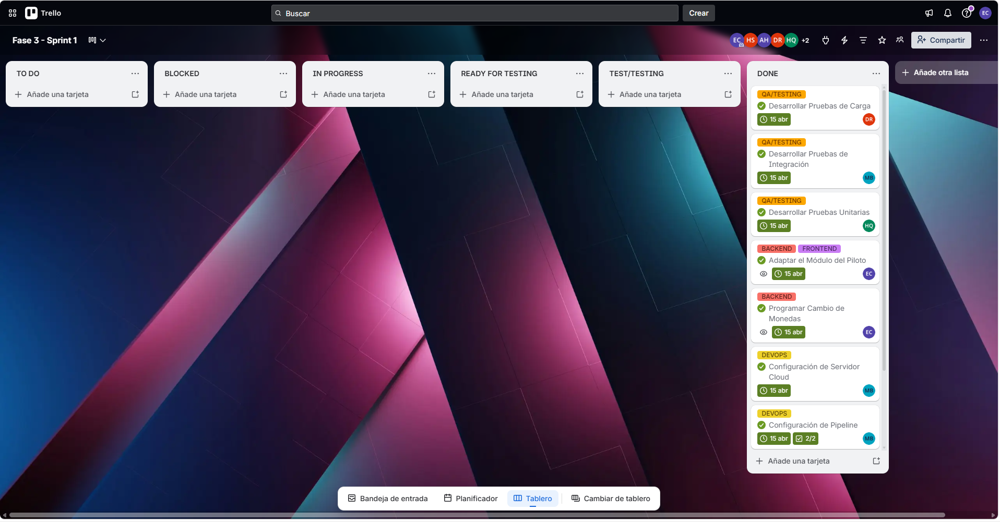

# Gestión Ágil del Proyecto - AYD2 Grupo 2

> **Metodología:** Scrum
> **Duración de Sprints:** ~1 semana
> **Equipo:** 6 desarrolladores
> **Framework:** Basado en la Guía Scrum 2020
> **Estado:** ⏳ En progreso

---

**[📹 Ver todas grabaciones Fase 1](https://drive.google.com/drive/u/2/folders/1OKNtUC4rdsPC6kN7s6AwAsapg5IZPnrc)**

---

## Tabla de Contenidos

- [Gestión Ágil del Proyecto - AYD2 Grupo 2](#gestión-ágil-del-proyecto---ayd2-grupo-2)
  - [Tabla de Contenidos](#tabla-de-contenidos)
  - [Resumen del Proyecto](#resumen-del-proyecto)
  - [Roles del Equipo Scrum](#roles-del-equipo-scrum)
  - [División del Trabajo](#división-del-trabajo)
  - [Fases del Proyecto](#fases-del-proyecto)
  - [Fase 1 — Arquitectura y Diseño](#fase-1--arquitectura-y-diseño)
    - [Sprint 1](#sprint-1)
      - [Daily Scrum 1 — 22 de febrero de 2026](#daily-scrum-1--22-de-febrero-de-2026)
      - [Daily Scrum 2 — 24 de febrero de 2026](#daily-scrum-2--24-de-febrero-de-2026)
      - [Sprint Retrospective — 26 de febrero de 2026](#sprint-retrospective--26-de-febrero-de-2026)
    - [Sprint 2](#sprint-2)
      - [Daily Scrum 1](#daily-scrum-1)
      - [Daily Scrum 2](#daily-scrum-2)
      - [Sprint Retrospective](#sprint-retrospective)
  - [Fase 2 — Desarrollo Principal](#fase-2--desarrollo-principal)
    - [Sprint 3](#sprint-3)
      - [Daily Scrum 1 — 16 de marzo de 2026](#daily-scrum-1--16-de-marzo-de-2026)
      - [Daily Scrum 2 — 17 de marzo de 2026](#daily-scrum-2--17-de-marzo-de-2026)
      - [Sprint Retrospective — 18 de marzo de 2026](#sprint-retrospective--18-de-marzo-de-2026)
    - [Sprint 4](#sprint-4)
      - [Daily Scrum 1 — 20 de marzo de 2026](#daily-scrum-1--20-de-marzo-de-2026)
      - [Daily Scrum 2 — 21 de marzo de 2026](#daily-scrum-2--21-de-marzo-de-2026)
      - [Sprint Retrospective — 22 de marzo de 2026](#sprint-retrospective--22-de-marzo-de-2026)
  - [Fase 3 — Integración y QA](#fase-3--integración-y-qa)
    - [Sprint 5](#sprint-5)
      - [Daily Scrum 1](#daily-scrum-1-1)
      - [Daily Scrum 2](#daily-scrum-2-1)
      - [Sprint Retrospective](#sprint-retrospective-1)
    - [Sprint 6](#sprint-6)
      - [Daily Scrum 1](#daily-scrum-1-2)
      - [Daily Scrum 2](#daily-scrum-2-2)
      - [Sprint Retrospective](#sprint-retrospective-2)
  - [Herramientas Utilizadas](#herramientas-utilizadas)

---

## Resumen del Proyecto

| Aspecto | Detalle |
|---------|---------|
| **Total de Sprints** | 6 Sprints |
| **Fases** | 3 fases (2 sprints por fase) |
| **Duración por Sprint** | ~1 semana |
| **Ceremonias** | Planning, Daily Scrums, Retrospectives |
| **Metodología de commits** | Conventional Commits |
| **Estrategia de branching** | Gitflow |
| **Estado del Proyecto** | ⏳ En progreso |

---

## Roles del Equipo Scrum

| Carnet | Nombre | Rol Scrum | Responsabilidad Técnica |
|--------|--------|-----------|------------------------|
| 202302220 | Enner Esaí Mendizabal Castro | Scrum Master | Base de datos / DDA |
| 201807398 | Anyelo Gustavo Hernández Ayala | Product Owner | Backend — Gestión de Órdenes |
| 202004071 | Henry David Quel Santos | Development Team | Frontend / Testing E2E |
| 202200214 | Pablo Alejandro Marroquin Cutz | Development Team | Backend — BI |
| 202202410 | Marcos Daniel Bonifasi de León | Development Team | Backend — Facturación |
| 202300670 | David Estuardo Barrios Ramírez | Development Team | Frontend |

---

## División del Trabajo

| Módulo | Mockups + Endpoints | Área |
|--------|---------------------|------|
| **Clientes** | Henry David Quel Santos, David Estuardo Barrios Ramírez | Frontend |
| **Gestión de Órdenes** | Anyelo Gustavo Hernández Ayala, Enner Esaí Mendizabal Castro | Backend + DB |
| **Facturación** | Marcos Daniel Bonifasi de León | Backend |
| **BI / Reportes** | Pablo Alejandro Marroquin Cutz | Backend |

---

## Fases del Proyecto

| Fase | Sprints | Enfoque |
|------|---------|---------|
| **Fase 1** | Sprint 1 — Sprint 2 | Arquitectura y diseño base |
| **Fase 2** | Sprint 3 — Sprint 4 | Desarrollo de módulos principales |
| **Fase 3** | Sprint 5 — Sprint 6 | Integración, pruebas y despliegue |

---

## Fase 1 — Arquitectura y Diseño

---

### Sprint 1

**Período:** 19 – 26 de febrero de 2026
**Objetivo:** Definir la arquitectura base, documentación técnica inicial y mockups del sistema

| Ceremonia | Fecha |
|-----------|-------|
| **Sprint Planning** | 19 de febrero de 2026 |
| **Daily Scrum 1** | 22 de febrero de 2026 |
| **Daily Scrum 2** | 24 de febrero de 2026 |
| **Sprint Retrospective** | 26 de febrero de 2026 |

---

#### Daily Scrum 1 — 22 de febrero de 2026

**Hora:** 22:00

**Participantes:**

---

**202302220 - Enner Esaí Mendizabal Castro**

*¿Qué hice ayer?*
- Dejé cerrados los drivers de calidad/restricción y consolidé el paquete de requisitos (funcionales, no funcionales y arquitecturales)

*¿Qué voy a hacer hoy?*
- Voy a levantar características priorizadas, avanzar en los diagramas de casos de uso y trazabilidad, e identificar stakeholders con sus preocupaciones

*¿Tengo algún impedimento?*
- No

---

**202202410 - Marcos Daniel Bonifasi de León**

*¿Qué hice ayer?*
- Terminé el diagrama de contexto del sistema

*¿Qué voy a hacer hoy?*
- Empezaré a desarrollar los mockups de la interfaz

*¿Tengo algún impedimento?*
- Al inicio tuve dudas con el formato del diagrama, pero las resolví investigando por mi cuenta

---

**202300670 - David Estuardo Barrios Ramírez**

*¿Qué hice ayer?*
- Inicié la redacción de la justificación de las decisiones de diseño arquitectónico

*¿Qué voy a hacer hoy?*
- Ajustaré la documentación conforme evolucione la arquitectura y arrancaré con los mockups

*¿Tengo algún impedimento?*
- No

---

**201807398 - Anyelo Gustavo Hernández Ayala**

*¿Qué hice ayer?*
- Terminé de leer el enunciado, avancé en el diagrama de bloques y dejé una base de mockups para el registro de transportes

*¿Qué voy a hacer hoy?*
- Voy a cerrar el diagrama de bloques del sistema

*¿Tengo algún impedimento?*
- Tengo limitaciones de tiempo por otros compromisos académicos

---

**202200214 - Pablo Alejandro Marroquin Cutz**

*¿Qué hice ayer?*
- Arranqué el diagrama de despliegue y me enfoqué en entender el alcance del proyecto

*¿Qué voy a hacer hoy?*
- Voy a finalizar el diagrama de despliegue

*¿Tengo algún impedimento?*
- Tengo poco tiempo por evaluaciones/compromisos de la universidad

---

**202004071 - Henry David Quel Santos**

*¿Qué hice ayer?*
- Terminé de revisar el enunciado y la documentación, avancé con el diagrama de componentes y definí lineamientos visuales para unificar los mockups

*¿Qué voy a hacer hoy?*
- Seguiré desarrollando los mockups

*¿Tengo algún impedimento?*
- No

---

**Resumen del Daily:**
El equipo avanzó en paralelo: se cerraron piezas de documentación arquitectónica y se dieron los primeros pasos en mockups. Enner consolidó DDA y requisitos; el resto repartió esfuerzos entre diagramas y prototipos. Henry impulsó lineamientos visuales para mantener consistencia. Dos integrantes reportaron limitaciones de tiempo por evaluaciones académicas.

**Notas Importantes:**
- Henry lideró la definición de los lineamientos visuales para mantener consistencia en los mockups del equipo
- Marcos resolvió de manera autónoma las dudas sobre el formato del diagrama de contexto
- Anyelo y Pablo reportaron presión de tiempo por evaluaciones universitarias, aspecto relevante para el ritmo del sprint
- Enner coordinó el cierre del DDA en paralelo con el avance técnico del resto del equipo

---

#### Daily Scrum 2 — 24 de febrero de 2026

**Hora:** 22:00

**Participantes:**

---

**202302220 - Enner Esaí Mendizabal Castro**

*¿Qué hice ayer?*
- Terminé de consolidar drivers y requisitos del sistema

*¿Qué voy a hacer hoy?*
- Hoy me enfocaré en estructurar y documentar el Scrum Management

*¿Tengo algún impedimento?*
- Hay restricciones generales de tiempo, pero sin bloqueos directos del proyecto

---

**202202410 - Marcos Daniel Bonifasi de León**

*¿Qué hice ayer?*
- Empecé los mockups y dejé finalizado el diagrama asignado

*¿Qué voy a hacer hoy?*
- Continuaré avanzando con los mockups

*¿Tengo algún impedimento?*
- El diagrama tomó varias iteraciones, lo que consumió más tiempo del esperado

---

**202300670 - David Estuardo Barrios Ramírez**

*¿Qué hice ayer?*
- Cerré la justificación de las decisiones de diseño de componentes

*¿Qué voy a hacer hoy?*
- Seguiré con mockups del módulo de clientes y atenderé pendientes

*¿Tengo algún impedimento?*
- No

---

**201807398 - Anyelo Gustavo Hernández Ayala**

*¿Qué hice ayer?*
- Estuve esperando retroalimentación del equipo sobre mi diagrama

*¿Qué voy a hacer hoy?*
- Integraré correcciones y ajustes solicitados

*¿Tengo algún impedimento?*
- Hubo un tema personal de salud, pero no afectó el avance en el proyecto

---

**202200214 - Pablo Alejandro Marroquin Cutz**

*¿Qué hice ayer?*
- Finalicé el diagrama de despliegue

*¿Qué voy a hacer hoy?*
- Quedo atento a revisión para ajustar y, en paralelo, empezaré mockups

*¿Tengo algún impedimento?*
- No

---

**202004071 - Henry David Quel Santos**

*¿Qué hice ayer?*
- Seguí con mockups y dejé listo el diagrama asignado

*¿Qué voy a hacer hoy?*
- Continuaré con mockups y haré ajustes si el diagrama lo requiere

*¿Tengo algún impedimento?*
- No

---

**Resumen del Daily:**
El equipo entró en la recta final de documentación base y mockups. Enner consolidó drivers/requisitos y se enfocó en Scrum Management. Marcos cerró su diagrama tras varias iteraciones y avanzó en prototipos. David terminó la justificación de componentes y siguió con mockups de clientes. Anyelo esperó retro para iterar. Pablo cerró despliegue y se alistó para mockups. Henry concluyó su diagrama y continuó con prototipos.

**Notas Importantes:**
- Anyelo reportó problemas de salud personales que no afectaron su rendimiento en el proyecto
- El diagrama de Marcos requirió múltiples iteraciones, lo que representó un reto de gestión del tiempo
- Pablo quedó en espera de retroalimentación antes de incorporar cambios a su diagrama
- Enner asumió la tarea de estructurar el Scrum Management del proyecto en este día

---

#### Sprint Retrospective — 26 de febrero de 2026

**Hora:** 22:00

**Participantes:**

---

**202302220 - Enner Esaí Mendizabal Castro**

*¿Qué salió bien en este sprint?*
- A pesar de las dificultades, se logró entregar documentación completa y alineada al enunciado; el proceso sirvió para aprender como equipo

*¿Qué no salió tan bien?*
- Hubo problemas de interpretación del enunciado que provocaron retrabajo y ajustes innecesarios

*¿Qué hemos aprendido?*
- Que cada integrante trabaja a ritmos distintos y conviene coordinar sin imponer sincronías poco realistas

*¿Qué haremos diferente la próxima vez?*
- Invertir tiempo real en una lectura y comprensión previa del enunciado, y balancear mejor la carga considerando tiempos individuales

---

**202202410 - Marcos Daniel Bonifasi de León**

*¿Qué salió bien en este sprint?*
- Me sirvió para aprender cómo documentar técnicamente y entender que primero se debe clarificar el negocio antes de diseñar

*¿Qué no salió tan bien?*
- Faltó profundizar en el análisis inicial, lo que limitó la visión global del sistema

*¿Qué hemos aprendido?*
- Que la documentación técnica sostiene tanto el diseño como la comunicación interna

*¿Qué haremos diferente la próxima vez?*
- Dedicar más tiempo desde el inicio a leer y comprender el enunciado

---

**202300670 - David Estuardo Barrios Ramírez**

*¿Qué salió bien en este sprint?*
- Se consiguió una documentación completa y se mantuvo un buen ambiente colaborativo

*¿Qué no salió tan bien?*
- En algunos momentos faltó comunicación y eso generó descoordinación

*¿Qué hemos aprendido?*
- Que una documentación sólida es clave para alinear al equipo y asegurar el éxito

*¿Qué haremos diferente la próxima vez?*
- Fortalecer canales y frecuencia de comunicación para mantener alineación constante

---

**201807398 - Anyelo Gustavo Hernández Ayala**

*¿Qué salió bien en este sprint?*
- La documentación quedó clara y completa; fue un entregable sólido para el sprint

*¿Qué no salió tan bien?*
- La complejidad del proyecto hizo más difícil interpretar el enunciado y pudo influir en decisiones de diseño

*¿Qué hemos aprendido?*
- Que iterar con cambios y correcciones es normal, pero impacta bastante en el esfuerzo de coordinación (especialmente del Scrum Master)

*¿Qué haremos diferente la próxima vez?*
- Reforzar comunicación para detectar ambigüedades temprano y evitar problemas posteriores

---

**202200214 - Pablo Alejandro Marroquin Cutz**

*¿Qué salió bien en este sprint?*
- El equipo se adaptó bien y logró resolver los retos que fueron apareciendo

*¿Qué no salió tan bien?*
- Los ajustes de último momento aumentaron presión y cortaron el ritmo de trabajo

*¿Qué hemos aprendido?*
- Que la flexibilidad es esencial, porque los ajustes del proyecto son inevitables

*¿Qué haremos diferente la próxima vez?*
- Ordenar mejor la planificación para reducir cambios tardíos y trabajar con mayor previsión

---

**202004071 - Henry David Quel Santos**

*¿Qué salió bien en este sprint?*
- Se cerró la documentación con mejoras, se definió una base visual para mockups y se avanzó con prototipos iniciales

*¿Qué no salió tan bien?*
- Hubo momentos de descoordinación que causaron confusión sobre la forma de trabajo y responsabilidades

*¿Qué hemos aprendido?*
- Que leer bien el enunciado evita malentendidos y que los ajustes propuestos por Scrum Master ayudan a mejorar el entregable

*¿Qué haremos diferente la próxima vez?*
- Hacer una lectura inicial más rigurosa para arrancar con un entendimiento común

---

**Resumen del Sprint:**
El sprint cerró con documentación completa y alineada a los requisitos. Como mejoras principales, el equipo identificó la interpretación del enunciado y la comunicación interna. Se repitieron conclusiones: leer mejor antes de repartir tareas, coordinar tiempos individuales con más realismo y fortalecer la sincronización del equipo. También se reconoció el esfuerzo de coordinación del Scrum Master para sostener la calidad.

**Notas Importantes:**
- La comprensión insuficiente del enunciado fue el impedimento más recurrente del sprint
- El Scrum Master asumió una carga considerable de correcciones y ajustes
- El equipo reconoció la importancia de la documentación técnica como base del proyecto
- La flexibilidad y la adaptación fueron habilidades que el equipo ejerció a lo largo del sprint

**Tablero del Sprint (referencia):**

---

### Sprint 2

**Período:** 26 de febrero – 5 de marzo de 2026 _(estimado)_
**Objetivo:** Completar los mockups del sistema y preparar la presentación de la primera fase del proyecto

| Ceremonia | Fecha |
|-----------|-------|
| **Sprint Planning** | 26 de febrero de 2026 |
| **Daily Scrum 1** | _(pendiente)_ |
| **Daily Scrum 2** | _(pendiente)_ |
| **Sprint Retrospective** | _(pendiente)_ |

---

#### Daily Scrum 1

**Hora:** 22:00

**Participantes:**

---

**202302220 - Enner Esaí Mendizabal Castro**

*¿Qué hice ayer?*
- Empecé a trabajar con los mockups asignados junto a Anyelo y me familiaricé con Figma

*¿Qué voy a hacer hoy?*
- Me enfocaré en completar los mockups que tengo asignados

*¿Tengo algún impedimento?*
- No

---

**202202410 - Marcos Daniel Bonifasi de León**

*¿Qué hice ayer?*
- Inicié la preparación de la presentación para la evaluación de la fase

*¿Qué voy a hacer hoy?*
- Continuaré avanzando con mockups y con la presentación

*¿Tengo algún impedimento?*
- No

---

**202300670 - David Estuardo Barrios Ramírez**

*¿Qué hice ayer?*
- Intenté cerrar los mockups, pero detecté que tenía una interpretación incorrecta de parte de los requisitos

*¿Qué voy a hacer hoy?*
- Revisaré lineamientos de la presentación para aclarar responsabilidades y alcance por integrante

*¿Tengo algún impedimento?*
- No

---

**201807398 - Anyelo Gustavo Hernández Ayala**

*¿Qué hice ayer?*
- Arranqué los mockups asignados coordinándome con Enner

*¿Qué voy a hacer hoy?*
- Continuaré hasta terminar los mockups a mi cargo

*¿Tengo algún impedimento?*
- No

---

**202200214 - Pablo Alejandro Marroquin Cutz**

*¿Qué hice ayer?*
- Empecé mis mockups asignados

*¿Qué voy a hacer hoy?*
- Seguiré avanzando con los mockups

*¿Tengo algún impedimento?*
- No

---

**202004071 - Henry David Quel Santos**

*¿Qué hice ayer?*
- Seguí avanzando con mockups del sistema

*¿Qué voy a hacer hoy?*
- Revisaré los requisitos de la presentación para aclarar qué debe desarrollar cada quien

*¿Tengo algún impedimento?*
- No

---

**Resumen del Daily:**
El equipo arrancó el Sprint 2 enfocado en mockups y en la presentación de la fase. Enner se puso al día con Figma para ejecutar sus prototipos. Marcos y Henry dividieron esfuerzo entre mockups y presentación. David detectó un malentendido de requisitos y corrigió el rumbo. Anyelo y Pablo mantuvieron un avance estable en sus entregables.

**Notas Importantes:**
- David identificó un malentendido en los requisitos de sus mockups, requiriendo ajuste de enfoque
- Enner incorporó Figma como herramienta de diseño durante este sprint
- El equipo comenzó a distribuir esfuerzos entre los mockups y la preparación de la presentación de fase

---

#### Daily Scrum 2

**Hora:** 22:00

**Participantes:**

---

**202302220 - Enner Esaí Mendizabal Castro**

*¿Qué hice ayer?*
- Cerré mis mockups asignados y avancé con el diagrama de flujo del sistema

*¿Qué voy a hacer hoy?*
- Me dedicaré a revisar el avance general para asegurar consistencia y cierre

*¿Tengo algún impedimento?*
- Hay incertidumbre sobre cómo dividir vistas (por casos de uso vs. por módulos), lo que requiere alineación

---

**202202410 - Marcos Daniel Bonifasi de León**

*¿Qué hice ayer?*
- Terminé mockups y dejé lista la presentación

*¿Qué voy a hacer hoy?*
- Ya tengo el sprint cerrado desde mi lado

*¿Tengo algún impedimento?*
- Detecté un tema de escalabilidad por impuestos/regiones que obligó a ajustar el enfoque

---

**202300670 - David Estuardo Barrios Ramírez**

*¿Qué hice ayer?*
- Revisé el trabajo realizado y profundicé en decisiones arquitectónicas documentadas

*¿Qué voy a hacer hoy?*
- Concluí mis tareas del sprint

*¿Tengo algún impedimento?*
- No

---

**201807398 - Anyelo Gustavo Hernández Ayala**

*¿Qué hice ayer?*
- Terminé de revisar lineamientos de la presentación y cerré mis mockups

*¿Qué voy a hacer hoy?*
- Ya cerré mis tareas del sprint

*¿Tengo algún impedimento?*
- No

---

**202200214 - Pablo Alejandro Marroquin Cutz**

*¿Qué hice ayer?*
- Finalicé el mockup asignado

*¿Qué voy a hacer hoy?*
- Quedo atento a la asignación de secciones para la presentación final

*¿Tengo algún impedimento?*
- No

---

**202004071 - Henry David Quel Santos**

*¿Qué hice ayer?*
- Terminé mockups y revisé la presentación para validar contenido

*¿Qué voy a hacer hoy?*
- Ya concluí mis tareas del sprint

*¿Tengo algún impedimento?*
- No

---

**Resumen del Daily:**
Al cierre del Sprint 2, la mayoría del equipo ya había terminado. Enner tomó el rol de revisión y levantó la duda sobre cómo dividir vistas (CDU vs módulos). Marcos detectó un requisito de escalabilidad regional y ajustó su entregable. El resto quedó en espera de asignaciones para la presentación.

**Notas Importantes:**
- Enner identificó una ambigüedad en la división de vistas por CDU vs módulos, punto a clarificar para sprints futuros
- Marcos incorporó consideraciones de escalabilidad regional con esquemas de impuestos diferenciados
- La mayoría del equipo concluyó sus tareas antes del cierre del sprint, mostrando mejora en la gestión del tiempo

---

#### Sprint Retrospective

**Hora:** 07:00

**Participantes:**

---

**202302220 - Enner Esaí Mendizabal Castro**

*¿Qué salió bien en este sprint?*
- Hubo un avance claro frente al sprint anterior, sobre todo en organización y manejo del tiempo

*¿Qué no salió tan bien?*
- Se heredaron confusiones del sprint anterior por interpretación del enunciado, y eso afectó el arranque

*¿Qué hemos aprendido?*
- Se volvió evidente que necesitamos una lectura más profunda (idealmente conjunta) antes de repartir trabajo

*¿Qué haremos diferente la próxima vez?*
- Estructurar mejor la planificación previa y confirmar que todos comprendan el enunciado antes de distribuir tareas

---

**202202410 - Marcos Daniel Bonifasi de León**

*¿Qué salió bien en este sprint?*
- Se mejoró la disciplina de versionamiento y cierre ordenado de cambios

*¿Qué no salió tan bien?*
- En algunos puntos se dependió demasiado de asistentes de IA, lo que puede frenar el aprendizaje profundo

*¿Qué hemos aprendido?*
- Que trabajar en cercanía con Scrum Master y comunicar a tiempo mejora resultados

*¿Qué haremos diferente la próxima vez?*
- Ser más rigurosos con lectura y análisis de materiales del proyecto

---

**202300670 - David Estuardo Barrios Ramírez**

*¿Qué salió bien en este sprint?*
- La guía del Scrum Master ayudó a mantener al equipo enfocado y encaminado

*¿Qué no salió tan bien?*
- Persistieron fallas de interpretación del enunciado que generaron desalineación

*¿Qué hemos aprendido?*
- Que una buena base documental facilita el desarrollo y las decisiones

*¿Qué haremos diferente la próxima vez?*
- Aumentar reuniones de coordinación para aclarar alcance y lineamientos

---

**201807398 - Anyelo Gustavo Hernández Ayala**

*¿Qué salió bien en este sprint?*
- El equipo mantuvo un ritmo constante y eficiente durante el sprint

*¿Qué no salió tan bien?*
- Hubo bastante estrés durante el sprint, afectando la experiencia de trabajo

*¿Qué hemos aprendido?*
- Que producir documentación con estándar profesional es un activo importante para el proyecto

*¿Qué haremos diferente la próxima vez?*
- Alinear directrices con más claridad para reducir incertidumbre y estrés

---

**202200214 - Pablo Alejandro Marroquin Cutz**

*¿Qué salió bien en este sprint?*
- Se cumplieron los entregables comprometidos del sprint

*¿Qué no salió tan bien?*
- Los cambios frecuentes y poco predecibles dificultaron el flujo de trabajo

*¿Qué hemos aprendido?*
- Como equipo, fortalecimos la capacidad de adaptación a cambios

*¿Qué haremos diferente la próxima vez?*
- Mejorar gestión de tiempo/reuniones y comprometerse con estimaciones más realistas

---

**202004071 - Henry David Quel Santos**

*¿Qué salió bien en este sprint?*
- Se lograron producir los diagramas requeridos de forma satisfactoria

*¿Qué no salió tan bien?*
- La priorización y autogestión del tiempo pudo ser mejor

*¿Qué hemos aprendido?*
- Se ganó experiencia en documentación técnica con estándar profesional

*¿Qué haremos diferente la próxima vez?*
- Mejorar autogestión y organización personal para ejecutar con más eficacia

---

**Resumen del Sprint:**
El Sprint 2 evidenció una mejora frente al anterior: se cumplieron los entregables comprometidos. Aun así, persistieron algunas confusiones heredadas por interpretación del enunciado. Quedaron como áreas prioritarias: autogestión individual, planificación colectiva antes de ejecutar y más comunicación para alinear expectativas.

**Notas Importantes:**
- El equipo completó todos los entregables del sprint, mostrando mejora en la gestión del tiempo respecto al Sprint 1
- La dependencia de herramientas de IA en lugar de investigación propia fue identificada como un riesgo de aprendizaje
- La guía del Scrum Master fue reconocida por varios integrantes como un factor clave de éxito
- Se recomienda incrementar la frecuencia de reuniones de coordinación en los siguientes sprints

**Tablero del Sprint (referencia):**

---

## Fase 2 — Desarrollo Principal

**[📹 Ver grabaciones de la Fase 2](https://drive.google.com/drive/u/2/folders/1w4DP6CERAgafuUTdYCGU5eyUonN0_qtr)**

---

### Sprint 3

**Período:** 15 – 18 de marzo de 2026
**Objetivo:** Implementar la base técnica (infra, autenticación e integración) y entregar los primeros módulos funcionales de la fase

| Ceremonia | Fecha |
|-----------|-------|
| **Sprint Planning** | 15 de marzo de 2026 — 22:00 |
| **Daily Scrum 1** | 16 de marzo de 2026 — 22:00 |
| **Daily Scrum 2** | 17 de marzo de 2026 — 22:00 |
| **Sprint Retrospective** | 18 de marzo de 2026 — 22:00 |

---

#### Daily Scrum 1 — 16 de marzo de 2026

**Hora:** 22:00

**Participantes:**

---

**202302220 - Enner Esaí Mendizabal Castro**

*¿Qué hice ayer?*
- Cerré el planteamiento de endpoints y avancé en la creación de la base de datos

*¿Qué voy a hacer hoy?*
- Quiero completar e iniciar pruebas del módulo FEL, y terminar seeds y ajustes de base de datos

*¿Tengo algún impedimento?*
- No

---

**202202410 - Marcos Daniel Bonifasi de León**

*¿Qué hice ayer?*
- Dejé configurado el backend (TypeORM, entidades, Clean Architecture, JWT y middlewares) y avancé con la infraestructura (on‑premise y balanceo)

*¿Qué voy a hacer hoy?*
- Continuaré con dockerización, pruebas e implementación de login en el backend

*¿Tengo algún impedimento?*
- No

---

**202300670 - David Estuardo Barrios Ramírez**

*¿Qué hice ayer?*
- Me dediqué a entender la estructura del frontend para arrancar bien el desarrollo

*¿Qué voy a hacer hoy?*
- Avanzaré para cerrar la parte frontend y apoyar en lo backend que se me asignó

*¿Tengo algún impedimento?*
- No

---

**201807398 - Anyelo Gustavo Hernández Ayala**

*¿Qué hice ayer?*
- Avancé en frontend mientras esperaba que el backend quedara listo

*¿Qué voy a hacer hoy?*
- Ahora que ya está el backend, trabajaré en integrarlo, conectarlo con el frontend y hacer pruebas

*¿Tengo algún impedimento?*
- No

---

**202200214 - Pablo Alejandro Marroquin Cutz**

*¿Qué hice ayer?*
- Avancé con parte del backend en módulos de logística

*¿Qué voy a hacer hoy?*
- Buscaré cerrar el backend para pasar a etapa de pruebas

*¿Tengo algún impedimento?*
- No

---

**202004071 - Henry David Quel Santos**

*¿Qué hice ayer?*
- Definí la estructura base del frontend para que el equipo pudiera trabajar sobre una misma base

*¿Qué voy a hacer hoy?*
- Implementaré el login y el frontend del módulo de patio

*¿Tengo algún impedimento?*
- No

---

**Resumen del Daily:**
El equipo se enfocó en sentar la base técnica: backend con arquitectura limpia, infraestructura con Docker/on‑premise y autenticación. En paralelo se preparó la estructura del frontend y se inició la integración para avanzar hacia pruebas.

**Notas Importantes:**
- Se priorizó el setup (infra, auth y arquitectura) para habilitar el desarrollo de módulos
- Frontend y backend empezaron a sincronizar integración y pruebas

---

#### Daily Scrum 2 — 17 de marzo de 2026

**Hora:** 22:00

**Participantes:**

---

**202302220 - Enner Esaí Mendizabal Castro**

*¿Qué hice ayer?*
- Terminé el módulo FEL (frontend y backend) y avancé en pruebas de seeds y el diseño de endpoints que se están implementando

*¿Qué voy a hacer hoy?*
- Haré pruebas integrales a lo desarrollado (backend y frontend) para validar funcionamiento

*¿Tengo algún impedimento?*
- Hubo una fricción leve con JWT porque el login todavía no estaba completamente integrado mientras desarrollaba

---

**202202410 - Marcos Daniel Bonifasi de León**

*¿Qué hice ayer?*
- Se integró login en el backend, se probó la infraestructura simulada con Docker y se realizó merge de cambios

*¿Qué voy a hacer hoy?*
- Terminaré de validar el login y aplicaré ajustes si aparecen issues

*¿Tengo algún impedimento?*
- No

---

**202300670 - David Estuardo Barrios Ramírez**

*¿Qué hice ayer?*
- Cerré frontend y backend asignados y ejecuté pruebas básicas que salieron bien

*¿Qué voy a hacer hoy?*
- Me quedo atento a revisiones; mi parte está cerrada

*¿Tengo algún impedimento?*
- No

---

**201807398 - Anyelo Gustavo Hernández Ayala**

*¿Qué hice ayer?*
- Terminé el backend asignado y lo conecté con el frontend

*¿Qué voy a hacer hoy?*
- Quedo pendiente de revisión; si hay feedback, aplico cambios

*¿Tengo algún impedimento?*
- No

---

**202200214 - Pablo Alejandro Marroquin Cutz**

*¿Qué hice ayer?*
- Terminé mis tareas y quedé a la espera de aprobación de QA

*¿Qué voy a hacer hoy?*
- Apoyaré en lo que haga falta para cerrar el sprint de forma exitosa

*¿Tengo algún impedimento?*
- No

---

**202004071 - Henry David Quel Santos**

*¿Qué hice ayer?*
- Finalicé el frontend asignado y lo integré con backend

*¿Qué voy a hacer hoy?*
- Haré pruebas de funcionalidad en conjunto con Marcos

*¿Tengo algún impedimento?*
- No

---

**Resumen del Daily:**
El equipo entró en etapa de pruebas e integración. Se consolidó el login, se validó infraestructura en Docker, y se cerraron módulos como FEL y patio. Varias tareas quedaron listas para revisión/QA, mientras se coordinó testing conjunto.

**Notas Importantes:**
- La integración de login/JWT fue crítica para habilitar pruebas completas
- Se reforzó la coordinación para QA y pruebas cruzadas

---

#### Sprint Retrospective — 18 de marzo de 2026

**Hora:** 22:00

**Participantes:**

---

**202302220 - Enner Esaí Mendizabal Castro**

*¿Qué salió bien en este sprint?*
- La implementación avanzó rápido y la coordinación con Gitflow facilitó integrar cambios con orden

*¿Qué no salió tan bien?*
- El arranque fue lento por inercia de la fase anterior y porque el login tomó más coordinación de lo esperado

*¿Qué hemos aprendido?*
- Que el desarrollo actual se apoya en más capas de abstracción/herramientas, y aprovecharlas bien acelera el trabajo

*¿Qué haremos diferente la próxima vez?*
- Arrancar antes y con acuerdos claros para no correr al final

---

**202202410 - Marcos Daniel Bonifasi de León**

*¿Qué salió bien en este sprint?*
- El setup de infraestructura y base del backend quedó sólido

*¿Qué no salió tan bien?*
- El tiempo de desarrollo se sintió ajustado

*¿Qué hemos aprendido?*
- Que Nginx y la arquitectura limpia son piezas clave para escalar el proyecto

*¿Qué haremos diferente la próxima vez?*
- Reutilizar conceptos/plantillas para avanzar más rápido en los módulos restantes

---

**202300670 - David Estuardo Barrios Ramírez**

*¿Qué salió bien en este sprint?*
- La organización y claridad del objetivo permitió que todos implementaran con menos fricción

*¿Qué no salió tan bien?*
- Se inició tarde y se trabajó contra reloj antes de los dailies

*¿Qué hemos aprendido?*
- Aplicar los patrones de arquitectura propuestos mejora consistencia del desarrollo

*¿Qué haremos diferente la próxima vez?*
- Trabajar con más anticipación y no concentrar el esfuerzo al final

---

**201807398 - Anyelo Gustavo Hernández Ayala**

*¿Qué salió bien en este sprint?*
- Mejoró el trabajo en equipo y la coordinación; hubo más confianza para integrar cambios

*¿Qué no salió tan bien?*
- El arranque costó y tomó tiempo alinear el inicio

*¿Qué hemos aprendido?*
- Que apoyarse en IA puede ayudar a cumplir tiempos, siempre que se use con criterio

*¿Qué haremos diferente la próxima vez?*
- Reaprovechar el código bien estructurado que salió de esta fase

---

**202200214 - Pablo Alejandro Marroquin Cutz**

*¿Qué salió bien en este sprint?*
- Hubo mejor coordinación entre front y back para empujar entregables de forma conjunta

*¿Qué no salió tan bien?*
- Costó organizar responsabilidades al inicio para repartir carga de forma equitativa

*¿Qué hemos aprendido?*
- Que la IA puede ser muy útil si se entiende el proyecto y se respetan los protocolos internos

*¿Qué haremos diferente la próxima vez?*
- Definir estándares desde el inicio para trabajar bajo una misma línea

---

**202004071 - Henry David Quel Santos**

*¿Qué salió bien en este sprint?*
- Se completaron las vistas/entregables que el equipo se propuso para el sprint

*¿Qué no salió tan bien?*
- Se concentró demasiado trabajo al final, cerca de los dailies

*¿Qué hemos aprendido?*
- Se ganó experiencia práctica con NestJS y el stack del backend

*¿Qué haremos diferente la próxima vez?*
- Acordar mejor herramientas y forma de trabajo desde el inicio

---

**Resumen del Sprint:**
El Sprint 3 consolidó la base técnica y permitió cerrar módulos iniciales con integración y pruebas. Como mejoras, el equipo identificó la necesidad de arrancar antes, definir estándares/plantillas reutilizables y distribuir mejor el trabajo para evitar presión al final.

**Notas Importantes:**
- Gitflow y la coordinación de merges ayudaron a integrar sin bloquear al equipo
- El login/JWT fue un punto de acoplamiento que requirió sincronización

**Tablero del Sprint (referencia):**

---

### Sprint 4

**Período:** 19 – 22 de marzo de 2026
**Objetivo:** Consolidar módulos de negocio de la fase, completar integraciones y dejar entregables listos para QA

| Ceremonia | Fecha |
|-----------|-------|
| **Sprint Planning** | 19 de marzo de 2026 — 22:00 |
| **Daily Scrum 1** | 20 de marzo de 2026 — 22:00 |
| **Daily Scrum 2** | 21 de marzo de 2026 — 22:00 |
| **Sprint Retrospective** | 22 de marzo de 2026 — 22:00 |

---

#### Daily Scrum 1 — 20 de marzo de 2026

**Hora:** 22:00

**Participantes:**

---

**202302220 - Enner Esaí Mendizabal Castro**

*¿Qué hice ayer?*
- Terminé el backend del área asignada

*¿Qué voy a hacer hoy?*
- Completaré el frontend, lo integraré con backend y coordinaré con lo de Anyelo para luego probar todo en conjunto

*¿Tengo algún impedimento?*
- No

---

**202202410 - Marcos Daniel Bonifasi de León**

*¿Qué hice ayer?*
- Arranqué con las vistas de frontend en coordinación con David y Pablo

*¿Qué voy a hacer hoy?*
- Continuaré el desarrollo del frontend

*¿Tengo algún impedimento?*
- No

---

**202300670 - David Estuardo Barrios Ramírez**

*¿Qué hice ayer?*
- Empecé a revisar el backend con más anticipación para entender bien lo que debía integrar

*¿Qué voy a hacer hoy?*
- Avanzaré con backend y seguiré con el frontend

*¿Tengo algún impedimento?*
- No

---

**201807398 - Anyelo Gustavo Hernández Ayala**

*¿Qué hice ayer?*
- Avancé en frontend y progresé con el backend asignado

*¿Qué voy a hacer hoy?*
- Integraré todo y ejecutaré pruebas

*¿Tengo algún impedimento?*
- No he encontrado complicaciones por ahora

---

**202200214 - Pablo Alejandro Marroquin Cutz**

*¿Qué hice ayer?*
- Empecé el desarrollo del backend y revisé validaciones necesarias

*¿Qué voy a hacer hoy?*
- Buscaré terminar backend para pasar al frontend

*¿Tengo algún impedimento?*
- No

---

**202004071 - Henry David Quel Santos**

*¿Qué hice ayer?*
- Recopilé ideas de frontend e investigué librerías para reutilizar en el proyecto

*¿Qué voy a hacer hoy?*
- Implementaré esas bases en código para que el equipo pueda usarlas

*¿Tengo algún impedimento?*
- No

---

**Resumen del Daily:**
El equipo avanzó en paralelo: backend con validaciones y endpoints, frontend con vistas y librerías compartidas, y trabajo de integración para pruebas. Se reforzó la coordinación entre integrantes para acelerar entregables.

**Notas Importantes:**
- Se priorizó integración temprana para detectar fallos antes de QA
- Se buscó reutilización de componentes/librerías para acelerar el frontend

---

#### Daily Scrum 2 — 21 de marzo de 2026

**Hora:** 22:00

**Participantes:**

---

**202302220 - Enner Esaí Mendizabal Castro**

*¿Qué hice ayer?*
- Finalicé frontend e integración con backend, incluyendo la unificación con lo trabajado por Anyelo

*¿Qué voy a hacer hoy?*
- Voy a probarlo y validar que todo funcione correctamente

*¿Tengo algún impedimento?*
- No

---

**202202410 - Marcos Daniel Bonifasi de León**

*¿Qué hice ayer?*
- Terminé endpoints de backend e integré con el frontend que ya tenía avanzado

*¿Qué voy a hacer hoy?*
- Haré pruebas de lo realizado

*¿Tengo algún impedimento?*
- No

---

**202300670 - David Estuardo Barrios Ramírez**

*¿Qué hice ayer?*
- Avancé mi parte del módulo de clientes en backend

*¿Qué voy a hacer hoy?*
- Terminaré el frontend; estoy recibiendo apoyo para cerrar a tiempo

*¿Tengo algún impedimento?*
- No hay bloqueos, pero sí atraso en frontend que se está cubriendo con ayuda del equipo

---

**201807398 - Anyelo Gustavo Hernández Ayala**

*¿Qué hice ayer?*
- Se avanzó fuerte, se cerró la integración y quedó conectado

*¿Qué voy a hacer hoy?*
- Haré una revisión final para detectar fallos

*¿Tengo algún impedimento?*
- No

---

**202200214 - Pablo Alejandro Marroquin Cutz**

*¿Qué hice ayer?*
- Terminé mi parte del backend e inicié el frontend

*¿Qué voy a hacer hoy?*
- Cerraré el frontend para enviarlo a QA

*¿Tengo algún impedimento?*
- No

---

**202004071 - Henry David Quel Santos**

*¿Qué hice ayer?*
- Terminé las vistas y funciones asignadas (incluyendo gerente con visualizaciones)

*¿Qué voy a hacer hoy?*
- Probaré todo en conjunto con el equipo

*¿Tengo algún impedimento?*
- No

---

**Resumen del Daily:**
El equipo cerró integraciones y pasó a una etapa fuerte de pruebas y QA. Se destacó apoyo cruzado para cerrar el frontend a tiempo, y se prepararon entregables para revisión final.

**Notas Importantes:**
- El apoyo entre integrantes ayudó a compensar atrasos en frontend
- La transición a QA se priorizó al cierre del sprint

---

#### Sprint Retrospective — 22 de marzo de 2026

**Hora:** 22:00

**Participantes:**

---

**202302220 - Enner Esaí Mendizabal Castro**

*¿Qué salió bien en este sprint?*
- La meta final se mantuvo clara y el uso de IA ayudó a acelerar implementación y cierre de tareas

*¿Qué no salió tan bien?*
- El cansancio acumulado y la carga de otros cursos afectaron motivación y ritmo

*¿Qué hemos aprendido?*
- Que la calidad del trabajo con IA depende mucho de prompts y de mantener disciplina técnica

*¿Qué haremos diferente la próxima vez?*
- Cuidar energía/ritmo y definir mejor guías de trabajo (incluyendo prompts/estándares) para evitar retrabajo

---

**202202410 - Marcos Daniel Bonifasi de León**

*¿Qué salió bien en este sprint?*
- La asistencia de código y conceptos ya establecidos ayudaron a avanzar más rápido

*¿Qué no salió tan bien?*
- La comunicación en detalles y el tiempo disponible limitaron la ejecución

*¿Qué hemos aprendido?*
- Que integrar todo (y preparar despliegue/demo) siempre destapa fallos, por lo que hay que planear integración temprano

*¿Qué haremos diferente la próxima vez?*
- Reforzar integración anticipada y comunicación fina para reducir sorpresas al unir trabajo

---

**202300670 - David Estuardo Barrios Ramírez**

*¿Qué salió bien en este sprint?*
- La documentación ayudó a guiar el desarrollo y la IA redujo la curva al aprender tecnologías nuevas

*¿Qué no salió tan bien?*
- Aprender nuevas tecnologías consumió tiempo, aunque se mitigó parcialmente con asistencia

*¿Qué hemos aprendido?*
- Que adoptar herramientas nuevas requiere planificar curva de aprendizaje e integración

*¿Qué haremos diferente la próxima vez?*
- Calendarizar mejor el aprendizaje e ir integrando por etapas para no atrasar entregables

---

**201807398 - Anyelo Gustavo Hernández Ayala**

*¿Qué salió bien en este sprint?*
- La cohesión del equipo y el uso de IA ayudaron a sostener el avance

*¿Qué no salió tan bien?*
- El tiempo y la procrastinación fueron un freno, dado el tamaño del proyecto

*¿Qué hemos aprendido?*
- Que mantener disciplina (incluyendo formato de commits) es clave para no introducir fricción en el flujo

*¿Qué haremos diferente la próxima vez?*
- Cuidar estándares desde el inicio (por ejemplo, convención de commits) y trabajar con más constancia

---

**202200214 - Pablo Alejandro Marroquin Cutz**

*¿Qué salió bien en este sprint?*
- Se identificó que optimizar el uso de recursos y herramientas puede mejorar el avance

*¿Qué no salió tan bien?*
- La comunicación de ideas no siempre fue clara y eso generó retrabajo; además, hubo fricción por herramientas/recursos usados

*¿Qué hemos aprendido?*
- Que comunicar con precisión (y estandarizar cómo se trabaja) es tan importante como programar

*¿Qué haremos diferente la próxima vez?*
- Establecer guías de comunicación/estándares y revisar optimización para no desperdiciar recursos

---

**202004071 - Henry David Quel Santos**

*¿Qué salió bien en este sprint?*
- Se mantuvo el objetivo final y la IA ayudó a repetir patrones ya conocidos con rapidez

*¿Qué no salió tan bien?*
- La IA a veces generó errores y, sumado al tamaño del proyecto, incrementó tiempo de corrección

*¿Qué hemos aprendido?*
- Que la IA acelera, pero requiere validación y pruebas constantes para no arrastrar fallos

*¿Qué haremos diferente la próxima vez?*
- Fortalecer pruebas y revisiones, y dividir mejor el trabajo por módulos para controlar complejidad

---

**Resumen del Sprint:**
El Sprint 4 reforzó la importancia de estandarizar la forma de trabajo y de manejar la complejidad del proyecto. El equipo confirmó que la IA acelera el desarrollo, pero exige disciplina (prompts, validación, pruebas y estándares) para que no se convierta en fuente de retrabajo.

**Notas Importantes:**
- Se identificaron riesgos por fatiga, motivación y tamaño del proyecto
- Se resaltó la necesidad de mejorar comunicación y estándares (incluyendo convenciones de commits y guías de QA)

**Tablero del Sprint (referencia):**

---

## Fase 3 — Integración y QA

**[📹 Ver grabaciones de la Fase 3](https://drive.google.com/drive/folders/1sRGlXKT4BA00Ei7E5Ii2Z64aGMgMWKst)**

---

### Sprint 5

**Período:** 8 – 15 de abril de 2026
**Objetivo:** Ejecutar el plan de pruebas completo (unitarias, de integración, de carga, de estrés y E2E), integrar el message broker, configurar la infraestructura cloud y adaptar el módulo piloto para el despliegue final

| Ceremonia | Fecha |
|-----------|-------|
| **Sprint Planning** | 8 de abril de 2026 — 22:00 |
| **Daily Scrum 1** | 10 de abril de 2026 — 22:00 |
| **Daily Scrum 2** | 13 de abril de 2026 — 22:00 |
| **Sprint Retrospective** | 15 de abril de 2026 — 22:00 |

---

#### Daily Scrum 1 — 10 de abril de 2026

**Hora:** 22:00

**Participantes:**

---

**202302220 - Enner Esaí Mendizabal Castro**

*¿Qué hice ayer?*
- Arranqué la adaptación del módulo piloto para el entorno de despliegue y senté las bases del cambio de monedas en el backend

*¿Qué voy a hacer hoy?*
- Continuaré cerrando la lógica del cambio de monedas e iniciaré la actualización de la base de datos para reflejar los ajustes de la fase

*¿Tengo algún impedimento?*
- No

---

**202202410 - Marcos Daniel Bonifasi de León**

*¿Qué hice ayer?*
- Comencé la integración del message broker dentro de la arquitectura del sistema

*¿Qué voy a hacer hoy?*
- Terminaré la integración del message broker y ejecutaré pruebas de integración para validar que la comunicación entre servicios funciona correctamente

*¿Tengo algún impedimento?*
- Hay algunos detalles de configuración del broker que requieren revisión, pero nada que bloquee el avance

---

**202300670 - David Estuardo Barrios Ramírez**

*¿Qué hice ayer?*
- Revisé el plan de pruebas y preparé el entorno necesario para ejecutar las pruebas de carga

*¿Qué voy a hacer hoy?*
- Ejecutaré las pruebas de carga sobre los endpoints principales y documentaré los resultados obtenidos

*¿Tengo algún impedimento?*
- No

---

**201807398 - Anyelo Gustavo Hernández Ayala**

*¿Qué hice ayer?*
- Preparé los escenarios de prueba para los flujos end‑to‑end más críticos del sistema

*¿Qué voy a hacer hoy?*
- Ejecutaré las pruebas E2E y comenzaré a actualizar los diagramas del sistema conforme a la arquitectura final

*¿Tengo algún impedimento?*
- No

---

**202200214 - Pablo Alejandro Marroquin Cutz**

*¿Qué hice ayer?*
- Preparé el guion y el entorno para grabar el video demostrativo del pipeline de CI/CD

*¿Qué voy a hacer hoy?*
- Grabaré el video de CI/CD y me aseguraré de que refleje correctamente el flujo automatizado de construcción y despliegue

*¿Tengo algún impedimento?*
- No

---

**202004071 - Henry David Quel Santos**

*¿Qué hice ayer?*
- Inicié la configuración del servidor cloud y trabajé en la definición del pipeline de despliegue

*¿Qué voy a hacer hoy?*
- Terminaré la configuración del servidor, cerraré el pipeline y comenzaré las pruebas de estrés y unitarias asignadas

*¿Tengo algún impedimento?*
- No

---

**Resumen del Daily:**
El equipo arrancó la fase de QA e integración con frentes bien distribuidos: Enner avanzó en la adaptación del módulo piloto y el cambio de monedas; Marcos se enfocó en conectar el message broker; David preparó y ejecutó pruebas de carga; Anyelo trabajó en escenarios E2E y actualización de diagramas; Pablo organizó la grabación del video de CI/CD; y Henry configuró la infraestructura cloud y el pipeline.

**Notas Importantes:**
- El sprint concentró el mayor esfuerzo de QA del proyecto, con pruebas en múltiples dimensiones
- La infraestructura cloud empezó a configurarse en paralelo con las pruebas para no generar bloqueos
- Se priorizó tener el entorno de despliegue listo a tiempo para validar los resultados de las pruebas

---

#### Daily Scrum 2 — 13 de abril de 2026

**Hora:** 22:00

**Participantes:**

---

**202302220 - Enner Esaí Mendizabal Castro**

*¿Qué hice ayer?*
- Cerré la lógica del cambio de monedas, actualicé la base de datos con los ajustes necesarios y avancé en la documentación general del sprint

*¿Qué voy a hacer hoy?*
- Finalizaré la gestión SCRUM del sprint, revisaré que la documentación esté al día y apoyaré en lo que falte para el cierre

*¿Tengo algún impedimento?*
- No

---

**202202410 - Marcos Daniel Bonifasi de León**

*¿Qué hice ayer?*
- Completé la integración del message broker y validé la comunicación entre servicios mediante pruebas de integración

*¿Qué voy a hacer hoy?*
- Revisaré posibles fallos emergentes en la integración y apoyaré con lo que sea necesario para cerrar el sprint

*¿Tengo algún impedimento?*
- No

---

**202300670 - David Estuardo Barrios Ramírez**

*¿Qué hice ayer?*
- Ejecuté las pruebas de carga y recopilé métricas de rendimiento bajo distintos niveles de tráfico

*¿Qué voy a hacer hoy?*
- Documentaré los resultados de las pruebas y los entregaré para revisión; mi parte del sprint está cerrada

*¿Tengo algún impedimento?*
- No

---

**201807398 - Anyelo Gustavo Hernández Ayala**

*¿Qué hice ayer?*
- Terminé las pruebas E2E y actualicé los diagramas del sistema para reflejar el estado actual de la arquitectura

*¿Qué voy a hacer hoy?*
- Haré una revisión final de los diagramas junto con el equipo para asegurar consistencia antes del cierre

*¿Tengo algún impedimento?*
- No

---

**202200214 - Pablo Alejandro Marroquin Cutz**

*¿Qué hice ayer?*
- Grabé el video de CI/CD y lo dejé listo para revisión del equipo

*¿Qué voy a hacer hoy?*
- Quedo disponible para apoyar en ajustes del video o en cualquier pendiente que surja antes del cierre del sprint

*¿Tengo algún impedimento?*
- No

---

**202004071 - Henry David Quel Santos**

*¿Qué hice ayer?*
- Completé la configuración del servidor cloud, cerré el pipeline y ejecuté las pruebas de estrés y pruebas unitarias asignadas

*¿Qué voy a hacer hoy?*
- Verificaré los resultados de las pruebas y colaboraré en la revisión de diagramas para el cierre del sprint

*¿Tengo algún impedimento?*
- No

---

**Resumen del Daily:**
El equipo llegó al segundo daily con la mayoría de tareas terminadas o en revisión. La integración del message broker quedó validada, las pruebas de carga y estrés arrojaron resultados documentados, el pipeline cloud quedó operativo y la documentación se actualizó de forma consistente. El sprint cerró de manera ordenada con apoyo cruzado entre integrantes.

**Notas Importantes:**
- Todas las categorías de prueba (unitarias, integración, carga, estrés y E2E) quedaron completadas antes del retrospective
- La actualización de diagramas se realizó de forma colaborativa entre Anyelo, Enner, Henry y Marcos
- El pipeline CI/CD y la infraestructura cloud quedaron listos para el despliegue final

---

#### Sprint Retrospective — 15 de abril de 2026

**Hora:** 22:00

**Participantes:**

---

**202302220 - Enner Esaí Mendizabal Castro**

*¿Qué salió bien en este sprint?*
- El equipo logró ejecutar un plan de pruebas ambicioso en poco tiempo y la coordinación entre frentes de trabajo fue más fluida que en sprints anteriores

*¿Qué no salió tan bien?*
- Algunos ajustes de última hora en la base de datos generaron retrabajo menor, lo que hubiera sido evitable con una revisión previa más detallada

*¿Qué hemos aprendido?*
- Que tener pruebas bien definidas desde el inicio del sprint acelera significativamente el cierre y reduce la incertidumbre

*¿Qué haremos diferente la próxima vez?*
- Revisar el estado de la base de datos con más anticipación para no generar cambios de último momento que afecten el trabajo de los demás

---

**202202410 - Marcos Daniel Bonifasi de León**

*¿Qué salió bien en este sprint?*
- La integración del message broker fue más limpia de lo esperado gracias a la base técnica establecida en fases anteriores

*¿Qué no salió tan bien?*
- Al principio hubo cierta confusión sobre la configuración correcta del broker, lo que consumió tiempo de investigación

*¿Qué hemos aprendido?*
- Que documentar las decisiones de configuración en el momento en que se toman evita tener que redescubrirlas después

*¿Qué haremos diferente la próxima vez?*
- Dejar registro inmediato de configuraciones técnicas para que el equipo pueda consultarlas sin depender de una sola persona

---

**202300670 - David Estuardo Barrios Ramírez**

*¿Qué salió bien en este sprint?*
- Las pruebas de carga se ejecutaron sin mayores contratiempos y los resultados permitieron identificar puntos de mejora concretos en el sistema

*¿Qué no salió tan bien?*
- Preparar el entorno de pruebas tomó más tiempo del planificado, lo que redujo el margen para iterar sobre los resultados

*¿Qué hemos aprendido?*
- Que la preparación del entorno de pruebas debe considerarse como una tarea propia dentro del sprint y no como algo menor

*¿Qué haremos diferente la próxima vez?*
- Incluir explícitamente el setup del entorno en la planificación para no subestimar el tiempo que requiere

---

**201807398 - Anyelo Gustavo Hernández Ayala**

*¿Qué salió bien en este sprint?*
- Las pruebas E2E cubrieron los flujos más importantes y la actualización de diagramas quedó alineada con el estado real del sistema

*¿Qué no salió tan bien?*
- Algunos escenarios de prueba tuvieron que ajustarse sobre la marcha porque los flujos habían cambiado respecto a la documentación previa

*¿Qué hemos aprendido?*
- Que mantener los diagramas actualizados a medida que avanza el desarrollo reduce significativamente el esfuerzo de prueba al final

*¿Qué haremos diferente la próxima vez?*
- Actualizar diagramas de forma incremental durante el desarrollo, no solo al final como una tarea de cierre

---

**202200214 - Pablo Alejandro Marroquin Cutz**

*¿Qué salió bien en este sprint?*
- El video de CI/CD quedó bien estructurado y muestra claramente el flujo automatizado que se implementó durante el proyecto

*¿Qué no salió tan bien?*
- Coordinar horarios para grabar el video fue más complejo de lo esperado, lo que obligó a ajustar la agenda

*¿Qué hemos aprendido?*
- Que los entregables de tipo audiovisual requieren su propia planificación y no deben tratarse como tareas secundarias

*¿Qué haremos diferente la próxima vez?*
- Reservar tiempo específico para grabaciones y presentaciones desde el inicio del sprint para no improvisarlas al final

---

**202004071 - Henry David Quel Santos**

*¿Qué salió bien en este sprint?*
- La configuración del servidor cloud y el pipeline quedaron funcionando correctamente, lo que da confianza para el despliegue final

*¿Qué no salió tan bien?*
- Concentrar tantas responsabilidades (infraestructura, pipeline y múltiples tipos de prueba) en un mismo integrante generó algo de presión

*¿Qué hemos aprendido?*
- Que las tareas de DevOps e infraestructura tienen una carga mayor de la que aparentan y conviene distribuirlas con más equidad

*¿Qué haremos diferente la próxima vez?*
- Distribuir mejor las responsabilidades de infraestructura desde la planificación para evitar concentrar demasiada carga en una sola persona

---

**Resumen del Sprint:**
El Sprint 5 marcó el punto de mayor madurez del equipo en términos de ejecución técnica. Se completó el plan de pruebas completo, se integró el message broker, se configuró la infraestructura cloud y se adaptó el módulo piloto. Las áreas de mejora giraron en torno a la planificación del entorno de pruebas, la distribución de carga en DevOps y la actualización incremental de diagramas.

**Notas Importantes:**
- El sprint cerró con todas las tareas en estado DONE según el tablero Kanban
- La infraestructura cloud y el pipeline CI/CD quedaron operativos para el despliegue final
- El equipo consolidó la práctica de pruebas multidimensionales como parte del proceso estándar

**Tablero del Sprint (referencia):**

---

### Sprint 6

**Período:** 15 – 22 de abril de 2026
**Objetivo:** Consolidar la documentación final del proyecto, preparar la demo y la presentación, y asegurar que el sistema quede en estado de producción listo para su entrega

| Ceremonia | Fecha |
|-----------|-------|
| **Sprint Planning** | 15 de abril de 2026 — 22:00 |
| **Daily Scrum 1** | 17 de abril de 2026 — 22:00 |
| **Daily Scrum 2** | 20 de abril de 2026 — 22:00 |
| **Sprint Retrospective** | 22 de abril de 2026 — 22:00 |

---

#### Daily Scrum 1 — 17 de abril de 2026

**Hora:** 22:00

**Participantes:**

---

**202302220 - Enner Esaí Mendizabal Castro**

*¿Qué hice ayer?*
- Comencé la consolidación de la documentación final, revisando que todos los artefactos del proyecto estén completos y actualizados

*¿Qué voy a hacer hoy?*
- Continuaré cerrando la documentación técnica y coordinaré con el equipo los últimos pendientes antes de la entrega

*¿Tengo algún impedimento?*
- No

---

**202202410 - Marcos Daniel Bonifasi de León**

*¿Qué hice ayer?*
- Revisé el sistema en su conjunto para identificar posibles inconsistencias antes de la demo final

*¿Qué voy a hacer hoy?*
- Apoyaré en la preparación del guion de la demo y me aseguraré de que los flujos del sistema funcionen correctamente de extremo a extremo

*¿Tengo algún impedimento?*
- No

---

**202300670 - David Estuardo Barrios Ramírez**

*¿Qué hice ayer?*
- Revisé los resultados de las pruebas de carga del sprint anterior e incorporé observaciones a la documentación

*¿Qué voy a hacer hoy?*
- Trabajaré en la parte de documentación que me corresponde y apoyaré con la preparación de la presentación final

*¿Tengo algún impedimento?*
- No

---

**201807398 - Anyelo Gustavo Hernández Ayala**

*¿Qué hice ayer?*
- Realicé una revisión final de los diagramas actualizados y verifiqué su coherencia con el sistema implementado

*¿Qué voy a hacer hoy?*
- Me enfocaré en preparar la sección de la presentación que me corresponde y apoyaré en la demo si es necesario

*¿Tengo algún impedimento?*
- No

---

**202200214 - Pablo Alejandro Marroquin Cutz**

*¿Qué hice ayer?*
- Organicé los materiales generados durante el proyecto para estructurar la presentación final

*¿Qué voy a hacer hoy?*
- Avanzaré en la preparación de las diapositivas de la presentación y coordinaré con el equipo el orden de exposición

*¿Tengo algún impedimento?*
- No

---

**202004071 - Henry David Quel Santos**

*¿Qué hice ayer?*
- Verifiqué que el servidor cloud y el pipeline sigan operativos después de los ajustes del sprint anterior

*¿Qué voy a hacer hoy?*
- Haré un ensayo del despliegue completo para confirmar que el sistema funciona en el entorno de producción antes de la demo

*¿Tengo algún impedimento?*
- No

---

**Resumen del Daily:**
El último sprint arrancó con el equipo enfocado en cierre y presentación. Cada integrante asumió responsabilidades claras: Enner coordinó la documentación final, Marcos y David revisaron el sistema y los entregables, Anyelo consolidó diagramas, Pablo organizó la presentación y Henry validó el entorno de producción con un ensayo de despliegue.

**Notas Importantes:**
- El sprint se orientó principalmente a entrega y comunicación del trabajo realizado
- Se distribuyó la carga de preparación de la presentación entre todos los integrantes
- Henry validó el entorno cloud como garantía de calidad antes de la demo

---

#### Daily Scrum 2 — 20 de abril de 2026

**Hora:** 22:00

**Participantes:**

---

**202302220 - Enner Esaí Mendizabal Castro**

*¿Qué hice ayer?*
- Cerré la documentación técnica del proyecto y revisé que el scrum management esté completo y coherente con todo lo realizado

*¿Qué voy a hacer hoy?*
- Haré una revisión final de todos los entregables del proyecto junto con el equipo para validar que no quede nada pendiente

*¿Tengo algún impedimento?*
- No

---

**202202410 - Marcos Daniel Bonifasi de León**

*¿Qué hice ayer?*
- Participé en el ensayo de la demo y realicé ajustes menores en el flujo de facturación para que quede presentable

*¿Qué voy a hacer hoy?*
- La demo y mi parte de la presentación están listas; quedo disponible para apoyar en lo que se necesite

*¿Tengo algún impedimento?*
- No

---

**202300670 - David Estuardo Barrios Ramírez**

*¿Qué hice ayer?*
- Terminé mi sección de la documentación y colaboré en el ensayo de la presentación

*¿Qué voy a hacer hoy?*
- Tengo mis entregas cerradas; apoyaré en lo que sea necesario para que el equipo llegue bien preparado a la presentación final

*¿Tengo algún impedimento?*
- No

---

**201807398 - Anyelo Gustavo Hernández Ayala**

*¿Qué hice ayer?*
- Finalicé mi parte de la presentación y apoyé en el ensayo general del equipo

*¿Qué voy a hacer hoy?*
- Todo está de mi parte cerrado; me quedo disponible por si surge algún ajuste de último momento

*¿Tengo algún impedimento?*
- No

---

**202200214 - Pablo Alejandro Marroquin Cutz**

*¿Qué hice ayer?*
- Cerré las diapositivas de la presentación y coordiné el orden de exposición con el equipo

*¿Qué voy a hacer hoy?*
- Haré un repaso final de la presentación para asegurar que el mensaje sea claro y que los tiempos de exposición estén bien distribuidos

*¿Tengo algún impedimento?*
- No

---

**202004071 - Henry David Quel Santos**

*¿Qué hice ayer?*
- Realicé el ensayo completo del despliegue en producción y confirmé que el sistema funciona correctamente de punta a punta

*¿Qué voy a hacer hoy?*
- Todo está listo desde el lado técnico; apoyaré en los últimos ensayos de la demo para que el equipo llegue con confianza a la presentación

*¿Tengo algún impedimento?*
- No

---

**Resumen del Daily:**
El equipo llegó al segundo daily del sprint con prácticamente todos los entregables cerrados. La documentación, la presentación, el entorno de producción y la demo quedaron listos para la entrega final. El espíritu general fue de cierre ordenado y colaboración para asegurar que nada quedara pendiente.

**Notas Importantes:**
- El proyecto quedó en estado de producción listo para entrega
- La preparación de la demo fue una actividad colectiva que fortaleció la cohesión del equipo
- Enner coordinó la revisión final de todos los artefactos del proyecto como cierre del rol de Scrum Master

---

#### Sprint Retrospective — 22 de abril de 2026

**Hora:** 22:00

**Participantes:**

---

**202302220 - Enner Esaí Mendizabal Castro**

*¿Qué salió bien en este sprint?*
- El proyecto cerró de forma ordenada y con todos los entregables completos; el equipo llegó a la presentación bien preparado y con confianza en lo que construyó

*¿Qué no salió tan bien?*
- La carga de coordinación y documentación se concentró demasiado en el Scrum Master a lo largo de todas las fases

*¿Qué hemos aprendido?*
- Que un proyecto de esta escala requiere una distribución más explícita de responsabilidades de gestión, no solo de desarrollo

*¿Qué haremos diferente la próxima vez?*
- Involucrar a más integrantes en tareas de gestión y documentación desde el inicio para que no recaiga todo en una sola persona

---

**202202410 - Marcos Daniel Bonifasi de León**

*¿Qué salió bien en este sprint?*
- El cierre fue tranquilo en comparación con sprints anteriores; tener todo hecho desde el sprint previo permitió enfocarse en calidad de presentación

*¿Qué no salió tan bien?*
- En algunos momentos del proyecto se perdió tiempo por falta de estándares claros que deberían haberse definido desde el inicio

*¿Qué hemos aprendido?*
- Que invertir en estándares y acuerdos de trabajo al inicio de un proyecto ahorra mucho tiempo y fricción a lo largo de todo el ciclo

*¿Qué haremos diferente la próxima vez?*
- Dedicar un tiempo real al inicio del proyecto a definir reglas de juego claras para evitar malentendidos recurrentes

---

**202300670 - David Estuardo Barrios Ramírez**

*¿Qué salió bien en este sprint?*
- El equipo demostró capacidad de adaptación a lo largo de todo el proyecto y el producto final refleja un esfuerzo real y consistente

*¿Qué no salió tan bien?*
- A lo largo del proyecto hubo momentos en que la curva de aprendizaje de tecnologías nuevas afectó el ritmo del equipo

*¿Qué hemos aprendido?*
- Que aprender y entregar al mismo tiempo es posible, pero requiere planificar explícitamente el tiempo de exploración tecnológica

*¿Qué haremos diferente la próxima vez?*
- Incluir desde la planificación inicial un período corto de investigación técnica para reducir sorpresas durante el desarrollo

---

**201807398 - Anyelo Gustavo Hernández Ayala**

*¿Qué salió bien en este sprint?*
- Llegar a la presentación con un sistema funcional y bien documentado es el mejor resultado que el equipo pudo lograr

*¿Qué no salió tan bien?*
- La presión de las últimas fases se acumuló porque algunas decisiones técnicas se tomaron demasiado tarde

*¿Qué hemos aprendido?*
- Que las decisiones arquitectónicas y de diseño deben tomarse lo antes posible para no frenar el avance del equipo en etapas críticas

*¿Qué haremos diferente la próxima vez?*
- Tomar decisiones de diseño más temprano y validarlas con el equipo antes de implementar, no después

---

**202200214 - Pablo Alejandro Marroquin Cutz**

*¿Qué salió bien en este sprint?*
- La organización de la presentación final fue un buen ejercicio de síntesis; el equipo logró comunicar bien el trabajo realizado

*¿Qué no salió tan bien?*
- Algunos cambios de alcance a mitad del proyecto generaron retrabajo que hubiera podido evitarse con una definición más sólida desde el inicio

*¿Qué hemos aprendido?*
- Que una buena definición del alcance al inicio del proyecto es tan valiosa como cualquier línea de código

*¿Qué haremos diferente la próxima vez?*
- Invertir más tiempo en la definición de alcance y criterios de aceptación antes de comenzar a desarrollar

---

**202004071 - Henry David Quel Santos**

*¿Qué salió bien en este sprint?*
- El sistema quedó desplegado y funcionando en producción, lo que representa el objetivo técnico más importante de todo el proyecto

*¿Qué no salió tan bien?*
- La carga de trabajo en DevOps e infraestructura fue mayor de lo previsto y no siempre estuvo bien distribuida

*¿Qué hemos aprendido?*
- Que la infraestructura y el despliegue son áreas que el equipo completo debe entender mínimamente, no solo quien las implementa

*¿Qué haremos diferente la próxima vez?*
- Compartir conocimiento de infraestructura desde etapas tempranas para que más integrantes puedan apoyar cuando se necesite

---

**Resumen del Sprint:**
El Sprint 6 cerró el proyecto de forma exitosa. El equipo presentó un sistema funcional, documentado y desplegado en producción. Las reflexiones finales convergieron en tres lecciones transversales: definir estándares y acuerdos desde el inicio, tomar decisiones de diseño temprano y distribuir más equitativamente las responsabilidades de gestión e infraestructura. El proyecto representó un aprendizaje profundo tanto técnico como colaborativo.

**Notas Importantes:**
- El proyecto cerró con todos sus entregables completados en las tres fases
- La gestión SCRUM fue un factor clave para mantener la trazabilidad del avance a lo largo del proyecto
- El equipo consolidó competencias en arquitectura limpia, DevOps, pruebas y desarrollo full-stack

**Tablero del Sprint (referencia):**

---

## Herramientas Utilizadas

- **GitLab / GitHub** — Control de versiones y CI/CD
- **Docker** — Containerización y ambientes de desarrollo
- **Google Meet** — Ceremonias Scrum y comunicación del equipo
- **Google Drive** — Almacenamiento de grabaciones y documentos
- **Trello** — Gestión de tareas y tablero Kanban
- **Figma** — Diseño de mockups e interfaces
- **NestJS / TypeORM** — Stack de desarrollo backend

---

**Fecha de última actualización:** 5 de abril de 2026
**Equipo:** Grupo 2 — Análisis y Diseño de Sistemas 2
