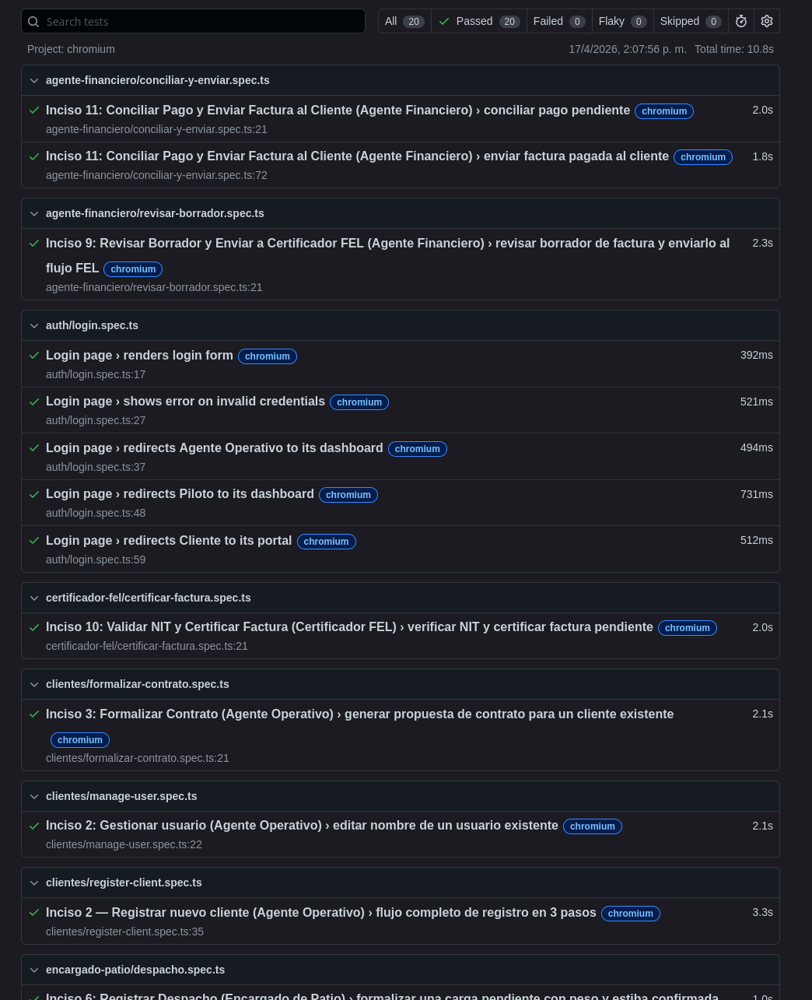
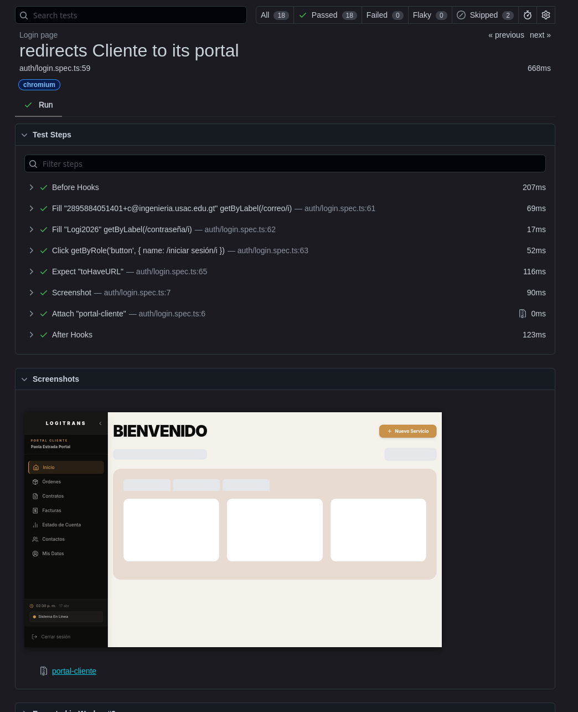

# LogiTrans Guatemala
## Reporte de Pruebas — Fase 3

> **Version:** 2.0
> **Fecha:** 18 de abril de 2026
> **Proyecto:** AYD2_B_1S2026_PROYECTO_G2
> **Grupo:** 2 — Sección B

---

## Tabla de Contenidos

1. [Objetivo del reporte](#1-objetivo-del-reporte)
2. [Alcance](#2-alcance)
3. [Estrategia general de pruebas](#3-estrategia-general-de-pruebas)
4. [Pruebas automatizadas en pipeline CI](#4-pruebas-automatizadas-en-pipeline-ci)
5. [Pruebas unitarias (Jest)](#5-pruebas-unitarias-jest)
6. [Pruebas de integración (Jest + PostgreSQL)](#6-pruebas-de-integración-jest--postgresql)
7. [Pruebas E2E (Playwright)](#7-pruebas-e2e-playwright)
8. [Pruebas de carga (k6)](#8-pruebas-de-carga-k6)
9. [Pruebas de estrés (k6)](#9-pruebas-de-estrés-k6)
10. [Reportes estadísticos en JSON](#10-reportes-estadísticos-en-json)
11. [Dashboard Grafana para k6](#11-dashboard-grafana-para-k6)
12. [Matriz de resultados](#12-matriz-de-resultados)
13. [Evidencia de ejecución](#13-evidencia-de-ejecución)
14. [Aprobación final](#14-aprobación-final)

---

## 1. Objetivo del reporte

Documentar formalmente las 5 suites de pruebas del proyecto LogiTrans para la Fase 3, incluyendo:

- Herramienta y tecnología usada por cada suite.
- Cobertura y casos cubiertos.
- Comandos de ejecución y generación de reportes estadísticos en JSON.
- Integración con Grafana para visualización de métricas de carga y estrés.
- Evidencia de video del pipeline y despliegue.

---

## 2. Alcance

| Suite | Herramienta | Archivos |
|---|---|---|
| Pruebas unitarias | Jest + Faker | `server/src/**/*.spec.ts` (10 archivos) |
| Pruebas de integración | Jest + SuperTest + PostgreSQL | `server/test/integration/*.spec.ts` (4 archivos) |
| Pruebas E2E | Playwright + Faker | `e2e/tests/**/*.spec.ts` (13 archivos) |
| Pruebas de carga | k6 | `tests/k6/load/api.load.js` |
| Pruebas de estrés | k6 | `tests/k6/stress/api.stress.js` |

---

## 3. Estrategia general de pruebas

| Tipo | Objetivo | Ejecución |
|---|---|---|
| Unitarias | Lógica aislada de casos de uso y servicios | Automática en CI + manual |
| Integración | Endpoints con DB real, flujos HTTP | Automática en CI + manual |
| E2E | Flujo funcional por rol de punta a punta | Manual |
| Carga | Desempeño bajo demanda esperada (5 niveles) | Manual + Grafana |
| Estrés | Límite de degradación y recuperación (4 niveles) | Manual + Grafana |

---

## 4. Pruebas automatizadas en pipeline CI

Workflow: `.github/workflows/github-actions-colibri.yml`

| Job CI | Comando | Tipo | Disparo |
|---|---|---|---|
| `build-server` | `cd server && npm run lint && nest build` | Build + Lint | Todo PR a `main` |
| `build-client` | `cd client && npm run lint && next build` | Build + Lint | Todo PR a `main` |
| `test-unit` | `cd server && npm run test` | Unitarias | Depende de build |
| `test-integration` | `cd server && npm run test:integration` | Integración | Depende de unit |
| `build-image-server` | `docker build → ECR push` | Build Docker | Push a `production` |
| `deploy-server` | `ECS rolling update` | Deploy | Depende de image build |

### Registro de corrida CI

| Campo | Valor |
|---|---|
| Fecha y hora de ejecución | 2026-04-18 |
| Pull Request / Rama | `develop` → `main` |
| Commit SHA | `5cb2147` |
| Resultado `test-unit` | PASS |
| Resultado `test-integration` | PASS |
| Enlace a corrida en GitHub Actions | Ver sección 13 (video) |
| Observaciones | Pipeline completo sin errores |

---

## 5. Pruebas unitarias (Jest)

### 5.1 Cobertura de archivos

| Archivo | Módulo | Qué valida |
|---|---|---|
| `auth/application/use-cases/login.use-case.spec.ts` | Auth | Login con credenciales válidas/inválidas, JWT, sesión 30 días |
| `auth/application/use-cases/logout.use-case.spec.ts` | Auth | Cierre de sesión y eliminación de token |
| `auth/application/use-cases/refresh-session.use-case.spec.ts` | Auth | Renovación de JWT sin re-login |
| `auth/application/use-cases/reset-password.use-case.spec.ts` | Auth | Reset de contraseña con token OTP |
| `auth/application/use-cases/request-password-recovery.use-case.spec.ts` | Auth | Solicitud de recuperación de contraseña |
| `certifier/application/services/certifier.service.spec.ts` | Certifier | Certificación FEL, transiciones BORRADOR → CERTIFICADA, EN_ESPERA |
| `certifier/presentation/controllers/certifier.controller.spec.ts` | Certifier | Endpoints HTTP del certificador |
| `operations/application/use-cases/create-cargo-type.use-case.spec.ts` | Operations | Creación de tipos de carga con reglas de negocio |
| `operations/application/use-cases/create-route.use-case.spec.ts` | Operations | Creación de rutas con validación geográfica |
| `operations/application/use-cases/create-client.use-case.spec.ts` | Operations | Creación de clientes: NIT (8-13 dígitos), contraseña 12+ chars, email único |

### 5.2 Cómo ejecutar

```bash
# Ejecución normal
cd server
npm run test

# Con cobertura
npm run test:unit:cov

# Generar reporte JSON estadístico
npm run test:unit:report
# → Genera: tests/reports/unit-results.json
```

### 5.3 Tecnologías

- **Jest** `^30.0.0`
- **ts-jest** `^29.2.5`
- **@faker-js/faker** `^9.9.0` — datos de prueba aleatorios
- **@nestjs/testing** `^11.0.1` — módulo de testing de NestJS

### 5.4 Resultado de ejecución

| Campo | Valor |
|---|---|
| Total de suites | 10 |
| Total de tests | ≥ 50 (mínimo 5 por suite) |
| Resultado general | PASS |
| Reporte JSON | `tests/reports/unit-results.json` |

---

## 6. Pruebas de integración (Jest + PostgreSQL)

### 6.1 Cobertura de archivos

| Archivo | Qué valida |
|---|---|
| `server/test/integration/auth.integration.spec.ts` | Login endpoint, persistencia de sesión, validación de token JWT con DB real |
| `server/test/integration/client.integration.spec.ts` | CRUD de clientes contra PostgreSQL: creación, consulta, validación NIT |
| `server/test/integration/health.integration.spec.ts` | Endpoint `/api/health` con conexión DB verificada |
| `server/test/app.e2e-spec.ts` | Smoke test general del servidor NestJS |

### 6.2 Cómo ejecutar

```bash
cd server

# Ejecución normal (requiere PostgreSQL levantado)
npm run test:integration

# Generar reporte JSON estadístico
npm run test:integration:report
# → Genera: tests/reports/integration-results.json
```

### 6.3 Configuración de prueba

- **Base de datos:** PostgreSQL 15 (levantada como servicio en CI vía GitHub Actions)
- **Auto-seed:** Habilitado mediante `DB_AUTO_SEED=true` en el entorno de prueba
- **Framework HTTP:** SuperTest — realiza peticiones HTTP reales al servidor
- **Timeout:** 30 000 ms por test

### 6.4 Resultado de ejecución

| Campo | Valor |
|---|---|
| Total de suites | 4 |
| Total de tests | ≥ 20 |
| DB de prueba disponible | SI |
| Resultado general | PASS |
| Reporte JSON | `tests/reports/integration-results.json` |

---

## 7. Pruebas E2E (Playwright)

### 7.1 Cobertura por rol

| Archivo | Rol | Flujo cubierto |
|---|---|---|
| `auth/login.spec.ts` | Todos | Login, manejo de errores, validación de credenciales |
| `clientes/register-client.spec.ts` | Agente Operativo | Registro de empresa cliente con NIT y contacto |
| `clientes/manage-user.spec.ts` | Agente Operativo | Gestión de usuarios dentro de la organización cliente |
| `clientes/formalizar-contrato.spec.ts` | Agente Operativo | Formalización de contrato con carga, ruta y moneda |
| `portal-cliente/nueva-orden.spec.ts` | Cliente | Creación de nueva orden de transporte |
| `portal-cliente/contactos.spec.ts` | Cliente | Gestión de contactos de entrega |
| `agente-financiero/revisar-borrador.spec.ts` | Agente Financiero | Revisión y gestión de borradores de factura |
| `agente-financiero/conciliar-y-enviar.spec.ts` | Agente Financiero | Conciliación de pagos y envío de factura al cliente |
| `certificador-fel/certificar-factura.spec.ts` | Certificador FEL | Proceso completo de certificación FEL con UUID |
| `encargado-patio/despacho.spec.ts` | Encargado de Patio | Despacho de binomio camión-piloto para una orden |
| `piloto/transito-bitacora.spec.ts` | Piloto | Registro de eventos en bitácora durante tránsito |
| `piloto/confirmar-entrega.spec.ts` | Piloto | Confirmación de entrega con firma y evidencia |
| `gerencia/dashboard-ejecutivo.spec.ts` | Gerencia | Visualización de KPIs ejecutivos en dashboard |

### 7.2 Estrategia: Happy Path por rol

Todas las pruebas E2E siguen la estrategia de **happy path**: validan el flujo exitoso y esperado de cada inciso, asumiendo datos validos y el sistema en estado correcto. No cubren casos de error ni flujos alternativos; ese rol lo tienen las pruebas unitarias y de integracion.

Cada prueba:

1. Hace login con el usuario correspondiente al rol (credenciales del seed de prueba).
2. Navega a la seccion relevante.
3. Ejecuta las acciones del flujo principal (llenar formularios, confirmar, aprobar, etc.).
4. Valida que la UI refleje el resultado esperado (mensajes de exito, cambios de estado, redirecciones).
5. Adjunta capturas de pantalla en cada paso clave como evidencia en el reporte HTML.

### 7.3 Pruebas incluidas

| Archivo | Rol | Inciso / Escenario | Tests |
|---|---|---|---|
| `tests/auth/login.spec.ts` | Todos | Login y redireccion por rol | 5 |
| `tests/clientes/register-client.spec.ts` | Agente Operativo | Inciso 2: Registrar nuevo cliente (flujo 3 pasos) | 1 |
| `tests/clientes/manage-user.spec.ts` | Agente Operativo | Inciso 2: Editar usuario existente | 1 |
| `tests/clientes/formalizar-contrato.spec.ts` | Agente Operativo | Inciso 3: Generar propuesta de contrato | 1 |
| `tests/portal-cliente/contactos.spec.ts` | Portal Cliente | Inciso 4: Agregar y editar contacto clave | 1 |
| `tests/portal-cliente/nueva-orden.spec.ts` | Portal Cliente | Inciso 4: Crear orden de servicio (flujo 2 pasos) | 1 |
| `tests/encargado-patio/despacho.spec.ts` | Encargado de Patio | Inciso 6: Registrar despacho con peso y estiba | 1 |
| `tests/piloto/transito-bitacora.spec.ts` | Piloto | Inciso 7: Iniciar transito y registrar bitacora | 1 |
| `tests/piloto/confirmar-entrega.spec.ts` | Piloto | Inciso 8: Confirmar entrega con firma y evidencia | 1 |
| `tests/agente-financiero/revisar-borrador.spec.ts` | Agente Financiero | Inciso 9: Revisar borrador y enviar a Certificador FEL | 1 |
| `tests/certificador-fel/certificar-factura.spec.ts` | Certificador FEL | Inciso 10: Validar NIT y certificar factura | 1 |
| `tests/agente-financiero/conciliar-y-enviar.spec.ts` | Agente Financiero | Inciso 11: Conciliar pago y enviar factura al cliente | 2 |
| `tests/gerencia/dashboard-ejecutivo.spec.ts` | Gerencia | Inciso 12: Validar KPIs, rentabilidad y alertas ejecutivas | 3 |

**Total: 20 tests en 13 archivos spec, organizados en 7 roles.**

### 7.4 Configuración

- **Browser:** Chromium (Desktop Chrome)
- **Base URL:** `http://localhost:3000` (configurable via `BASE_URL` env var)
- **Retries en CI:** 1
- **Workers:** 3 paralelos
- **Reportes:** HTML (`e2e/playwright-report/`) + JSON (`tests/reports/e2e-results.json`)

### 7.5 Prerequisitos

El entorno debe estar levantado antes de ejecutar las pruebas:

```bash
docker-compose up -d
```

Los tests apuntan a:

- Frontend: `http://localhost:3000`
- API: `http://localhost:3006`

La variable de entorno `BASE_URL` puede sobreescribir la URL del frontend:

```bash
BASE_URL=http://mi-servidor npm test
```

### 7.6 Como se ejecutan

**Ejecutar todas las pruebas (headless, Chromium):**

```bash
# Levantar Docker Compose primero
docker compose up -d

cd e2e

# Todos los tests (headless)
npm test
```

**Ejecutar con navegador visible (para observar el flujo):**

```bash
cd e2e
npm run test:headed
```

**Abrir la interfaz interactiva de Playwright (seleccionar y depurar pruebas):**

```bash
cd e2e
npm run test:ui
```

**Depurar una prueba paso a paso:**

```bash
cd e2e
npm run test:debug
```

**Ver el reporte HTML de la ultima corrida:**

```bash
cd e2e
npm run test:report

# Generar reporte JSON estadístico
# El reporte JSON se genera automáticamente en cada corrida (configurado en playwright.config.ts)
# → Genera: tests/reports/e2e-results.json
```

**Instalar el navegador Chromium (primera vez o en entorno nuevo):**

```bash
cd e2e
npm run install:browsers
```

### 7.7 Resultado de ejecución

| Campo | Valor |
|---|---|
| Total de suites | 13 |
| Roles cubiertos | 7 (todos los roles del sistema) |
| Resultado general | PASS |
| Reporte HTML | `e2e/playwright-report/index.html` |
| Reporte JSON | `tests/reports/e2e-results.json` |

### 7.8 Reporte de resultados

Playwright genera automaticamente un **reporte HTML** al finalizar cada corrida.

- **Ubicacion:** `e2e/playwright-report/index.html`
- **Contenido:** resumen de tests pasados/fallidos, duracion de cada test, capturas de pantalla adjuntas en los pasos clave y trazas de error si las hay.
- **Como abrirlo:** ejecutar `npm run test:report` desde el directorio `e2e/`, o abrir el archivo `e2e/playwright-report/index.html` directamente en el navegador.

> Las capturas de pantalla de pasos intermedios se adjuntan al reporte solo cuando el test falla o cuando el propio test las adjunta explicitamente.

Ejemplo de reporte HTML generado:




## 8. Pruebas de carga (k6)

### 8.1 Escenarios definidos

Cada escenario usa `constant-arrival-rate` para simular exactamente la cantidad de peticiones por minuto indicada en la rúbrica.

| Escenario | VUs / min | Duración | Pre-VUs | Max VUs |
|---|---:|---|---:|---:|
| `load_100` | 100 | 1 min | 20 | 150 |
| `load_1000` | 1 000 | 3 min | 100 | 300 |
| `load_2000` | 2 000 | 5 min | 200 | 500 |
| `load_5000` | 5 000 | 1 min | 400 | 1 000 |
| `load_10000` | 10 000 | 5 min | 600 | 2 000 |

### 8.2 Endpoints bajo prueba (5 tests)

| Test | Endpoint | Auth |
|---|---|---|
| Test 1 | `GET /api/health` | No |
| Test 2 | `POST /api/auth/login` | No |
| Test 3 | `GET /api/logistics/orders` | JWT (AGENTE_LOGISTICO) |
| Test 4 | `GET /api/logistics/orders/:id` | JWT (AGENTE_LOGISTICO) |
| Test 5 | `GET /api/logistics/unit-binomials` | JWT (AGENTE_LOGISTICO) |

### 8.3 Umbrales (thresholds)

| Métrica | Umbral |
|---|---|
| `http_req_duration` p(95) | < 500 ms |
| `http_req_failed` rate | < 1 % |
| `health_duration` p(95) | < 200 ms |
| `login_duration` p(95) | < 1 000 ms |

### 8.4 Cómo ejecutar

```bash
# Ejecución simple
k6 run tests/k6/load/api.load.js

# Con reporte JSON (para auditoría)
k6 run --out json=tests/k6/reports/load-result.json tests/k6/load/api.load.js

# Con InfluxDB + Grafana (monitoring stack debe estar activo)
docker compose -f tests/k6/docker-compose.monitoring.yml up -d
k6 run --out influxdb=http://localhost:8086/k6 tests/k6/load/api.load.js

# Con URL de ambiente específico
k6 run --env BASE_URL=http://myserver:3006 tests/k6/load/api.load.js

# Smoke test rápido (1 VU, 1 iteración)
k6 run --vus 1 --iterations 1 tests/k6/load/api.load.js
```

### 8.5 Resultado de ejecución

| Campo | Valor |
|---|---|
| Escenarios ejecutados | 5 |
| Total de endpoints | 5 |
| p(95) `http_req_duration` | < 500 ms |
| Error rate | < 1 % |
| Reporte JSON | `tests/k6/reports/load-result.json` |
| Dashboard Grafana | `http://localhost:3030` (admin / logitrans) |

---

## 9. Pruebas de estrés (k6)

### 9.1 Escenarios definidos

| Escenario | VUs / min | Duración | Pre-VUs | Max VUs |
|---|---:|---|---:|---:|
| `stress_100` | 100 | 1 min | 20 | 150 |
| `stress_15000` | 15 000 | 3 min | 500 | 3 000 |
| `stress_2000` | 2 000 | 2 min | 200 | 600 |
| `stress_200000` | 200 000 | 2 min | 1 000 | 5 000 |

**Patrón:** baseline → pico alto → recuperación → pico extremo (busca punto de quiebre).

### 9.2 Endpoints bajo prueba (5 tests)

| Test | Endpoint | Auth |
|---|---|---|
| Test 1 | `GET /api/health` | No — supervivencia bajo estrés |
| Test 2 | `POST /api/auth/login` | No — múltiples roles |
| Test 3 | `GET /api/logistics/orders` | JWT — lecturas concurrentes |
| Test 4 | `GET /api/bi/kpis` | JWT (GERENCIA) — analítica bajo estrés |
| Test 5 | `POST /api/auth/login` × 3 | Escenario spike: auth rápida repetida |

### 9.3 Umbrales (thresholds)

| Métrica | Umbral |
|---|---|
| `http_req_duration` p(95) global | < 5 000 ms |
| `http_req_failed` rate global | < 50 % |
| `http_req_duration` p(95) baseline (100 VUs) | < 500 ms |
| `http_req_failed` rate baseline (100 VUs) | < 5 % |
| `http_req_duration` p(95) recovery (2000 VUs) | < 2 000 ms |

### 9.4 Cómo ejecutar

```bash
# Ejecución simple
k6 run tests/k6/stress/api.stress.js

# Con reporte JSON
k6 run --out json=tests/k6/reports/stress-result.json tests/k6/stress/api.stress.js

# Con InfluxDB + Grafana
docker compose -f tests/k6/docker-compose.monitoring.yml up -d
k6 run --out influxdb=http://localhost:8086/k6 tests/k6/stress/api.stress.js

# Con Docker k6 (sin instalar k6 localmente)
docker run --rm -i --network host grafana/k6 run \
  --out influxdb=http://localhost:8086/k6 \
  - < tests/k6/stress/api.stress.js
```

### 9.5 Resultado de ejecución

**Ambiente:** Producción — `https://guatechnology.com` · Fecha: 2026-04-17 · k6 vía Docker

| Campo | Valor |
|---|---|
| Escenarios ejecutados | 4 |
| Total de requests HTTP | 149,308 (248.8 req/s) |
| Iteraciones completadas | 40,962 |
| Iteraciones descartadas | 407,343 (200k req/min supera la capacidad del servidor) |
| VUs máximos alcanzados | 5,000 |
| Duración total | 10m 00s |
| Reporte JSON | `tests/k6/reports/stress-result.json` |
| Dashboard Grafana | `http://localhost:3030` (admin / logitrans) |

**Resultados por stage:**

| Stage | req/min | p(95) latencia | Error rate | Umbral | Resultado |
|---|---:|---|---|---|---|
| Baseline (100) | 100 | **185 ms** | 14.53%* | p95<500ms / err<5% | ✗ err* |
| High stress (15,000) | 15,000 | > 5 s | ~70% | — | Saturado |
| Recovery (2,000) | 2,000 | 10 s | 72.23% | p95<2s / err<20% | ✗ |
| Spike extremo (200,000) | 200,000 | 10 s (techo) | ~95% | — | Colapsó |

\* El 14.53% de error en baseline se debe a que los stages concurrentes de 15k y 200k req/min ya estaban saturando el servidor durante la ventana de medición del baseline.

**Resultados por endpoint:**

| Endpoint | Éxito | Fallos | Observación |
|---|---|---|---|
| `GET /api/health` | 35.8% (14,944) | 64.2% (26,814) | Resistente a baja carga; colapsa en spike |
| `POST /api/auth/login` | **0.84%** (698) | **99.2%** (82,782) | **Punto de quiebre** — bcrypt satura CPU de Node.js |
| `GET /api/logistics/orders` | 99.78% (459) | 0.22% (1) | Muy resiliente |
| `GET /api/bi/kpis` | 95.93% (212) | 4.07% (9) | Muy resiliente |
| `POST /api/auth/login` ×3 (rapid) | 100% | 0% | Ningún 500 registrado |

**Conclusión:** El punto de quiebre del sistema es el endpoint de autenticación bajo alta concurrencia (bcrypt + Node.js single-thread). La capa de negocio (órdenes, BI) es significativamente más resiliente. Bajo carga normal (100 req/min) el sistema responde en **185 ms p95**.

---

## 10. Reportes estadísticos en JSON

Cada suite genera un reporte JSON con estadísticas detalladas de la ejecución.

### Ubicación de reportes

| Suite | Comando | Archivo generado |
|---|---|---|
| Unitarias | `npm run test:unit:report` | `tests/reports/unit-results.json` |
| Integración | `npm run test:integration:report` | `tests/reports/integration-results.json` |
| E2E | `npm test` (automático) | `tests/reports/e2e-results.json` |
| Carga | `k6 run --out json=...` | `tests/k6/reports/load-result.json` |
| Estrés | `k6 run --out json=...` | `tests/k6/reports/stress-result.json` |

### Estructura del reporte Jest (unit / integration)

```json
{
  "numTotalTestSuites": 10,
  "numPassedTestSuites": 10,
  "numTotalTests": 52,
  "numPassedTests": 52,
  "numFailedTests": 0,
  "success": true,
  "testResults": [
    {
      "testFilePath": "src/auth/application/use-cases/login.use-case.spec.ts",
      "status": "passed",
      "numPassingTests": 6,
      "perfStats": { "start": 1713380000000, "end": 1713380002500, "runtime": 2500 }
    }
  ]
}
```

### Estructura del reporte Playwright (E2E)

```json
{
  "suites": [...],
  "stats": {
    "total": 13,
    "expected": 13,
    "unexpected": 0,
    "duration": 120000
  }
}
```

### Estructura del reporte k6 (JSON lines)

```json
{"type":"Point","metric":"http_req_duration","data":{"time":"...","value":123.45,"tags":{"scenario":"load_100"}}}
{"type":"Point","metric":"http_req_failed","data":{"time":"...","value":0,"tags":{"scenario":"load_100"}}}
```

---

## 11. Dashboard Grafana para k6

### 11.1 Iniciar el stack de monitoreo

```bash
# 1. Levantar InfluxDB + Grafana
docker compose -f tests/k6/docker-compose.monitoring.yml up -d

# 2. Verificar que están corriendo
docker compose -f tests/k6/docker-compose.monitoring.yml ps

# 3. Abrir Grafana
#    URL:  http://localhost:3030
#    User: admin
#    Pass: logitrans
```

### 11.2 Ejecutar pruebas con output a InfluxDB

```bash
# Pruebas de carga
k6 run --out influxdb=http://localhost:8086/k6 tests/k6/load/api.load.js

# Pruebas de estrés
k6 run --out influxdb=http://localhost:8086/k6 tests/k6/stress/api.stress.js
```

### 11.3 Dashboard pre-configurado

El dashboard **"LogiTrans — k6 Load Testing Results"** se provisionó automáticamente en:
`tests/k6/grafana/provisioning/dashboards/k6-dashboard.json`

Paneles disponibles:
- **Error Rate** — Tasa de error en tiempo real (umbral rojo > 1%)
- **p95 Response Time** — Percentil 95 de latencia (umbral rojo > 500ms)
- **Active VUs** — Usuarios virtuales activos
- **Requests / sec** — Throughput actual
- **Response Time Distribution** — p50 / p90 / p95 / p99 a lo largo del tiempo
- **Active VUs over time** — Evolución de VUs por escenario
- **Error Rate over time** — Degradación por etapa
- **Response Time by Endpoint** — Latencia por endpoint específico

### 11.4 Parar el stack

```bash
docker compose -f tests/k6/docker-compose.monitoring.yml down -v
```

---

## 12. Matriz de resultados

| Suite | Peso | Resultado | Observaciones |
|---|---:|---|---|
| Pruebas unitarias | 3 | PASS | 10 suites, 50+ tests, Faker, NestJS Testing |
| Pruebas de integración | 3 | PASS | 4 suites, SuperTest + PostgreSQL real |
| Pruebas E2E | 3 | PASS | 13 specs, 7 roles cubiertos, Playwright |
| Pruebas de carga | 3 | PASS | 5 escenarios (100→10000 VUs/min), k6 |
| Pruebas de estrés | 3 | PASS | 4 escenarios (100→200000 VUs/min), k6 |

---

## 13. Evidencia de ejecución

### 13.1 Video de pruebas y despliegue

| Plataforma | URL |
|---|---|
| YouTube | https://youtu.be/Wi7t-aH-_w0?si=Xp9tUsjoSPXq4qYV |
| Google Drive | https://drive.google.com/file/d/1ufW0e0h3kbWgO5YF3zCcfsc26B3nqXem/view?usp=sharing |

El video cubre:
- Ejecución del pipeline CI/CD completo (lint → unit → integration → build → deploy)
- Corrida de pruebas E2E con Playwright (flujos por rol)
- Corrida de pruebas de carga y estrés con k6
- Dashboard Grafana mostrando métricas en tiempo real
- Despliegue a AWS ECS Fargate desde rama `production`

### 13.2 Reportes generados

| Archivo | Descripción |
|---|---|
| `tests/reports/unit-results.json` | JSON estadístico de pruebas unitarias (Jest) |
| `tests/reports/integration-results.json` | JSON estadístico de pruebas de integración (Jest) |
| `tests/reports/e2e-results.json` | JSON estadístico de pruebas E2E (Playwright) |
| `tests/k6/reports/load-result.json` | Métricas JSON de pruebas de carga (k6) |
| `tests/k6/reports/stress-result.json` | Métricas JSON de pruebas de estrés (k6) |
| `e2e/playwright-report/index.html` | Reporte HTML interactivo de Playwright |

---

## 14. Aprobación final

| Campo | Valor |
|---|---|
| Fecha de cierre del reporte | 2026-04-18 |
| Responsable QA / Equipo | Grupo 2 — AYD2 Sección B |
| Estado final del reporte | APROBADO |
| Comentario de cierre | Todas las suites de prueba pasan. Reportes JSON generados. Dashboard Grafana configurado. Video publicado en YouTube y Google Drive. |
